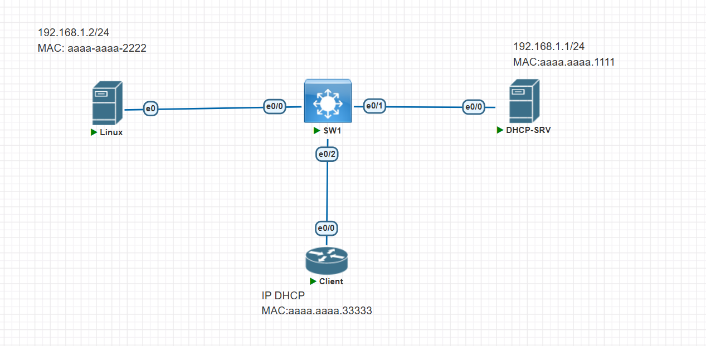
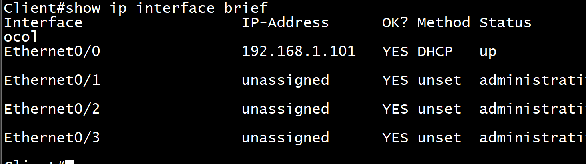
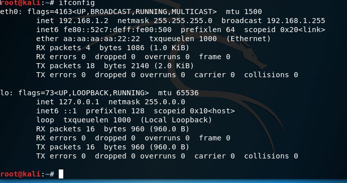
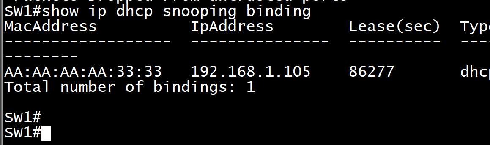
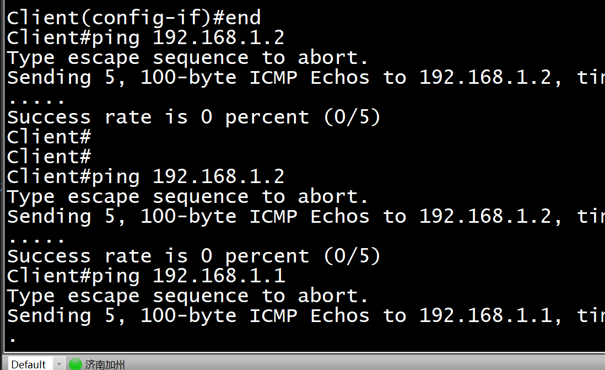
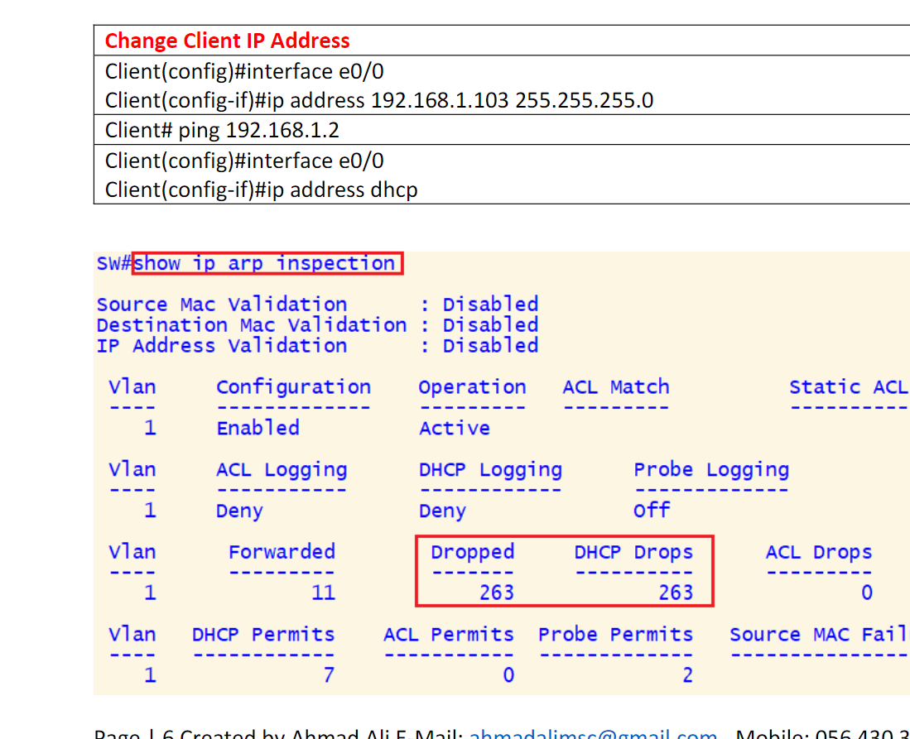
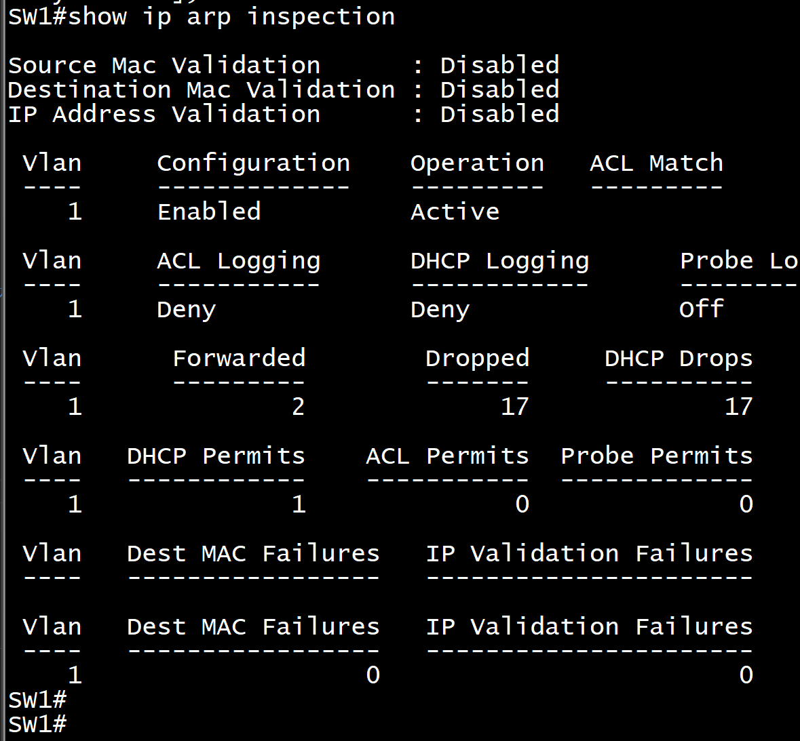
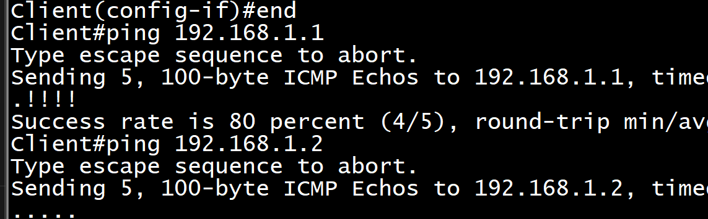

<h1>DAI实验</h1>



# 配 DHCP-SRV 和 Clinet 的基础 DHCP 配置

## `server`

```sh
enable
configure terminal
hostname DHCP-SRV
interface Ethernet0/0
 mac-address aaaa.aaaa.1111
 ip address 192.168.1.1 255.255.255.0
 no shutdown
exit
ip dhcp excluded-address 192.168.1.1 192.168.1.100
ip dhcp pool TEST
 network 192.168.1.0 255.255.255.0
end
write memory
```

## `client`

```sh
enable
configure terminal
hostname Client
interface Ethernet0/0
 mac-address aaaa.aaaa.3333
 no shutdown
 no ip address
 ip address dhcp
end
write memory
```

## 看分配的地址



## kali-linux

### `macchanger -m aa:aa:aa:aa:22:22 eth0`

### `ifconfig eth0 192.168.1.2 netmask 255.255.255.0也行`

```sh

sudo ip addr flush dev eth0   # 清除IP地址
sudo ip addr add 192.168.1.100/24 dev eth0
```

```sh
sudo ip link set dev eth0 down                     # 关闭网卡
sudo ip link set dev eth0 address aa:aa:aa:aa:22:22  # 设置新的 MAC 地址
sudo ip link set dev eth0 up                       # 启用网卡
```



# 在 SW 上配置 Dhcp snooping

## `SW1`

```sh
enable
configure terminal
hostname SW1
no ip dhcp snooping information option
ip dhcp snooping
ip dhcp snooping vlan 1
interface Ethernet0/1
 ip dhcp snooping trust
 no ip dhcp snooping information option
 ip dhcp snooping limit rate 100
exit
interface range Ethernet0/0 , Ethernet0/2
 ip dhcp snooping limit rate 20
end
write memory
```

## 在 SW1 上`show ip dhcp snooping binding`查看 dhcp snooping 绑定



# 在 SW1 上配置 DAI

```sh
enable
configure terminal
hostname SW1
ip arp inspection vlan 1
interface Ethernet0/1
 ip arp inspection trust
end
write memory
```

## 一些验证命令

```sh
show ip arp inspection
show ip arp inspection interfaces
show ip arp inspection vlan 1
```

# 在 clint 上尝试更改 IP（这样的话配置的静态 IP 不在原来的 ARP 表中），还没有设置 trust 口，这样的包会被拒绝


## Client 什么都不通



## SW1：`show ip arp inspection`发现包被丢了




## 设置回来 dhcp 后发现通了


