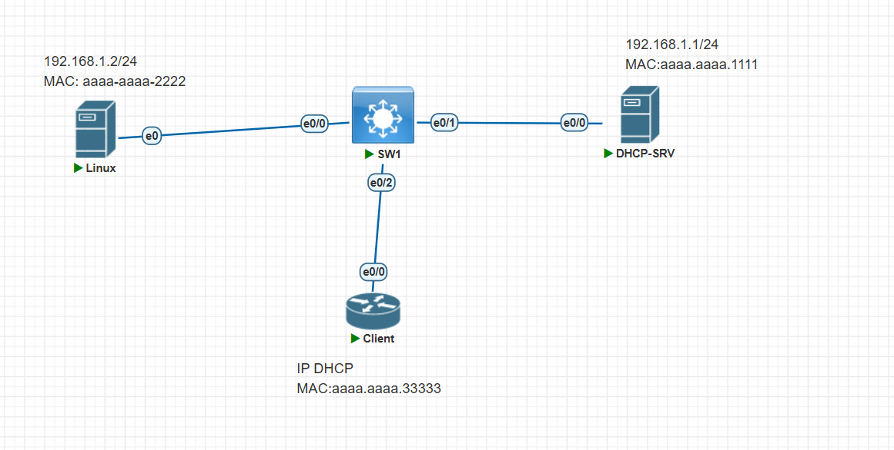

# 配置 server 和 client 的地址分配

## `server`

```sh
enable
configure terminal
hostname DHCP-SRV
interface Ethernet0/0
 mac-address aaaa.aaaa.1111
 ip address 192.168.1.1 255.255.255.0
 no shutdown
exit
ip dhcp excluded-address 192.168.1.1 192.168.1.100
ip dhcp pool TEST
 network 192.168.1.0 255.255.255.0
end
write memory
```

## `client`

```sh
enable
configure terminal
hostname Client
interface Ethernet0/0
 mac-address aaaa.aaaa.3333
 no shutdown
 no ip address
 ip address dhcp
end
write memory
```

## dhcp 获取了地址

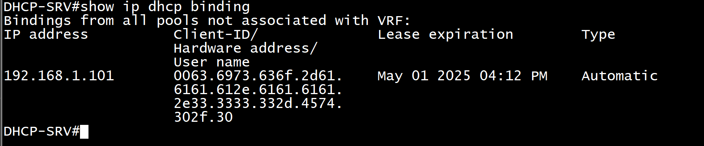
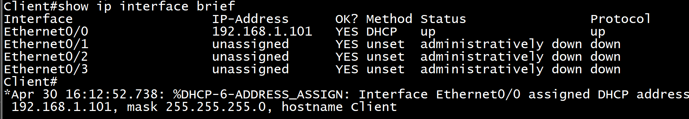

# 给 kali-linux 配置静态网卡 eth0:192.168.1.2/24,mac 地址配置 aa:aa:aa:aa:22:22

```sh
sudo ip link set dev eth0 down                     # 关闭网卡
sudo ip link set dev eth0 address 00:11:22:33:44:55  # 设置新的 MAC 地址
sudo ip link set dev eth0 up                       # 启用网卡
```

```sh
sudo ip addr flush dev eth0   # 清除IP地址
sudo ip addr add 192.168.1.100/24 dev eth0
```

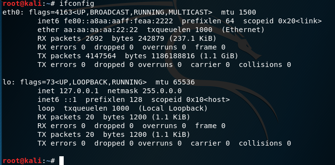

# 启动`ettercap -G`

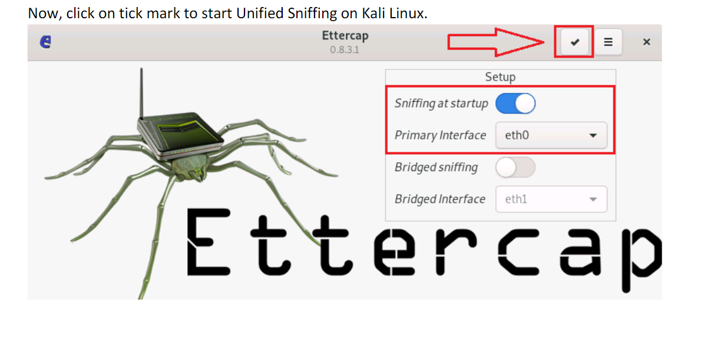
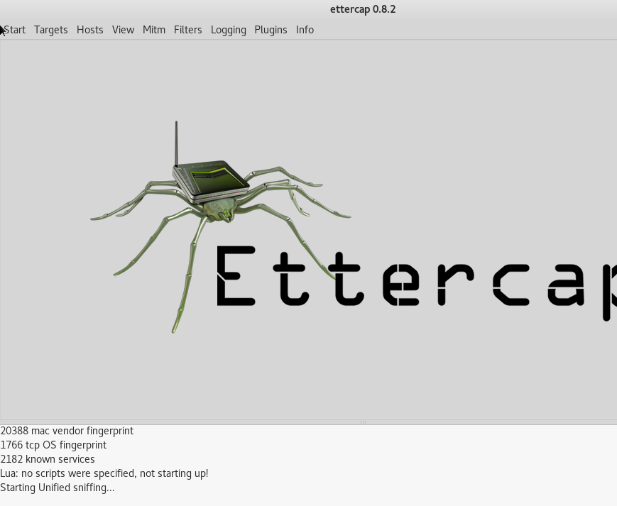

# scan 遍历我们网络中的 ARP 主机

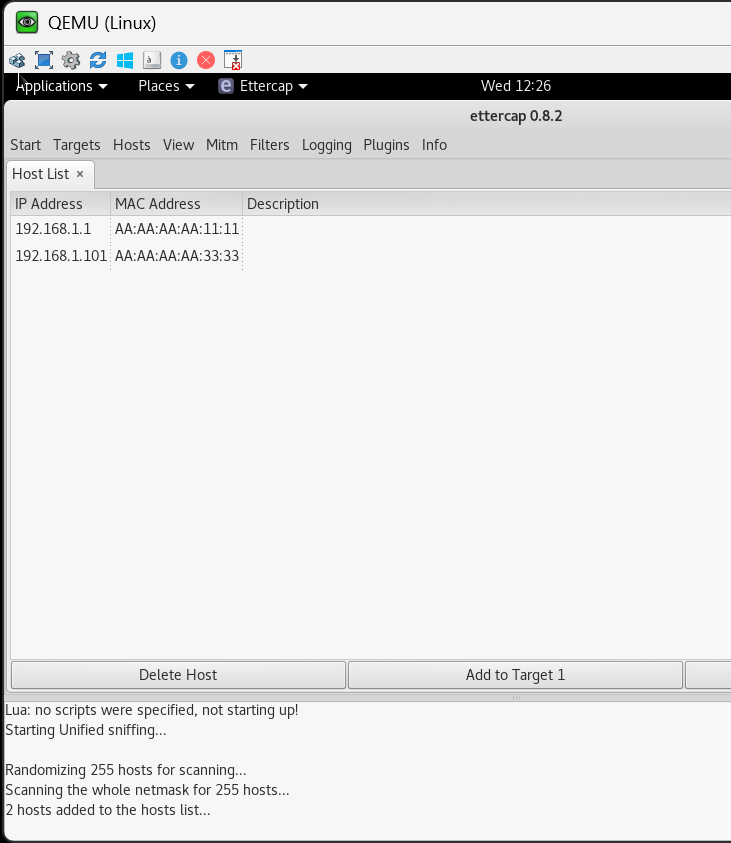

# 经过操作 ARP 中毒后，篡改了 DHCP-SRV 和 client 的 ARP 表

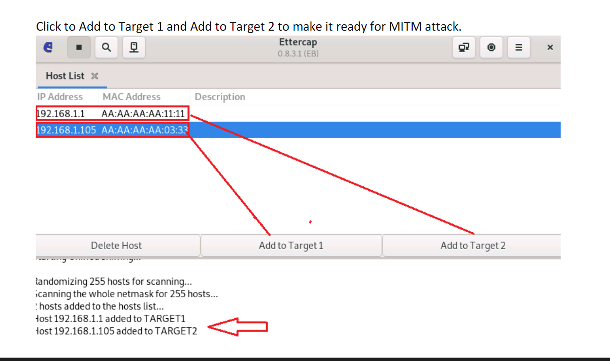
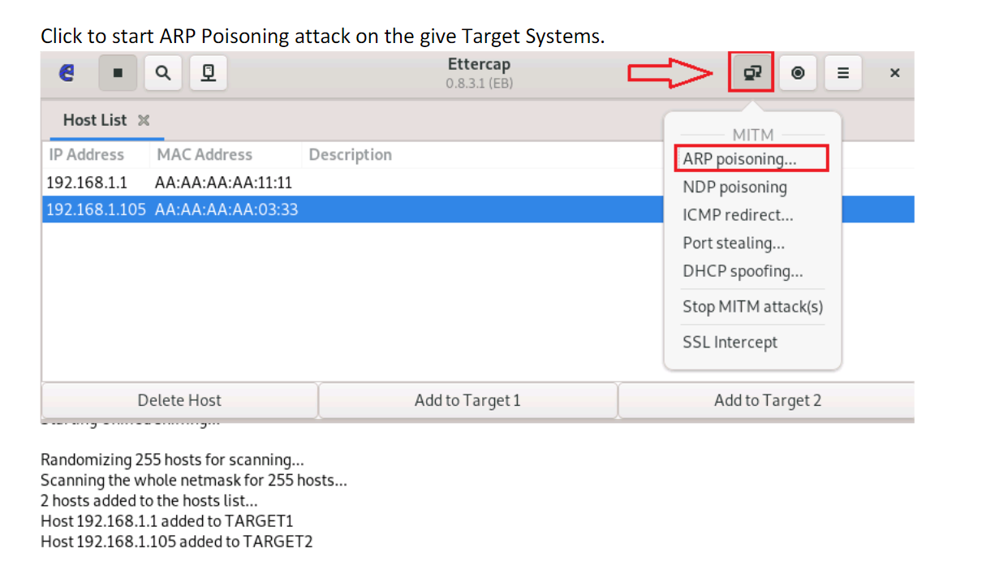
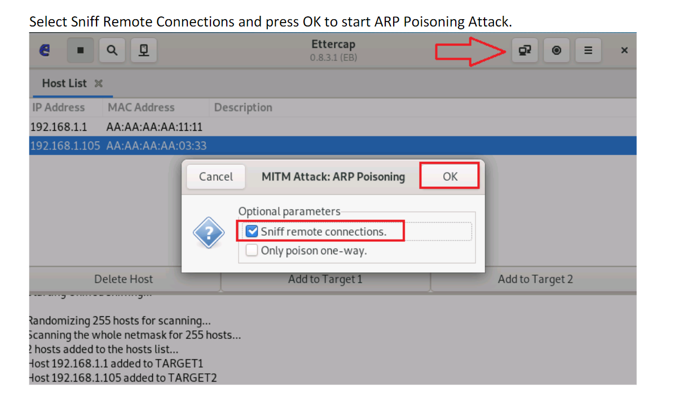
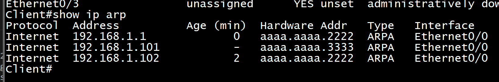
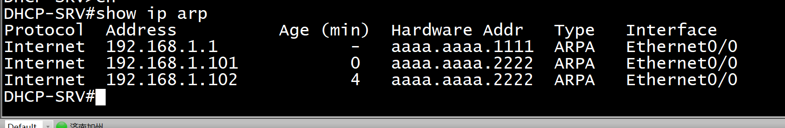
