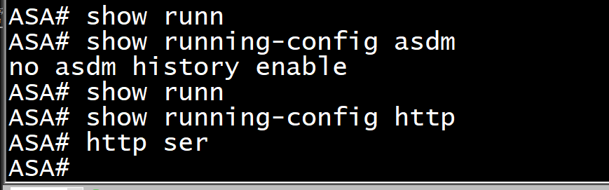
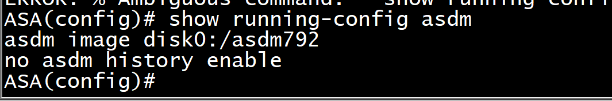
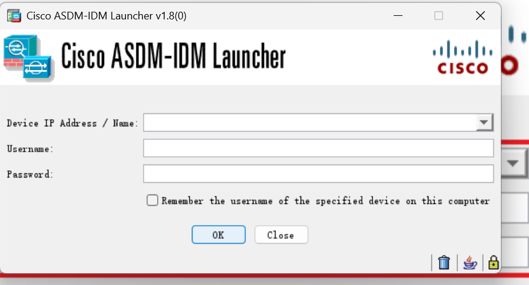
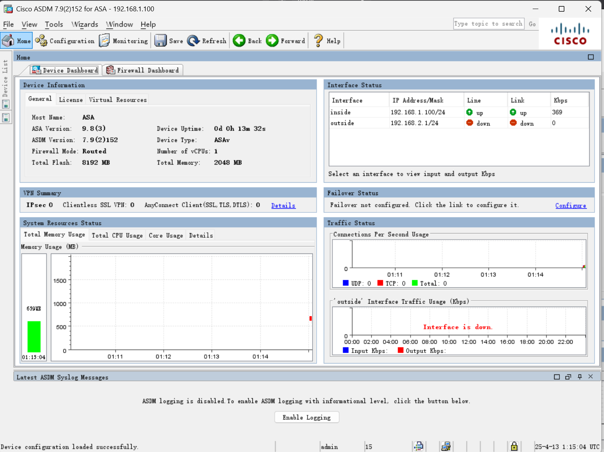

# 1. ASDM 工具？


# 2. Dir 看有没有 ASMD 的管理 bin 文件


# 3. `show running-config http`和`show running-config asdm`看看有没有配置文件



# 4. `http 192.168.1.0 255.255.255.0 inside `启用 HTTP 服务，`asdm image disk0:/asdm792`将 asdm 管理文件导入



# 通过 tftpd64 传


# 5. 创建用户

```sh
ASA(config)# userna
ASA(config)# username adm
ASA(config)# username admin pass
ASA(config)# username admin password 123
ASA(config)# http ser
ASA(config)# http server en
ASA(config)# http server enable
ASA(config)# http 0 0 ins
ASA(config)# http 0 0 inside
ASA(config)# aaa auth
ASA(config)# aaa authen
ASA(config)# aaa authentication http
ASA(config)# aaa authentication http con
ASA(config)# aaa authentication http console LO
ASA(config)# aaa authentication http console LOCAL
ASA(config)# show run http
http server enable
http 192.168.1.0 255.255.255.0 inside
http 0.0.0.0 0.0.0.0 inside
```

### 访问网址`https://192.168.1.100/admin/public/index.html`(不行就 reload 一下)



