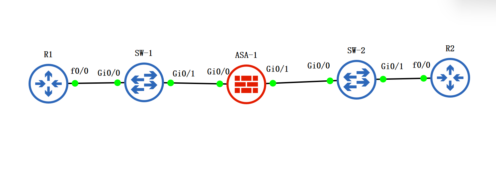
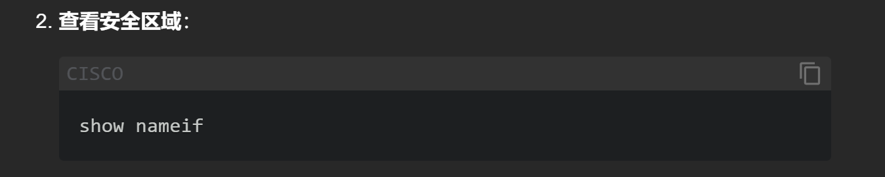
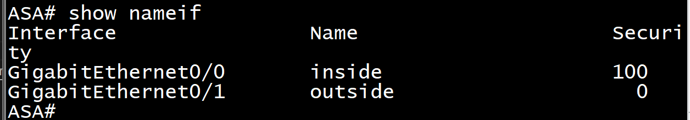
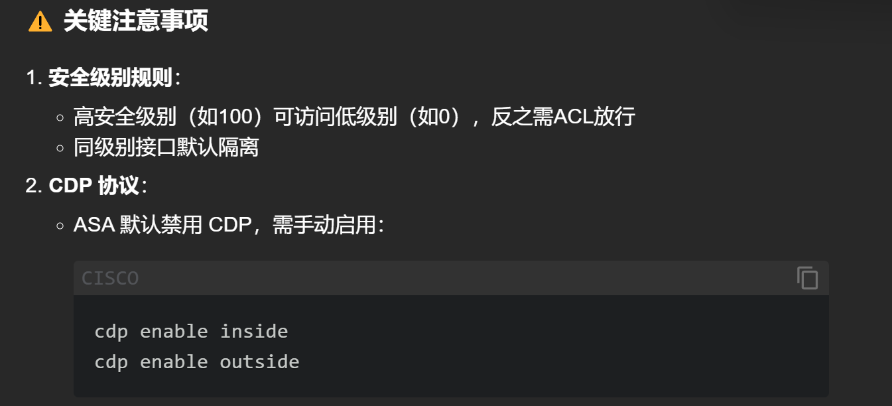
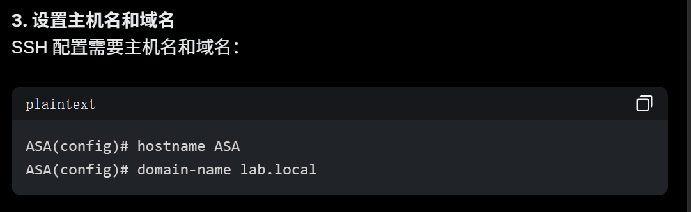
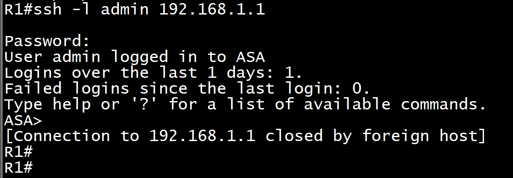
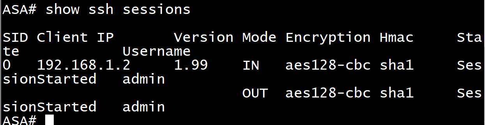

# 拓扑图



## 配 IP

### R1

```sh
enable
configure terminal
hostname R1
interface FastEthernet0/0
 ip address 192.168.1.2 255.255.255.0
 no shutdown
end
write memory

```

### R2

```sh
enable
configure terminal
interface FastEthernet0/0
 ip address 192.168.2.2 255.255.255.0
 no shutdown
end
write memory

```

### ASA

! 配置内部接口（安全级别 100）
! 配置外部接口（安全级别 0）

```sh
enable
configure terminal
hostname ASA


interface GigabitEthernet0/0
 nameif inside
 security-level 100
 ip address 192.168.1.1 255.255.255.0
 no shutdown


interface GigabitEthernet0/1
 nameif outside
 security-level 0
 ip address 192.168.2.1 255.255.255.0
 no shutdown

end
write memory
```

### 看现象





## 生成 RSA 密钥对

```sh
crypto key generate rsa modulus 1024
```

## 设置域名



### ASA 配 SSH

! 允许内网（192.168.1.0/24）通过 SSHv2 访问
! 创建管理员账户（特权级别 15）
! 启用本地认证

```sh
enable
configure terminal
hostname ASA
username admin password 123 privilege 15
aaa authentication ssh console LOCAL
domain-name lab.local
ssh 192.168.1.0 255.255.255.0 inside
ssh version 2
ssh timeout 10
```

### 检验 SSH `ssh -l admin 192.168.1.1`密码`123`

### `show ssh sessions`查看对话情况



