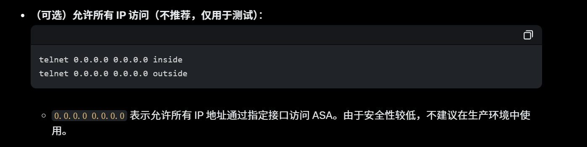
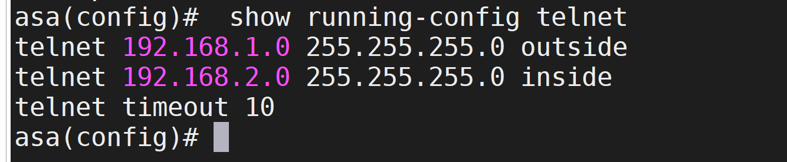
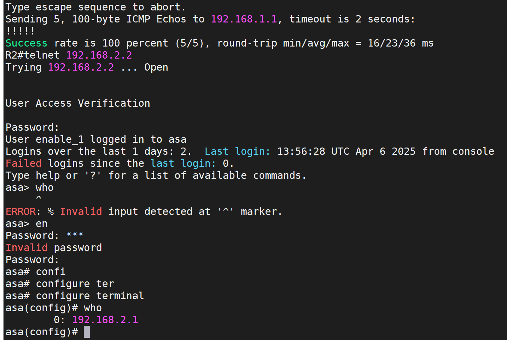
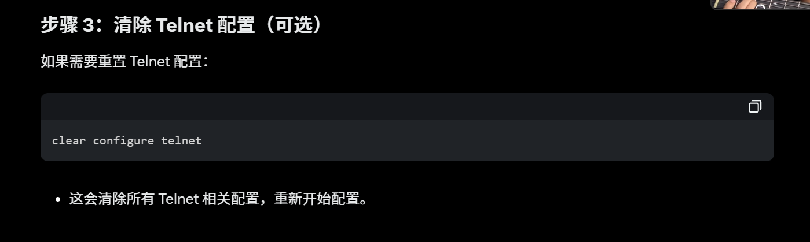

# 1. 拓扑图（密码 Cisco2025!)


# 2.Cisco ASA 使用“安全级别”（Security Level）来控制流量，默认规则是高安全级别到低安全级别的流量可以自动通过，反之需要显式允许。

### ASA

```SH
interface GigabitEthernet0/0
 nameif outside
 security-level 0
 ip address 192.168.1.2 255.255.255.0
 no shutdown
```

```SH
interface GigabitEthernet0/1
 nameif inside
 security-level 100
 ip address 192.168.2.2 255.255.255.0
 no shutdown
```

### R1

```SH
enable
configure terminal
interface FastEthernet0/0
 ip address 192.168.1.1 255.255.255.0
 no shutdown
```

### R2

```SH
enable
configure terminal
interface FastEthernet0/0
 ip address 192.168.2.1 255.255.255.0
 no shutdown
```

# 3. 设置默认路由让 R1 和 R2 通：2.1 在 ASA1 上配置默认路由，通常，ASA 的外部接口（outside）会有一条默认路由指向外部网关。这里我们简化场景，假设 R1 是外部网络的代表：

```sh
route outside 0.0.0.0 0.0.0.0 192.168.1.1
```

### R1

```sh
ip route 0.0.0.0 0.0.0.0 192.168.1.2
```

### R2

```sh
ip route 0.0.0.0 0.0.0.0 192.168.2.2
```


# 4. 配 ACL

```sh
access-list OUTSIDE_IN extended permit ip 192.168.1.0 255.255.255.0 192.168.2.0 255.255.255.0
```


### 将 ACL 应用到 outside 接口

```sh
access-group OUTSIDE_IN in interface outside
```


### 测试连通性


# 5. telnet 实验 VTY(0 4)

### ASA 允许 inside 网络（R2）Telnet 访问 ASA，允许 outside 网络（R1）Telnet 访问 ASA

```sh
telnet 192.168.2.0 255.255.255.0 inside
telnet 192.168.1.0 255.255.255.0 outside
```




### 设置 telnet 超时

```sh
telnet timeout 10
```

### 设置全局密码

```sh
passwd 123
```

### 创建本地用户

```sh
username admin password 123
```

### 启用本地认证，启用 Telnet 的本地认证（LOCAL 表示使用 ASA 本地的用户数据库）。用户需要输入用户名和密码（例如 admin/123）才能登录。

```sh
aaa authentication telnet console LOCAL
```

### 这样的话实际上是 R2 可以 telnet ASA 但是 R1 不行



### (可选)清除 telnet


