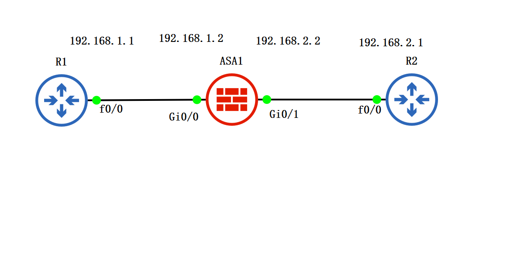
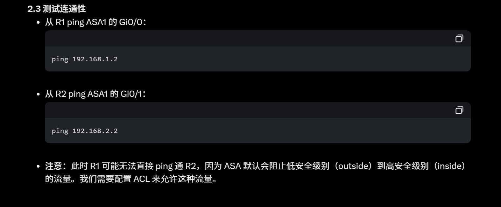
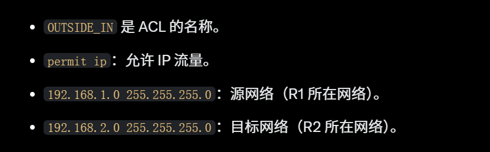
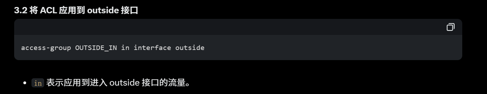
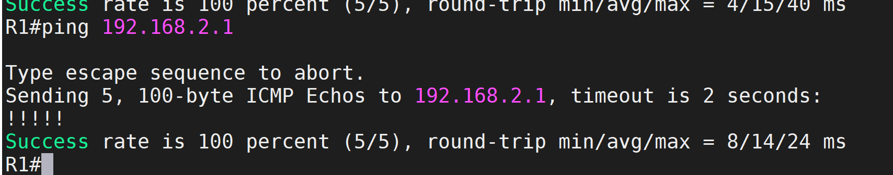
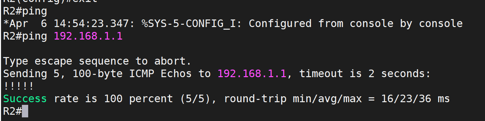

# 1. 拓扑图



# 2.Cisco ASA 使用“安全级别”（Security Level）来控制流量，默认规则是高安全级别到低安全级别的流量可以自动通过，反之需要显式允许。

### ASA

```SH
interface GigabitEthernet0/0
 nameif outside
 security-level 0
 ip address 192.168.1.2 255.255.255.0
 no shutdown
```

```SH
interface GigabitEthernet0/1
 nameif inside
 security-level 100
 ip address 192.168.2.2 255.255.255.0
 no shutdown
```

### R1

```SH
enable
configure terminal
interface FastEthernet0/0
 ip address 192.168.1.1 255.255.255.0
 no shutdown
```

### R2

```SH
enable
configure terminal
interface FastEthernet0/0
 ip address 192.168.2.1 255.255.255.0
 no shutdown
```

# 3. 设置默认路由让 R1 和 R2 通：2.1 在 ASA1 上配置默认路由，通常，ASA 的外部接口（outside）会有一条默认路由指向外部网关。这里我们简化场景，假设 R1 是外部网络的代表：

```sh
route outside 0.0.0.0 0.0.0.0 192.168.1.1
```

### R1

```sh
ip route 0.0.0.0 0.0.0.0 192.168.1.2
```

### R2

```sh
ip route 0.0.0.0 0.0.0.0 192.168.2.2
```



# 4. 配 ACL

```sh
access-list OUTSIDE_IN extended permit ip 192.168.1.0 255.255.255.0 192.168.2.0 255.255.255.0
```



### 将 ACL 应用到 outside 接口

```sh
access-group OUTSIDE_IN in interface outside
```



### 测试连通性



