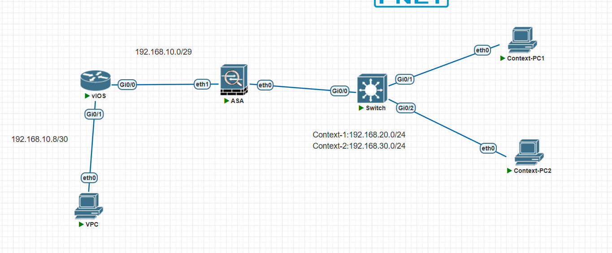

# cisco ASA: show mode 显示默认是单模式

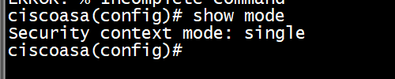

# cisco ASA: mode multiple 切换模式，确认后会重启

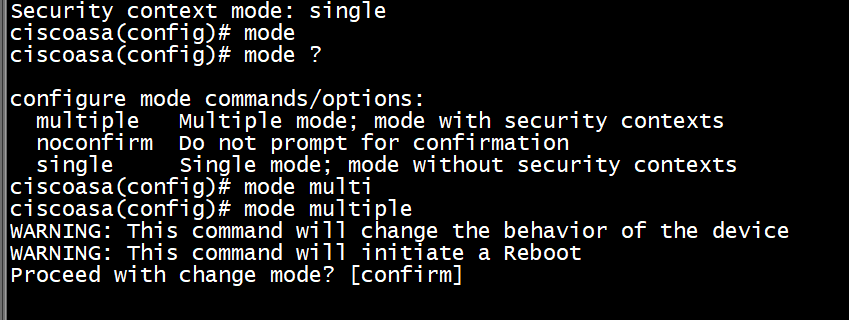
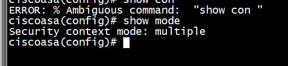

# ASA: show context 看，当下有一个默认的 context

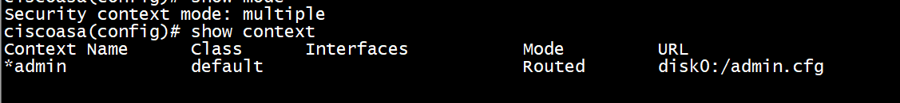

# ASA: context context1,config-url disk0:/context1.cfg

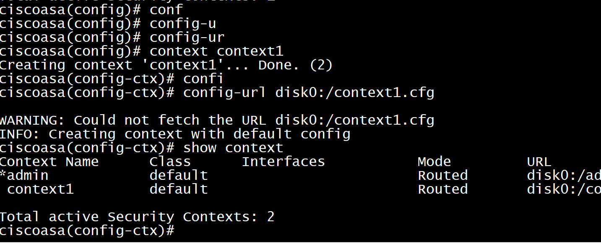

# 加上 allocate interface eth0 后，看加上的端口情况

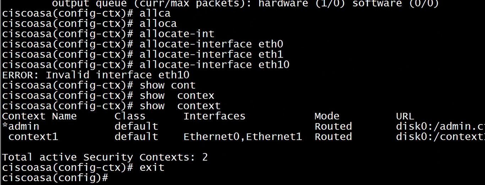

# 创建 context2

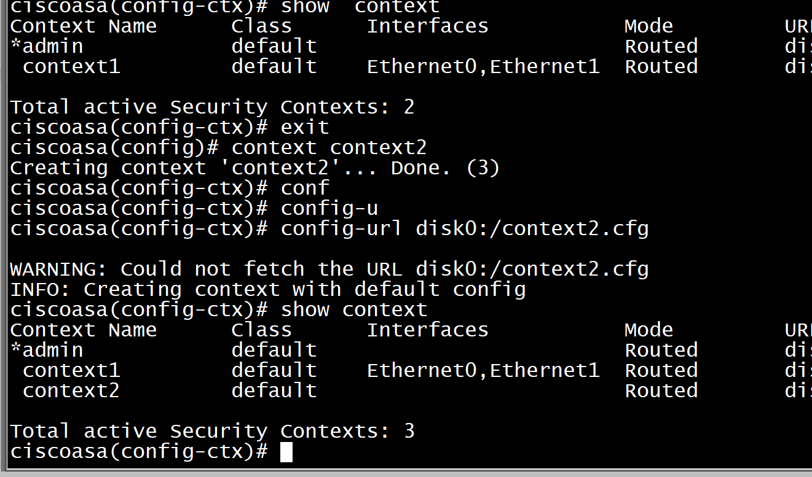
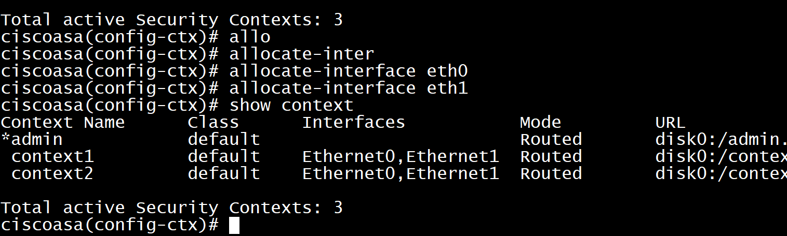

# 创建好后，changeto context context1

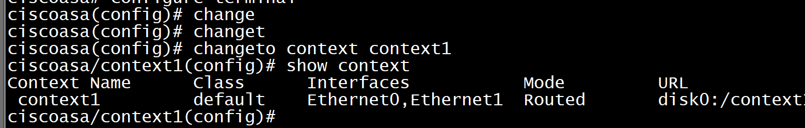

## 配下 inside

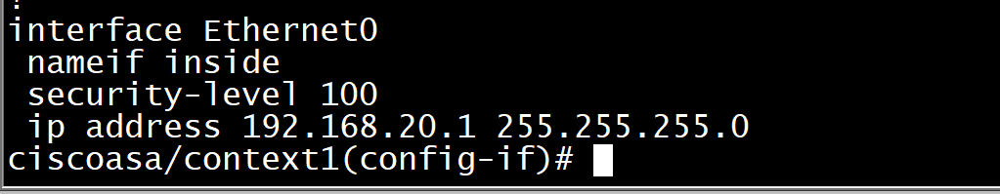

# changeto context context2 切换到 context2

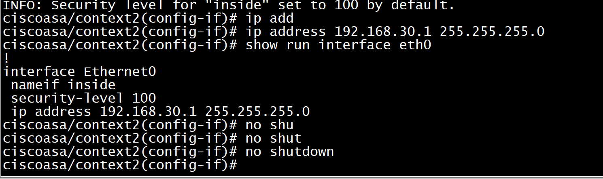

# 检查一下 mac 地址，发现 mac 地址一样

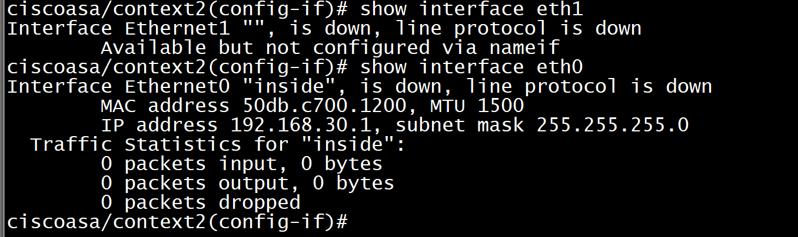
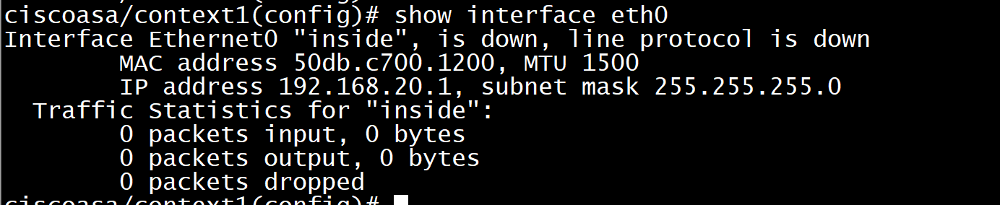

# changeto system

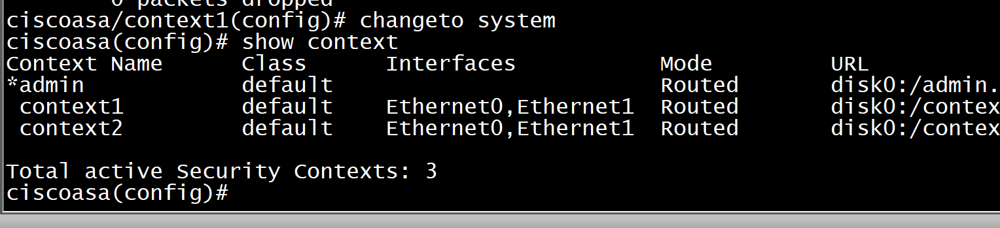

# 改了 mac 地址前缀后，发现 mac 地址自动不一样了

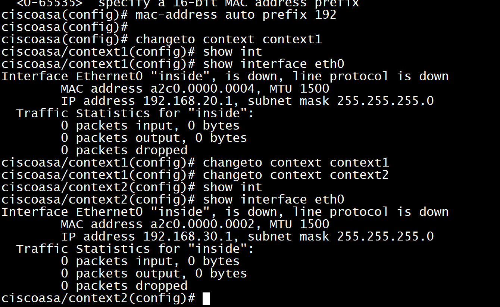

# 改 eth1 在不同 context 的地址

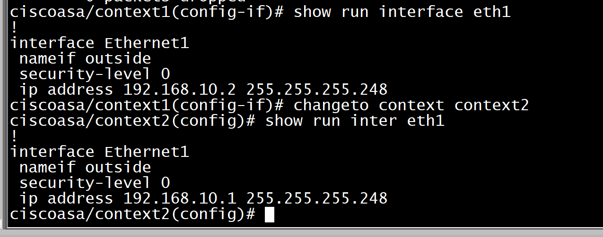

# 最后在 system 视图看下配置

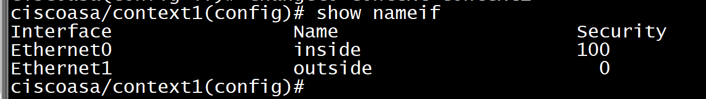
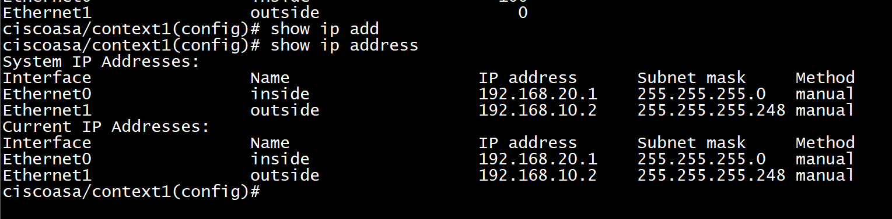
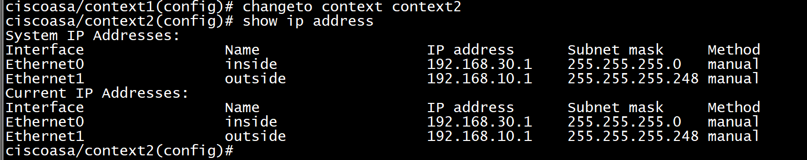

# 给两台 pc 配 ip

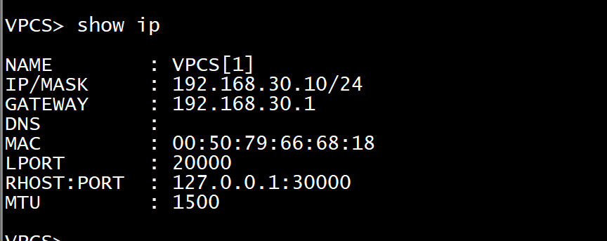

# 给路由器配 ip

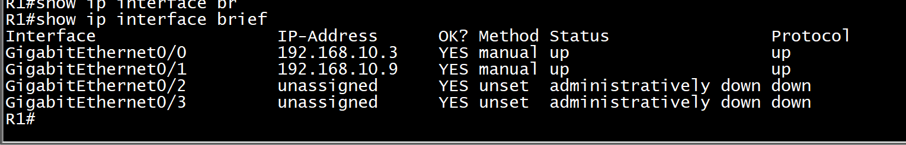
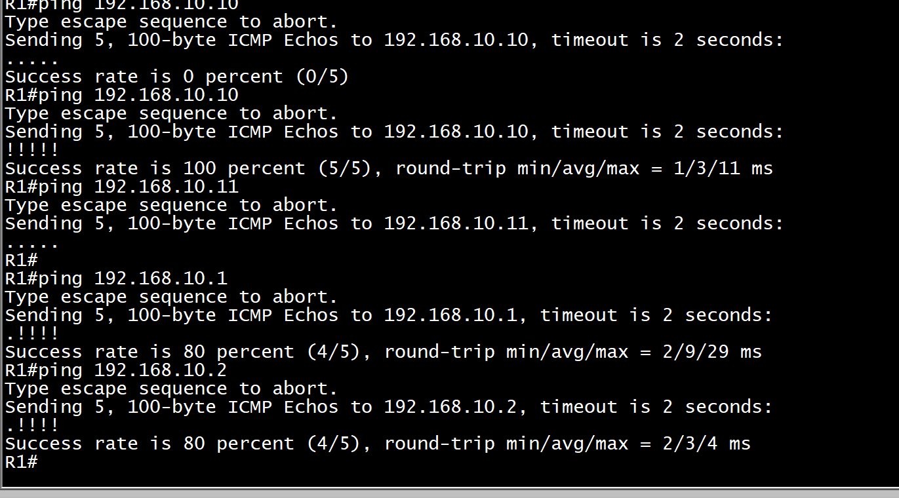

# asa 的 context2 中看 route

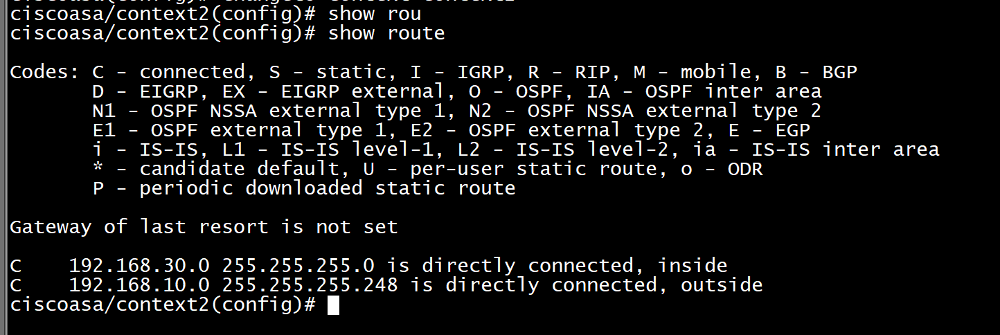

# 在 R1 上写 route

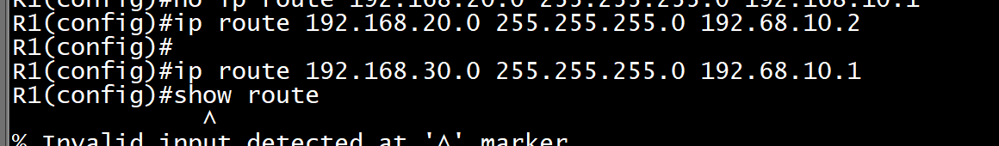
