<h1 align="center">DHCP侦听Snooping实验</h1>
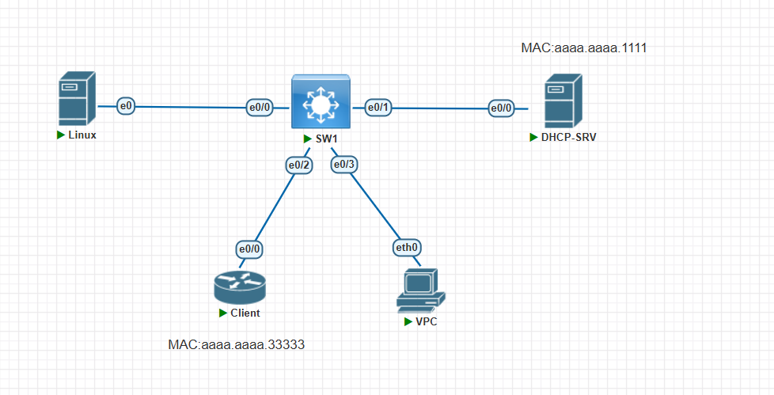

# 配置 server 和 client 的地址分配

## `server`

```sh
enable
configure terminal
hostname DHCP-SRV
interface Ethernet0/0
 mac-address aaaa.aaaa.1111
 ip address 192.168.1.1 255.255.255.0
 no shutdown
exit
ip dhcp excluded-address 192.168.1.1 192.168.1.100
ip dhcp pool TEST
 network 192.168.1.0 255.255.255.0
end
write memory
```

## `client`

```sh
enable
configure terminal
hostname Client
interface Ethernet0/0
 mac-address aaaa.aaaa.3333
 no shutdown
 no ip address
 ip address dhcp
end
write memory
```

## 配完后`show ip dhcp binging`查看是否分配了地址

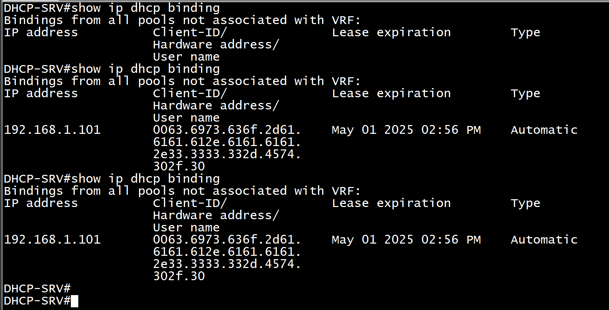
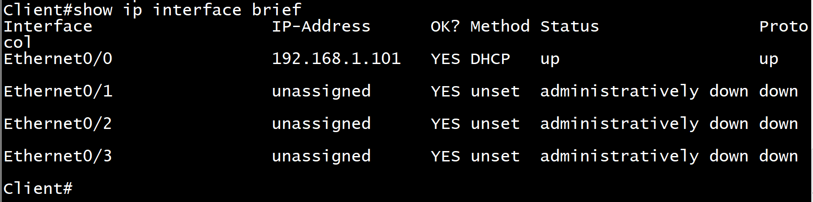
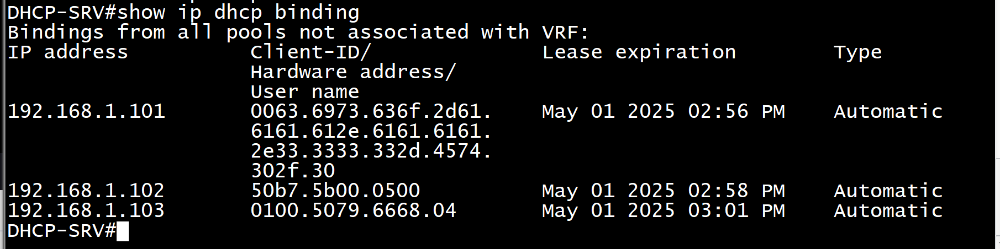

# `Kali`中`yersinia -G`打开 DHCP 渗透测试工具

## 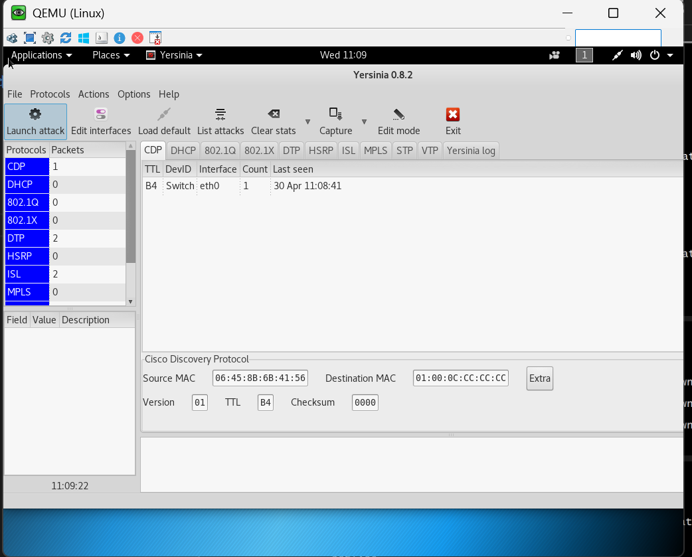

## 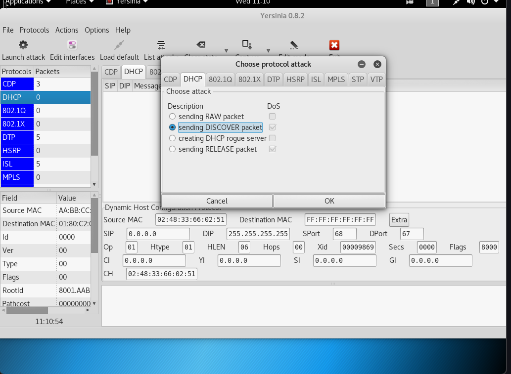

## 可以看到攻击后 DHCP-SRV 的地址

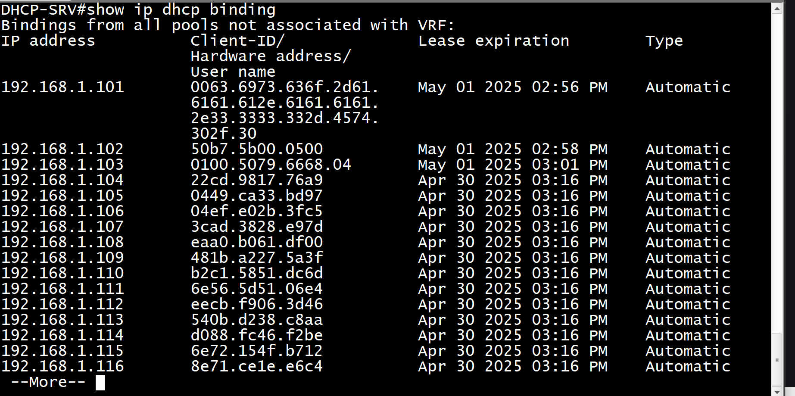

# 在 SW 上配置 Dhcp snooping

## `SW1`

```sh
enable
configure terminal
hostname SW1
no ip dhcp snooping information option
ip dhcp snooping
ip dhcp snooping vlan 1
interface Ethernet0/1
 ip dhcp snooping trust
 no ip dhcp snooping information option
 ip dhcp snooping limit rate 100
exit
interface range Ethernet0/0 , Ethernet0/2
 ip dhcp snooping limit rate 20
end
write memory
```

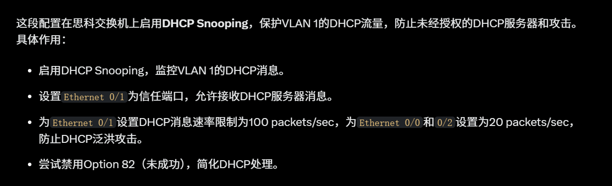

## 清一下 DCHP-SRV 的配置 `clear ip dhcp binging *`

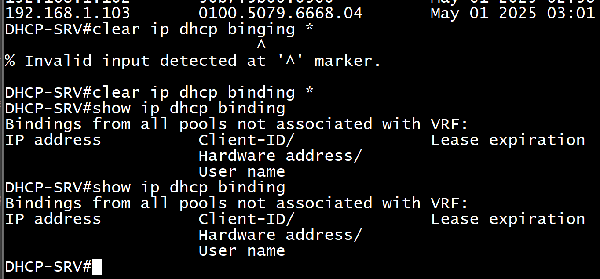

## 再在 PC 和 Client 上 dhco 一下，在 SW 上`show ip dhcp snooping binding`查看侦听情况，在 SW 上`show ip dhcp snooping`看一下`信任口和不信任口`

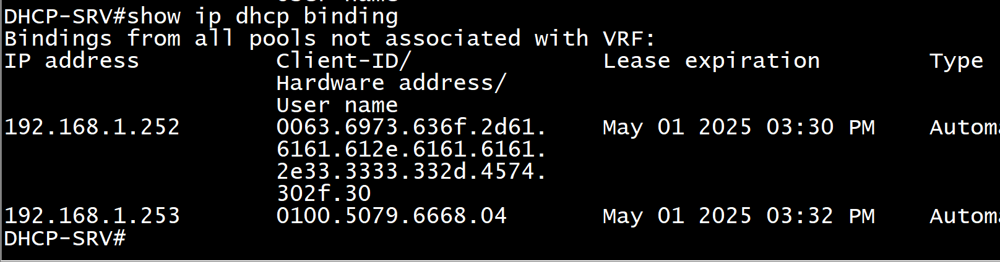
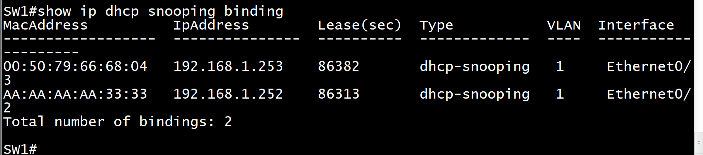
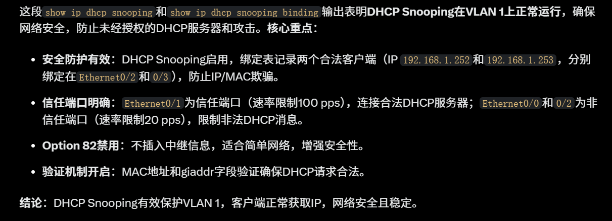

## 通过`show ip dhcp snooping statistics`检查下 dhcp 包的情况

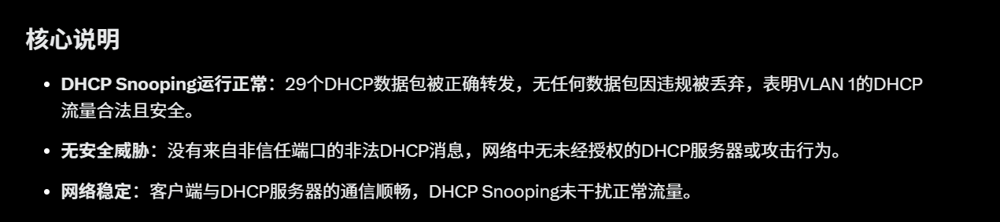
