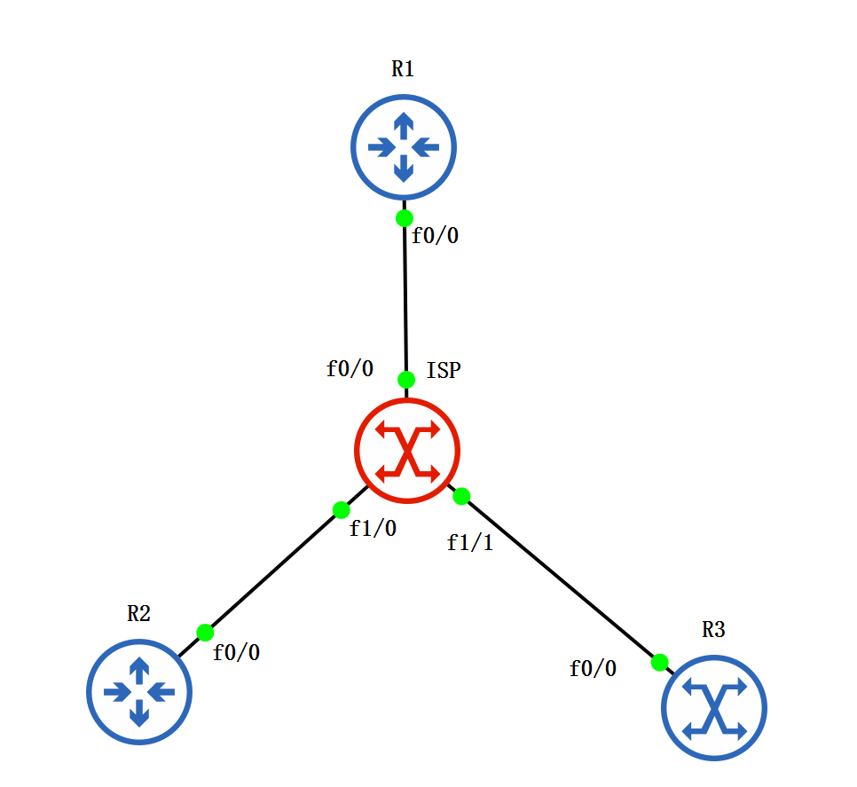
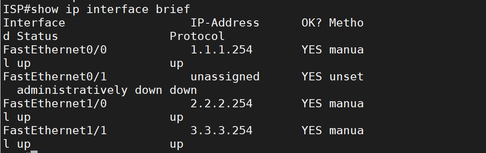
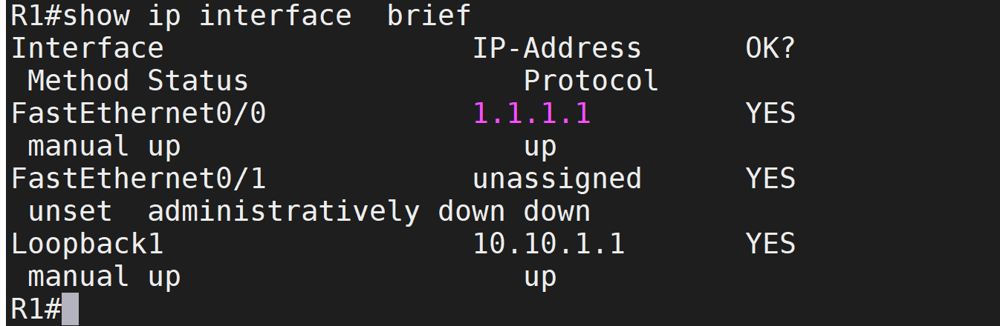
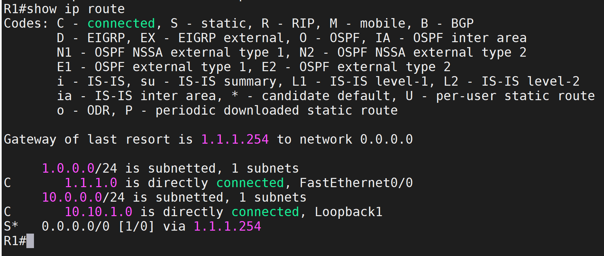
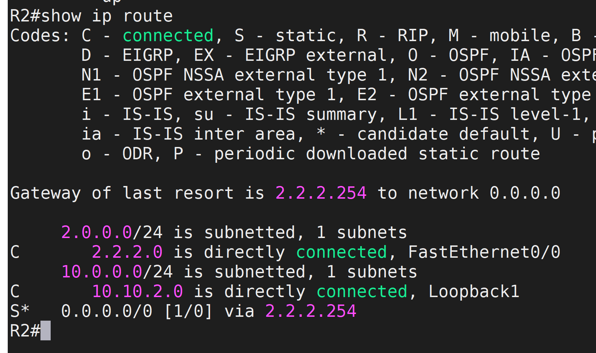
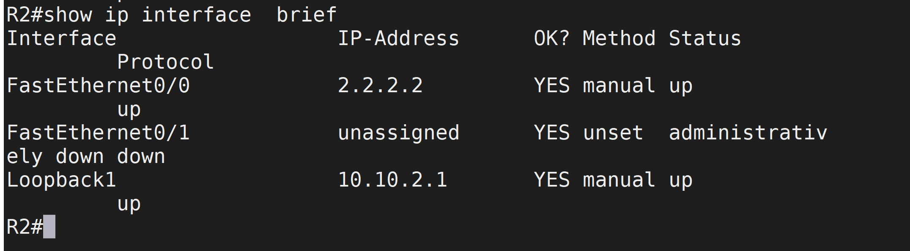
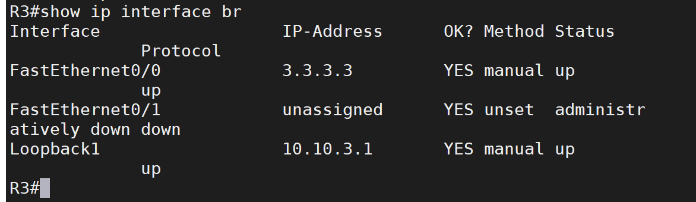
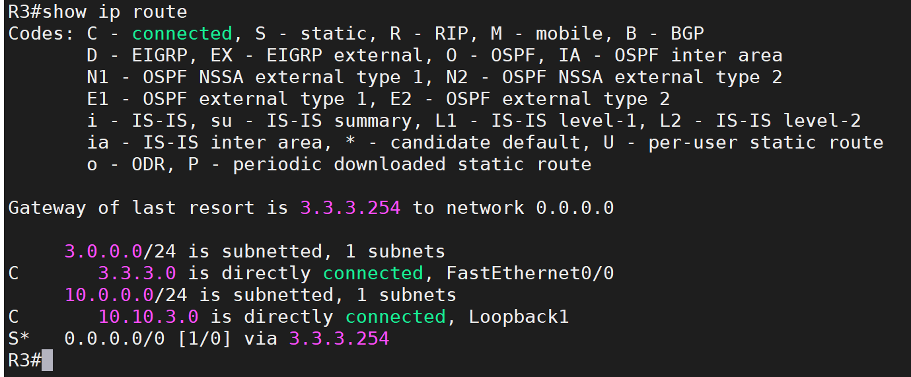
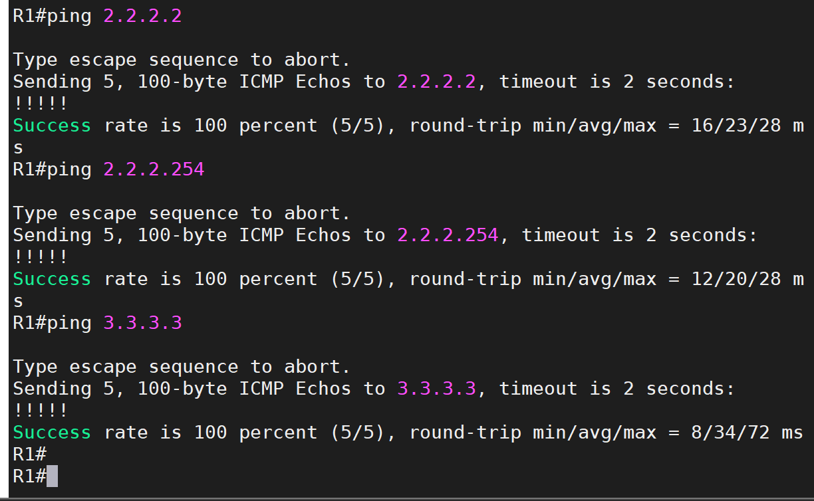

# 实验有问题

# 1. 拓扑图



# 2. 配接口

### ISP

```SH
interface f0/0
 ip add 1.1.1.254 255.255.255.0
 no shutdown
interface f1/0
 ip add 2.2.2.254 255.255.255.0
 no shutdown
interface f1/1
 ip add 3.3.3.254 255.255.255.0
 no shutdown
```



### R1

```sh
interface f0/0
 ip add 1.1.1.1 255.255.255.0
 no shutdown
interface loopback1
 ip add 10.10.1.1 255.255.255.0
 no shutdown
ip route 0.0.0.0 0.0.0.0 1.1.1.254
```




### R2

```sh
interface f0/0
 ip add 2.2.2.2 255.255.255.0
 no shutdown
interface loopback1
 ip add 10.10.2.1 255.255.255.0
 no shutdown
ip route 0.0.0.0 0.0.0.0 2.2.2.254
```




### R3

```sh
interface f0/0
 ip add 3.3.3.3 255.255.255.0
 no shutdown
interface loopback1
 ip add 10.10.3.1 255.255.255.0
 no shutdown
ip route 0.0.0.0 0.0.0.0 3.3.3.254

```




### 全网通



# 3. Phase 1 的配置？

### `R1`：hub

```sh
interface Tunnel 0
 ip address 192.168.1.1 255.255.255.0
 no ip redirects
 tunnel mode gre multipoint
 tunnel source f0/0
 ip nhrp authentication vpn
 ip nhrp map multicast dynamic
 ip nhrp network-id 1

```

### `R2`:spoke

```sh
interface tunnel 0
 ip address 192.168.1.2 255.255.255.0
 ip nhrp authentication vpn
 ip nhrp map 192.168.1.1 1.1.1.1
 ip nhrp map multicast 1.1.1.1
 ip nhrp network-id 1
 ip nhrp nhs 192.168.1.1
 tunnel source f0/0
 tunnel destination 1.1.1.1

```

### `R3`:spoke

```sh
interface tunnel 0
 ip address 192.168.1.3 255.255.255.0
 ip nhrp authentication vpn
 ip nhrp map 192.168.1.1 1.1.1.1
 ip nhrp map multicast 1.1.1.1
 ip nhrp network-id 1
 ip nhrp nhs 192.168.1.1
 tunnel source f0/0
 tunnel destination 1.1.1.1

```

# 4. EIGRP 路由配置
