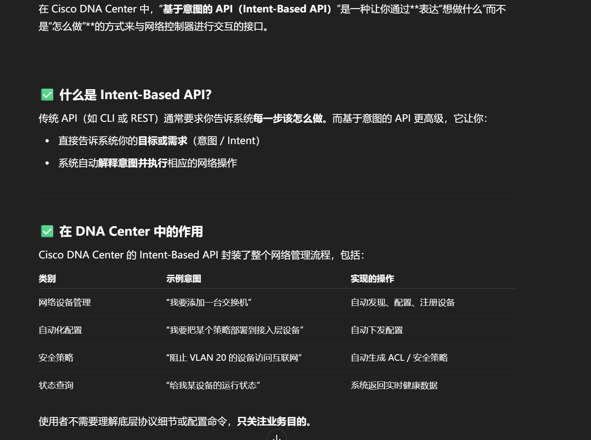
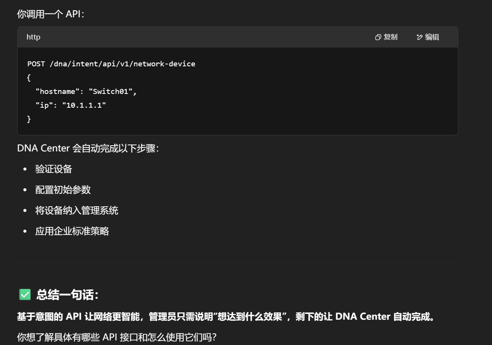

如何理解DNA通过API控制

你这个问题问得很好，很有网络自动化思维！

简单直接告诉你，理解“**Cisco DNA 主要是通过 API 控制的**”，可以这样把握：

---

### ✅ 核心理解一句话

> **Cisco DNA Center 本身就是一个平台，开放了大量 API，供其他系统、脚本、运维工具来调用，去控制网络设备和管理网络策略。**

也就是说，**DNA Center 自己不直接登录设备发命令**，而是通过自己提供的一整套标准化 API，别人调用它，它再统一管理下面的设备。

---

### 🛠️ 举个通俗的例子

如果以前你想让交换机做 VLAN 配置：

- 传统方式：运维人员用 SSH 登进去，敲 `conf t`，`vlan 10`，`name xxx` 这样一条条手动配。
- DNA 时代：运维人员调用 DNA Center 的 API，比如 `POST /dna/intent/api/v1/vlan`，发一条 JSON 格式的请求给 DNA Center，让它自己去帮你下发到设备上。

所以，**DNA Center 相当于是中控 + 翻译器 + 管理器**，你只要和 DNA 交互（通过 API），不用直接去和底下的设备打交道了。

---

### ✅ 为什么要这么设计？

| 原因                                            | 解释                                                                              |
| ----------------------------------------------- | --------------------------------------------------------------------------------- |
| **简化管理**                                    | 统一标准化入口，减少设备种类差异（不同型号的 CLI 命令不同，API 隐藏了这些差异）。 |
| **自动化集成**                                  | 可以很方便地让 DNA Center 集成到 CI/CD 流程、自动化脚本、网管平台里。             |
| **支持意图驱动网络（Intent-Based Networking）** | 你告诉 DNA 想要什么“目标”（比如启用某条策略），它自己帮你完成设备配置。           |
| **更易扩展和二次开发**                          | 开发者可以基于 DNA API 做自己的定制化运维工具或者监控仪表板。                     |

---

### ✅ 小总结

| 问题                         | 答案                                                   |
| ---------------------------- | ------------------------------------------------------ |
| **Cisco DNA 怎么控制网络？** | 通过开放标准化的 API 接口，由 API 调用去控制网络设备。 |
| **好处？**                   | 自动化、标准化、减少人手、支持大规模部署。             |

---

要不要我再顺便给你列一小部分 DNA Center API 的例子？比如设备发现、VLAN 配置、Path Trace？看你需不需要深入一点。要的话我可以直接贴接口示例！🚀
要不要继续？

# 什么是基于意图的 API（intent-based api)

