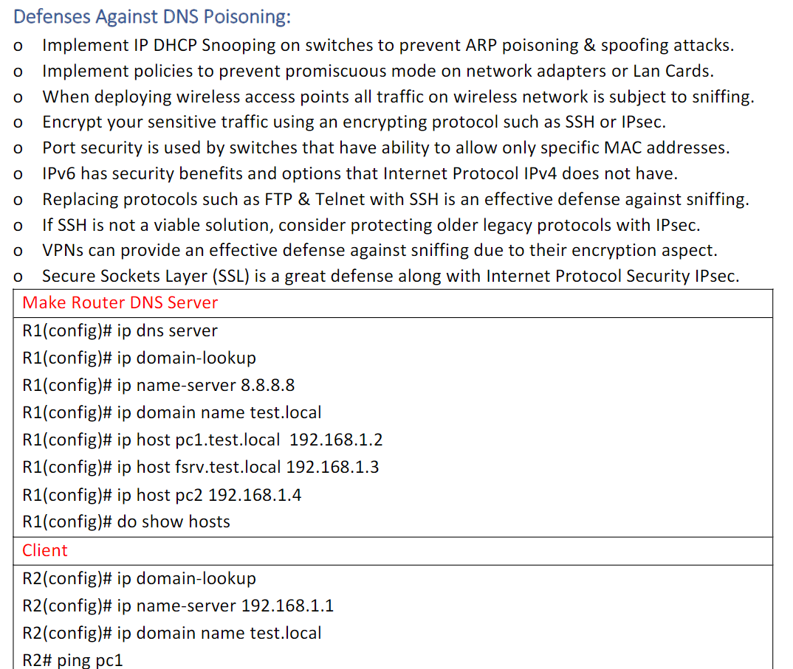
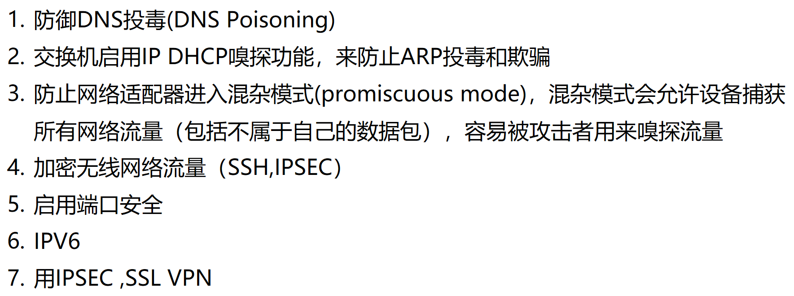
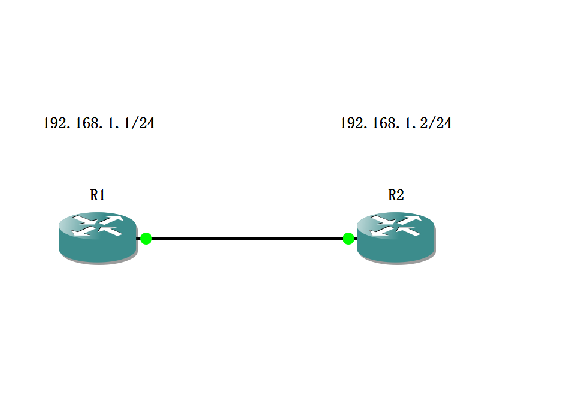
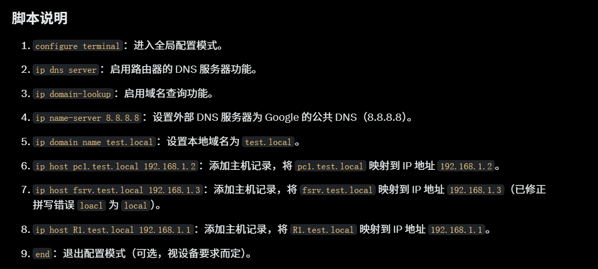
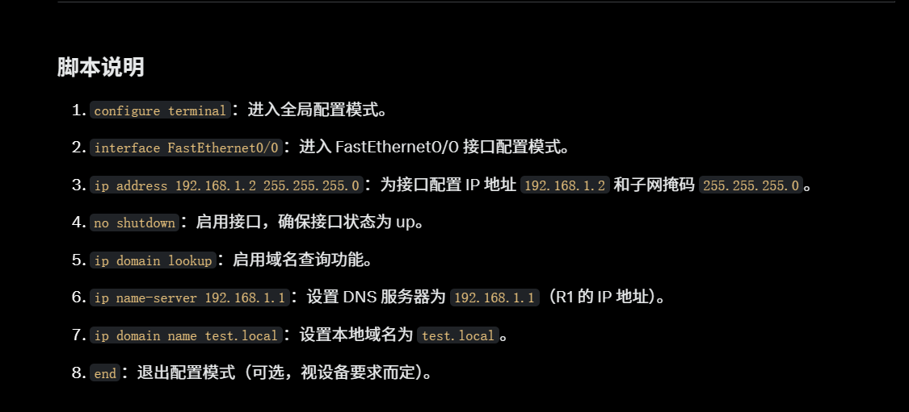

# 实验



### R1

```sh
configure terminal
ip dns server
ip domain-lookup
ip name-server 8.8.8.8
ip domain name test.local
ip host pc1.test.local 192.168.1.2
ip host fsrv.test.local 192.168.1.3
ip host R1.test.local 192.168.1.1
end
```



### R2

```sh
configure terminal
interface FastEthernet0/0
ip address 192.168.1.2 255.255.255.0
no shutdown
ip domain lookup
ip name-server 192.168.1.1
ip domain name test.local
end
```


