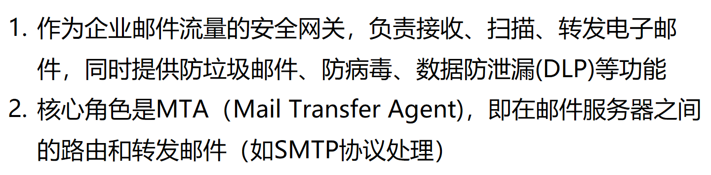

# Cisco ESA（Email Security Appliance)

# DLP（Data Loss Prevention）数据泄露防护？

什么是DLP

Cisco ESA（Email Security Appliance）中的 **DLP** 功能指的是：

> **Data Loss Prevention（数据泄露防护）**

---

### 📌 Cisco ESA 的 DLP 功能作用：

**防止敏感信息通过电子邮件外泄。**

比如：

- 客户个人信息（如身份证号、信用卡号）
- 公司机密文档（如财务报表、研发资料）
- 医疗记录（HIPAA）
- 符合 GDPR、PCI-DSS、SOX 等法规的数据

---

### 🔍 DLP 的主要功能包括：

1. **预定义策略模板**：

   - Cisco 提供了大量内建的法规合规模板，如：
     - PCI DSS（支付卡行业）
     - HIPAA（医疗）
     - GLBA（金融）
     - GDPR（欧盟隐私）
   - 管理员可以直接启用使用。

2. **自定义策略**：

   - 支持管理员自定义规则，如：
     - 邮件主题/正文包含某关键词
     - 附件文件类型匹配
     - 正则表达式匹配（如身份证号、邮箱、关键字）

3. **动作处理（Actions）**：

   - 拦截（drop）
   - 加密（和 Cisco CRES 集成）
   - 替换或警告
   - 报告或告警

4. **内容扫描引擎**：
   - 使用 Cisco 的内容分析引擎，对邮件的正文和附件内容做深度检测。
   - 可扫描多种格式，如 PDF、Word、Excel、ZIP 等。

---

### ✅ 使用场景举例：

- 防止员工误把包含客户资料的 Excel 表格发到外部邮箱
- 自动加密发送含有信用卡号的邮件
- 阻止含有“Confidential”标记的文档被发往非公司域名

---

如果你想知道 ESA DLP 是怎么配置的，我也可以给你列一下操作步骤。你是正在准备 CCIE Security 或使用 ESA 做实际部署？

