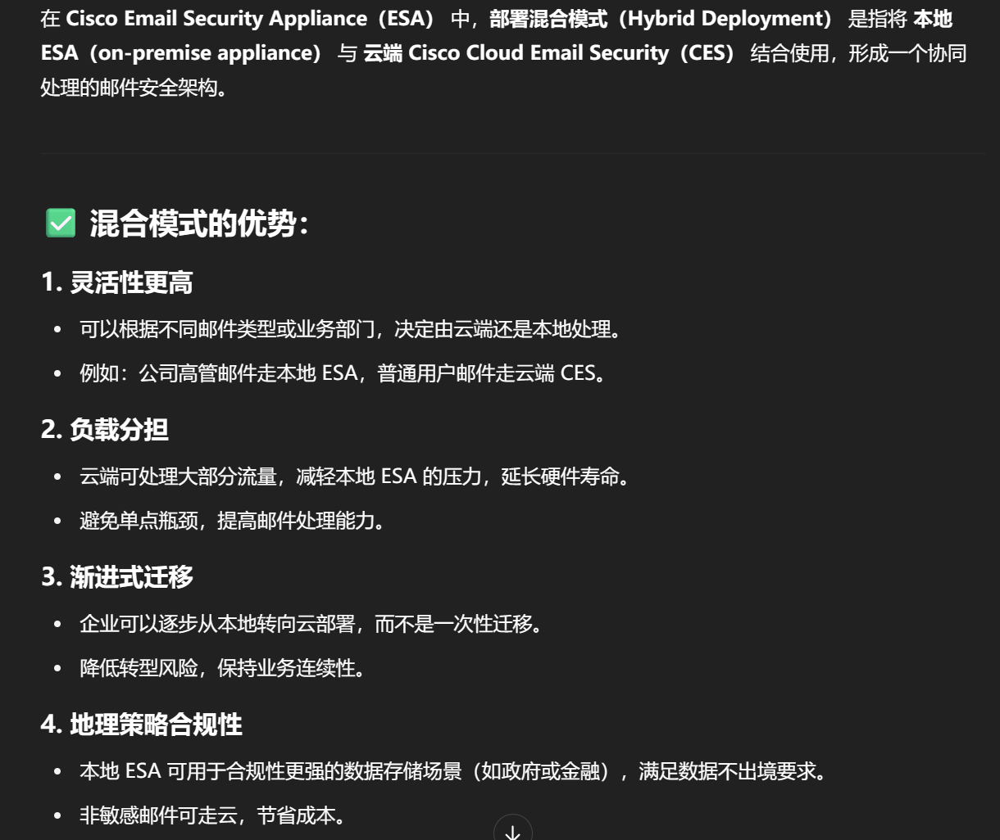
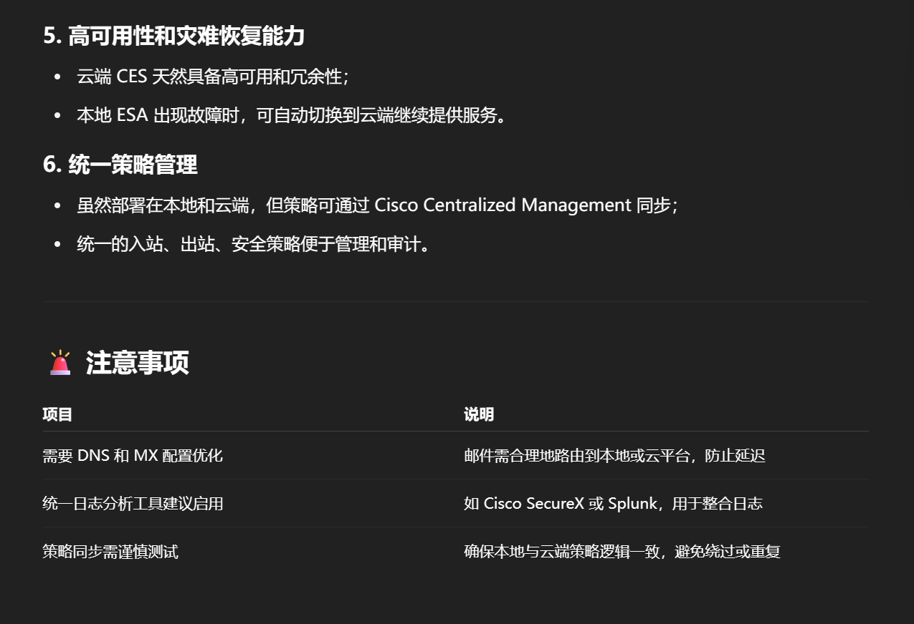
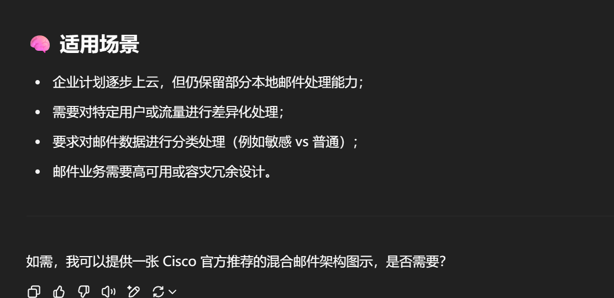

非常专业的问题！我们来详细解释一下：

---

## ✅ 什么是 ESA 的“混合模式”（Hybrid Mode）？

**Cisco ESA 的“混合模式”** 是指将 Cisco ESA 同时部署在本地（on-premises）与云端（cloud），**协同工作来处理邮件安全**，从而结合两种部署方式的优点。

---

## 🎯 混合模式的作用和优势：

| 功能点          | 混合模式的优势                                                                                 |
| --------------- | ---------------------------------------------------------------------------------------------- |
| ☁️ 云端快速过滤 | 第一层由 Cisco Cloud Email Security (CES) 在云端过滤，拦截大量垃圾邮件、恶意邮件，减少本地流量 |
| 🖥️ 本地高级策略 | 第二层交由本地 ESA 处理，如 Data Loss Prevention（DLP）、加密、合规检查、本地用户策略          |
| 🔁 流量优化     | 减轻本地 ESA 负载，延长硬件寿命                                                                |
| 🔒 更高安全性   | 多重过滤机制：云端过滤 + 本地深度检测（如 AMP、URL Filtering）                                 |
| 🔄 灾备灵活     | 云服务不中断，保障邮件流动性和连续性                                                           |

---

## 🧩 混合模式是怎么工作的？

1. 邮件先由 Cisco Cloud Email Security（CES）进行第一层过滤
2. 清洗过的邮件再投递到本地 ESA
3. 本地 ESA 做更细粒度的策略控制（合规、DLP、加密等）
4. 然后再送给内部邮件服务器（如 Microsoft Exchange）

---

## 🏗️ ESA 支持的几种部署模式对比：

| 模式                        | 描述                                                  | 优势                               | 适用场景                           |
| --------------------------- | ----------------------------------------------------- | ---------------------------------- | ---------------------------------- |
| **Cloud Only（纯云模式）**  | 全部由 Cisco Cloud Email Security（CES） 处理邮件安全 | 无需本地硬件，部署快，弹性高       | 中小型企业或无本地服务器需求       |
| **On-Premises（本地部署）** | ESA 部署在本地机房，通过 SMTP 网关接收/发送邮件       | 可自定义复杂策略，集成现有基础设施 | 安全合规严格，需本地控制权         |
| **Hybrid（混合模式）**      | 云端 CES 做初步过滤，本地 ESA 做深度策略控制          | 兼具云端弹性与本地控制力           | 企业需要云效率又不愿丧失策略灵活性 |

---

## 🎯 总结一句话：

> ESA 的 **混合模式** 是一种 **云端初步过滤 + 本地深入处理** 的部署方式，结合云服务的弹性与本地策略的可控性，适合对邮件安全、合规性要求较高的中大型企业。

---

如果你在准备部署设计文档、考试复习或产品对比，我可以帮你画出 3 种部署模式的架构图，要我帮你整理一下图示吗？

# 混合模式的优势主要是什么？

