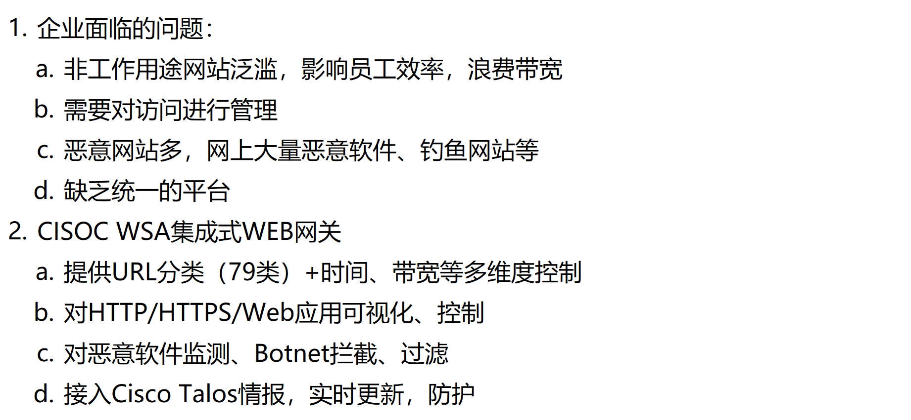
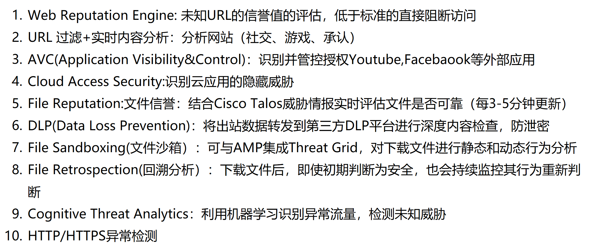

# 为什么要部署 WSA？

# WSA 的核心功能？

# WSA 的代理（部署）模式？

分为两种模式

这段内容介绍的是 **Cisco WSA（Web Security Appliance）的两种部署模式：Explicit Mode（显式代理）和 Transparent Mode（透明代理）**，以及它们的工作原理与部署特点。

---

### ✅ 一、**Explicit Mode（显式代理模式）**

**概念：**
显式模式下，**客户端明确知道代理服务器的存在**，并将所有的 Web 请求主动发给代理设备（WSA）。

**特点总结：**

| 特点             | 说明                                                                                                            |
| ---------------- | --------------------------------------------------------------------------------------------------------------- |
| 客户端需配置     | 每台终端都需要手动或自动设置代理地址（IP/端口）。可使用 PAC 脚本或 WPAD 自动发现。                              |
| 请求流程         | 用户请求 → 浏览器将请求发送给 WSA → WSA 根据策略判断放行或阻止。                                                |
| 网络设备无须配置 | 路由器、交换机、ASA 等网络设备无需任何配置。                                                                    |
| 认证更简单       | 显式代理模式中用户身份认证配置和管理更简单。                                                                    |
| 配置方式         | 可通过：  - 手动设置代理服务器地址  - PAC（Proxy Auto-Config）脚本  - WPAD（Web Proxy Auto-Discovery） |

---

### ✅ 二、**Transparent Mode（透明代理模式）**

**概念：**
在透明模式下，**客户端无需感知代理的存在**，由网络设备将 Web 流量重定向至 WSA 进行检测与控制。

**特点总结：**

| 特点                 | 说明                                                                                                                |
| -------------------- | ------------------------------------------------------------------------------------------------------------------- |
| 客户端无需配置       | 终端用户无需任何代理设置，用户认为自己在直接访问网站。                                                              |
| 网络设备需支持重定向 | 要在防火墙（如 ASA）、路由器（如 ASR）、或交换机上配置 WCCP（Web Cache Communication Protocol）或 PBR（策略路由）。 |
| 请求流程             | 用户请求 → 网络设备重定向流量 → WSA 分析后决定放行或阻止。                                                          |
| 重定向方式           | - WCCP：主流方式，适用于 Cisco 设备  - PBR：策略路由方式  - In-line：WSA 部署在数据路径中，无需额外重定向     |
| 优点                 | 部署便捷，用户无感知；适用于无法或不方便配置客户端代理的场景。                                                      |

---

### 📌 总结对比：

| 对比项               | 显式代理（Explicit） | 透明代理（Transparent）        |
| -------------------- | -------------------- | ------------------------------ |
| 客户端是否需配置代理 | 是                   | 否                             |
| 网络设备是否需配置   | 否                   | 是（需 WCCP/PBR）              |
| 用户是否感知代理     | 感知                 | 无感知                         |
| 是否适合大规模环境   | 一般                 | 更适合大规模或 BYOD 环境       |
| 认证管理复杂度       | 较低，易于集成       | 相对复杂，需要额外处理认证策略 |

---

是否需要我进一步为你画一张部署对比示意图？

