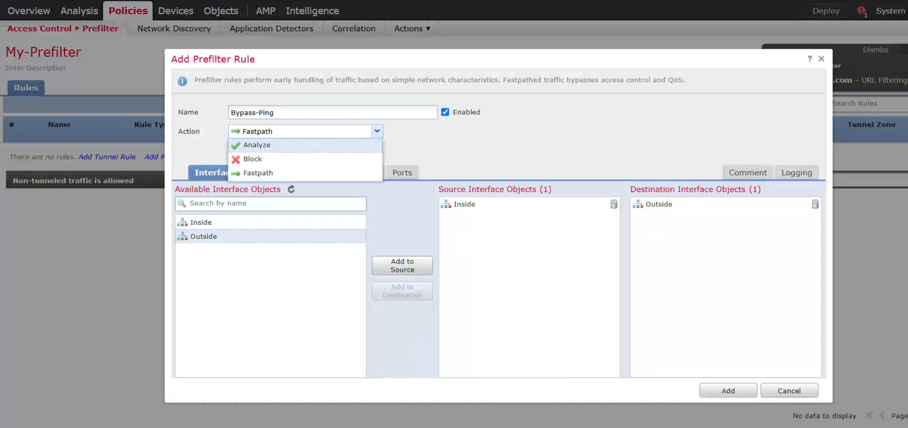

你给出的这段是介绍 **Cisco Firepower Threat Defense (FTD)** 中 **Pre-Filter Policy（预过滤策略）** 的内容，我来用简明扼要的方式解释它的作用和结构：

---

## 🔍 什么是 Pre-Filter Policy？

**Pre-Filter Policy 是 FTD 中访问控制流程的第一步（可选）**，它的主要作用是用来**快速匹配并决定某些流量的去留**，从而节省后续的处理资源。

### 🧠 特点总结：

| 特性                | 说明                                                   |
| ------------------- | ------------------------------------------------------ |
| ⏩ **执行位置**     | 在 Access Control Policy（ACP）之前执行。              |
| ⚡ **处理效率高**   | 不进行深度检测（无 Snort 引擎参与），执行快。          |
| ✅ **匹配条件简单** | 仅匹配第 2 ～ 4 层信息（如 IP、端口、Zone、VLAN 等）。 |
| 🧱 **规则类型**     | 包括 **Prefilter Rules** 和 **Tunnel Rules**。         |
| 🔄 **匹配失败时**   | 流量会继续进入 ACP（进行深度检查）。                   |

---

## 🎯 Pre-Filter Policy 的三个动作（Action）

| 动作         | 说明                                                    |
| ------------ | ------------------------------------------------------- |
| **Analyze**  | 将流量交由 ACP 进一步分析（默认行为）。                 |
| **Block**    | 直接丢弃流量，不再进入 ACP，节省资源。                  |
| **Fastpath** | 直接允许流量通过，完全绕过 Snort 和 ACP，提高转发效率。 |

## 

## 📦 两种规则类型说明：

1. **Prefilter Rules**

   - 基于 L2-L4 匹配，如 IP、Zone、端口、VLAN Tag 等。
   - 用于直接处理普通的 L3/L4 流量。

2. **Tunnel Rules**

   - 用于识别并快速处理封装流量（如 GRE、IP-in-IP）。
   - 典型应用：你可能不希望对 VPN 封装流量做深入检查，直接 fastpath。

---

## 🛠 使用场景举例：

- 🎯 **允许 ICMP 流量进行网络测试**

  - ICMP 不需要深度检查，用 Fastpath 动作提升效率。

- 🔒 **快速丢弃特定国家的流量（基于 IP）**

  - Block 动作丢弃，不浪费资源去深入检测。

- 🚀 **VPN 隧道的 GRE/IPSec 封装流量**

  - 用 Tunnel Rule 设置 fastpath，加快处理。

---

## 🗺 配置路径：

在 FMC 中设置：

```
Policies → Access Control → Prefilter
```

你可以创建多个 Pre-Filter 策略，然后将它们与特定设备关联。

---

## ⚠️ 补充注意：

- 如果 **Pre-Filter 规则匹配成功**，且动作是 Block 或 Fastpath，则不会进入 ACP。
- 如果 **没有匹配任何规则**，则流量进入 ACP，由 Snort 引擎进行深入检测。

---

需要我帮你画个流程图展示 Pre-Filter 和 ACP 的关系吗？
