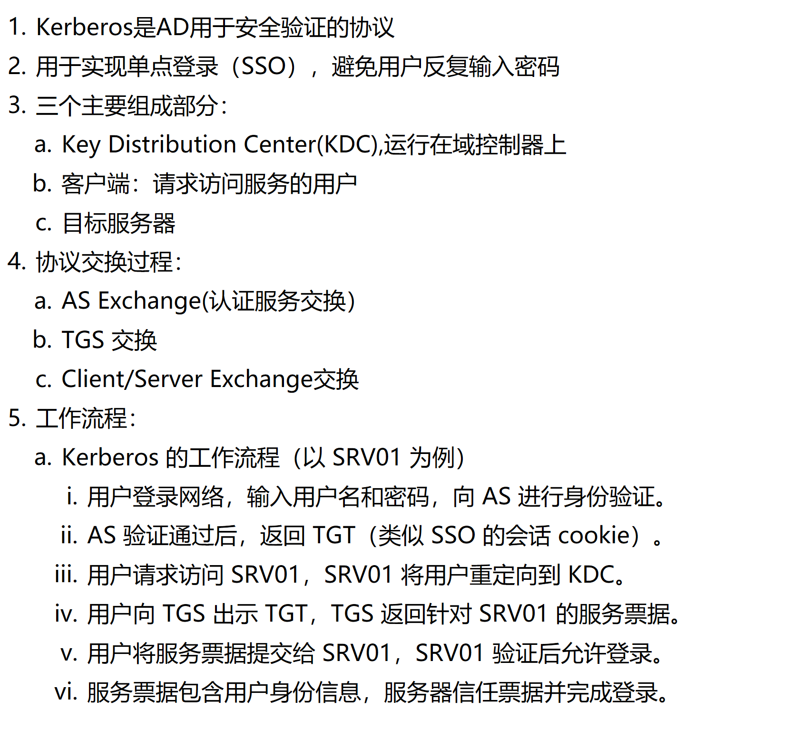
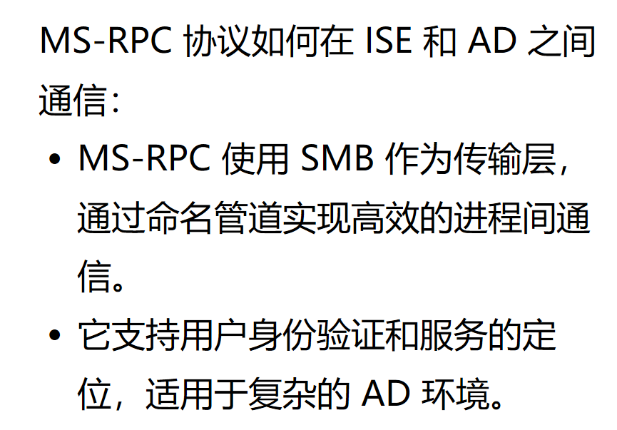

# 什么是 Kerberos 协议？

# 什么是 MS-RPC 协议

# AD 和 ISE 集成，实现安全的身份认证

这段内容旨在说明 ISE 如何与 AD 集成，以实现安全的身份验证、授权和域管理。它涵盖了以下几个关键方面：
协议：ISE 使用 LDAP（查询 AD 数据库）、Kerberos（身份验证和票据分发）、MS-RPC（创建和管理机器账户）与 AD 通信。

加入/离开 AD 域：ISE 如何通过域发现、DNS 查询、CLDAP 和 MS-RPC 加入 AD 域，以及离开域时的注意事项。

域控制器故障转移：当 DC 不可用时，ISE 如何自动切换到其他 DC，确保认证不中断。

全局编录（GC）：GC 在 AD 森林中存储所有对象的部分属性，便于跨域搜索。

用户/设备标识格式：AD 中用于认证的不同标识类型（如 SAM、UPN、SPN 等）。
