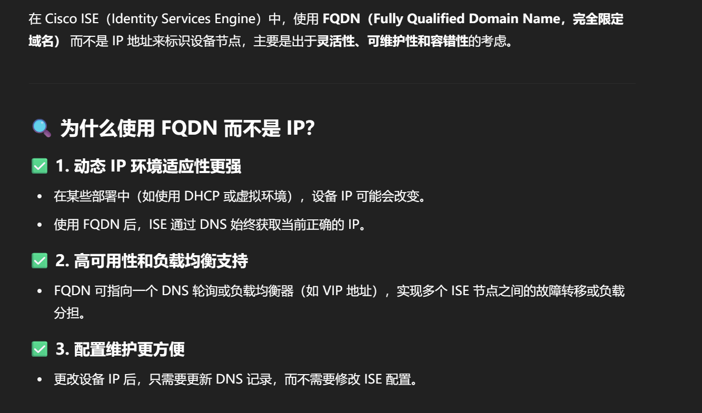
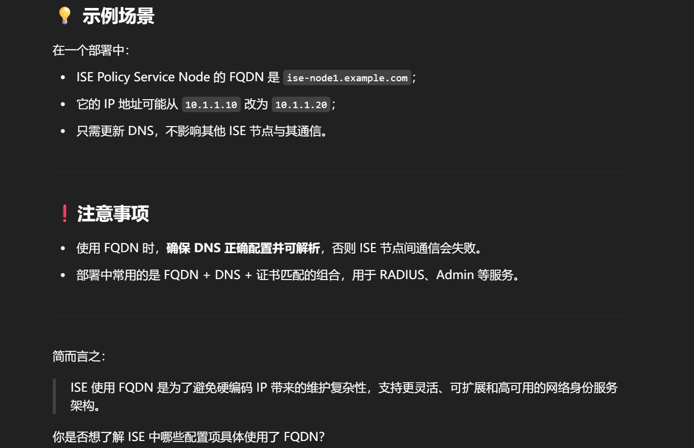

# 如何理解 ISE 设备通过 FQDN 而非 IP 标识节点？

在 Cisco ISE（Identity Services Engine）的实施中，**FQDN** 指的是：

> **Fully Qualified Domain Name（完全限定域名）**

---

### 🧩 举例说明：

- 普通主机名：`ise-server`
- FQDN：`ise-server.example.com`

FQDN 是指包含主机名 + 所属完整域名的名称，**在 ISE 环境中广泛用于以下场景**：

---

### 🧠 ISE 实施中 FQDN 的主要作用：

| 用途场景           | 说明                                                                                                               |
| ------------------ | ------------------------------------------------------------------------------------------------------------------ |
| **ISE 节点通信**   | 各个 ISE 节点（PAN、PSN、MnT）之间使用 FQDN 建立信任和通信（特别是通过 HTTPS 和证书）                              |
| **证书颁发与验证** | ISE 颁发/使用的 HTTPS 或 EAP 证书中，常常使用 FQDN 作为 **CN 或 SAN**，便于客户端验证身份                          |
| **客户端重定向**   | 客户端被重定向至 ISE 的 Web Portal（如 Guest Portal、BYOD Portal）时，URL 一般为 `https://guestportal.example.com` |
| **DNS 解析配置**   | ISE 需要正确配置 DNS，FQDN 才能被客户端或其他设备正确解析访问                                                      |
| **与外部系统集成** | 如 Active Directory、SAML IdP、SMTP 等系统集成时也经常使用 FQDN                                                    |

---

### ✅ 配置建议：

- ISE 安装部署前应：
  - 确保 DNS 正确解析 FQDN
  - 所有节点应使用 FQDN 注册到系统中，而不是 IP 地址
  - 证书签名请求（CSR）中应填写 FQDN，确保客户端验证时不会报错

---

### 🧠 总结一句话：

> 在 Cisco ISE 实施中，**FQDN 是身份标识、证书验证、重定向门户等功能的关键组成部分**，比 IP 更安全、更易管理，强烈建议使用。

如果你在部署 ISE 多节点集群或配置 portal 遇到 FQDN 问题，我也可以帮你梳理 DNS、证书或重定向配置，要不要一起看下？
