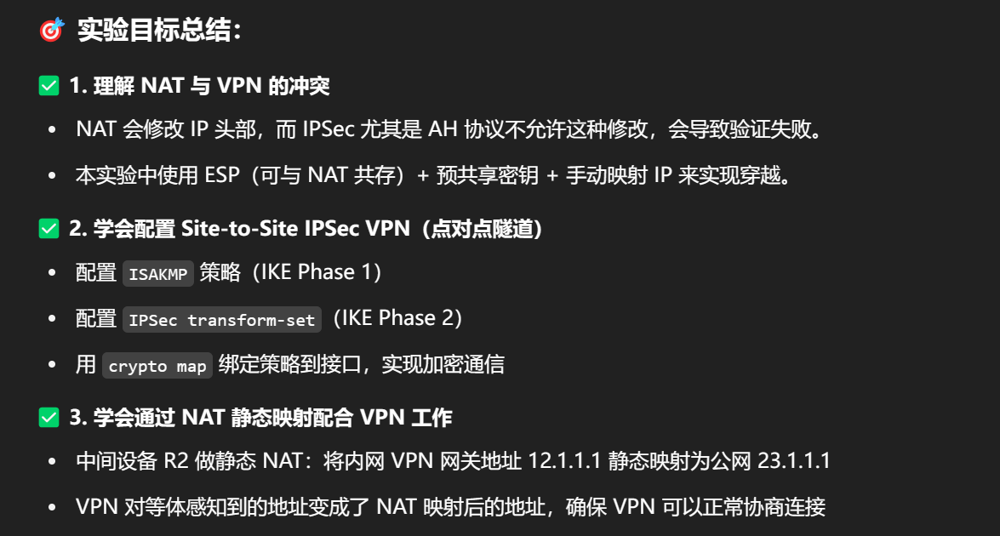
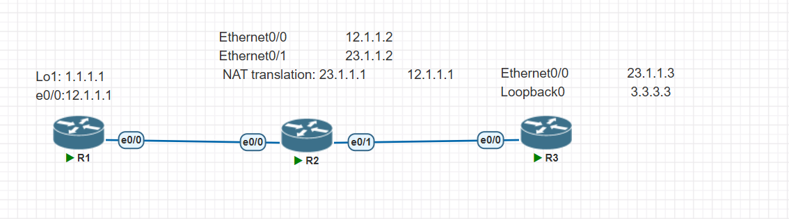
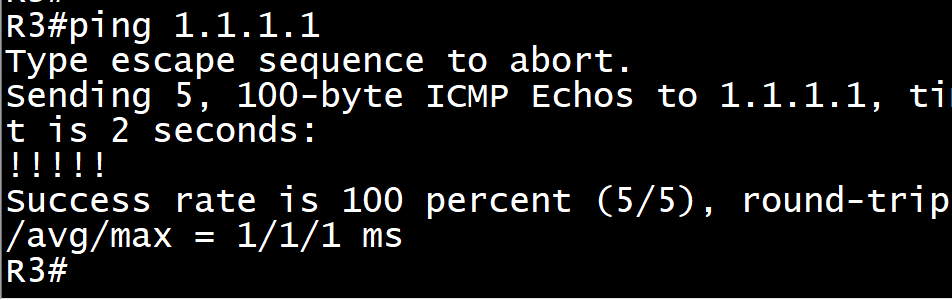
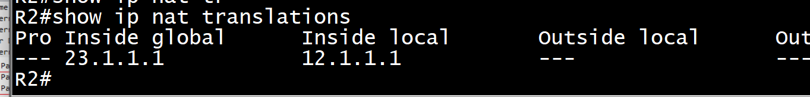
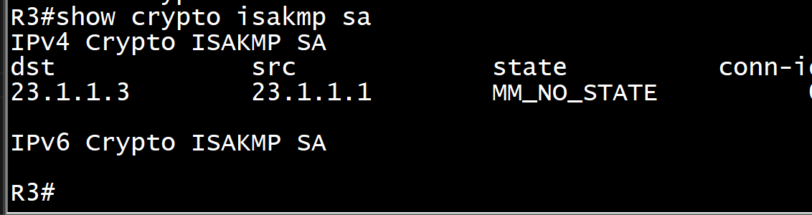
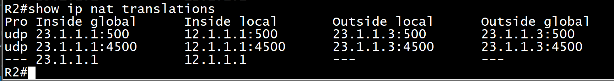
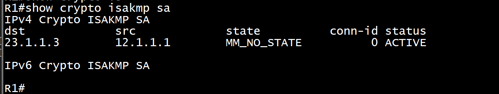

<h1>NAT穿越实验</h1>




# 配 IP

## R1

```sh
enable
configure terminal
no logging console
hostname R1
interface Ethernet0/0
 ip address 12.1.1.1 255.255.255.0
 no shutdown
exit
interface Loopback0
 ip address 1.1.1.1 255.255.255.255
 no shutdown
exit
ip route 0.0.0.0 0.0.0.0 12.1.1.2
end
write memory
```

## R2

```sh
enable
configure terminal
no logging console
hostname R2
interface Ethernet0/0
 ip address 12.1.1.2 255.255.255.0
 no shutdown
exit
interface Ethernet0/1
 ip address 23.1.1.2 255.255.255.0
 no shutdown
exit
ip route 1.1.1.0 255.255.255.0 12.1.1.1
ip route 3.3.3.0 255.255.255.0 23.1.1.3
end
write memory
```

## R3

```SH
enable
configure terminal
hostname R3
interface Ethernet0/0
 ip address 23.1.1.3 255.255.255.0
 no shutdown
exit
interface Loopback0
 ip address 3.3.3.3 255.255.255.255
 no shutdown
exit
ip route 0.0.0.0 0.0.0.0 23.1.1.2
end
write memory

```

## 测试连通性



# 配 IPSEC 和 NAT 映射

## R1

```sh
enable
configure terminal
crypto isakmp policy 10
 encryption 3des
 hash md5
 authentication pre-share
 group 2
exit
crypto isakmp key cisco address 23.1.1.3
crypto ipsec transform-set TEST esp-des esp-md5-hmac
exit
access-list 100 permit ip host 1.1.1.1 host 3.3.3.3
crypto map CMAP 10 ipsec-isakmp
 set peer 23.1.1.3
 set transform-set TEST
 match address 100
exit
interface Ethernet0/0
 crypto map CMAP
end
write memory
```

## R2

```sh
enable
configure terminal
interface Ethernet0/0
 ip nat inside
exit
interface Ethernet0/1
 ip nat outside
exit
ip nat inside source static 12.1.1.1 23.1.1.1
end
write memory
```

## 测试 NAT 转换`show ip nat translations`



## R3

```sh
enable
configure terminal
crypto isakmp policy 10
 encryption 3des
 hash md5
 authentication pre-share
 group 2
exit
crypto isakmp key cisco address 23.1.1.1
crypto ipsec transform-set TEST esp-des esp-md5-hmac
exit
access-list 100 permit ip host 3.3.3.3 host 1.1.1.1
crypto map CMAP 10 ipsec-isakmp
 set peer 23.1.1.1
 set transform-set TEST
 match address 100
exit
interface Ethernet0/0
 crypto map CMAP
end
write memory
```

# 看结果`show crypto isakmp sa`




