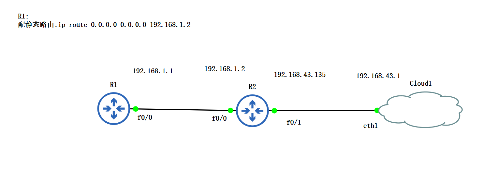
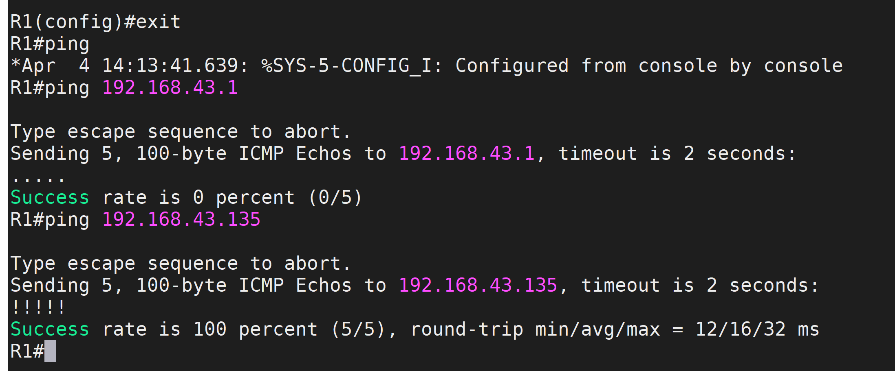
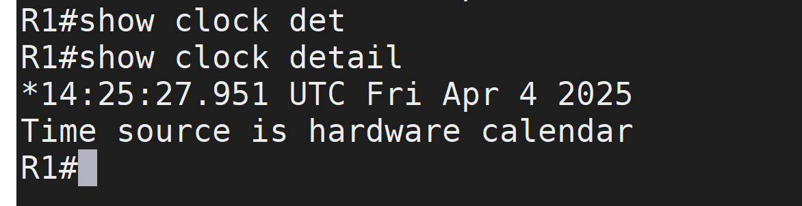
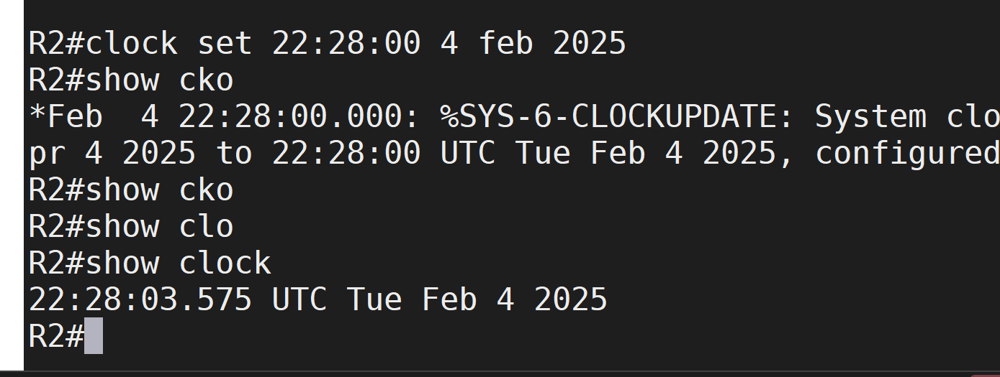
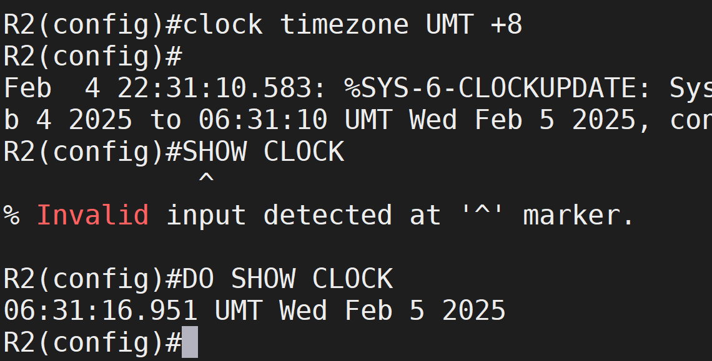
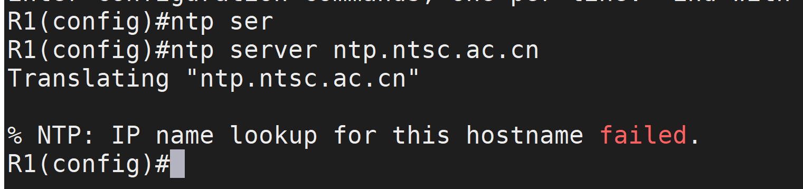
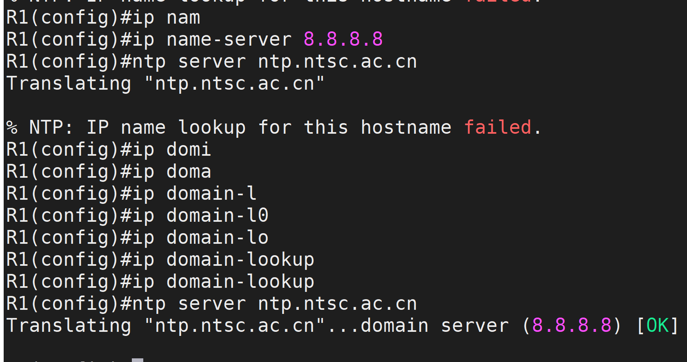

# 1. 拓扑图



### 关键指令

```sh
show running-config
```

### `配静态路由`

```sh
`ip route 0.0.0.0 0.0.0.0 192.168.1.2`
```

### `do show ip route`查看路由并验证 R2 的连接



# 2. 检查 NTP 配置：`show clock`和`show clock detail`



# 3. 设置 R2 时间 ：`clock set`



# 4. 设置时区`set timezone`



# 5. 在 R1 上直接设置 ntp server 失败

```sh
ntp server ntp.ntsc.ac.cn
```



# 6. 设置 nameserver 和 domain 后可以



# 3. 配置 NTP 服务器


