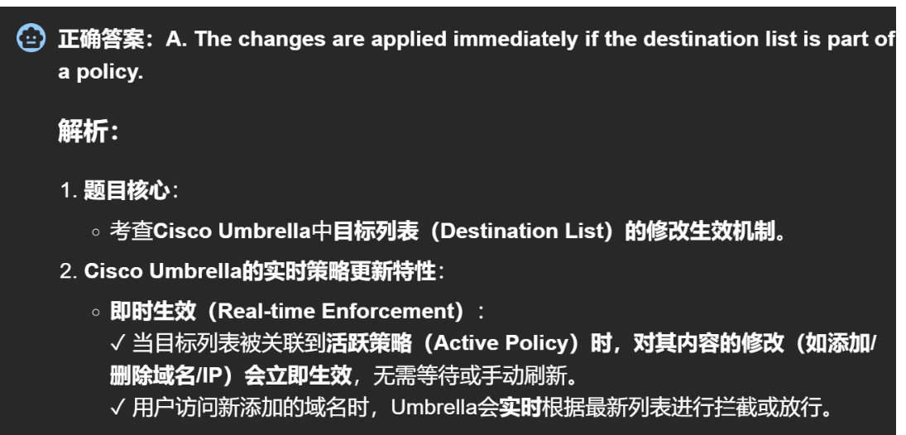

# Cisco Umbrella 技术详解 🌐

## 一、产品概述 🚀

### 1. 核心定位

- **云原生 DNS 平台**：提供可靠安全的互联网体验
- **服务规模**：日活跃用户 > 1 亿
- **部署方式**：云端交付，全局可见性

### 2. 功能集成

- 🛡️ **防火墙**（Firewall）
- 🔒 **安全网关**（Secure Web Gateway）
- 🌐 **DNS 层安全**（DNS-layer Security）
- ☁️ **云访问安全**（Cloud Access Security）
- 🔍 **威胁情报**（Threat Intelligence Solutions）

## 二、技术特性 💫

### 1. 保护范围

- **用户覆盖**
  - 远程办公人员
  - 分支机构
  - 移动设备
- **安全保障**
  - 统一策略
  - 一致性防护
  - 全局监控

### 2. 威胁防护机制

- **多层防护**
  - DNS 层过滤
  - IP 层拦截
  - URL 检测
- **威胁类型**
  - 🦠 恶意软件
  - 🔒 勒索软件
  - 🎣 钓鱼攻击
  - 🤖 僵尸网络

### 3. 智能分析

- **大数据处理**
  - 每日数十亿请求分析
  - 全球活动模式识别
- **机器学习应用**
  - 新型威胁识别
  - 异常行为检测
  - DNS 请求分析

## 三、核心优势 ⭐

### 1. 安全性能

- **网关功能**
  - 全流量检查
  - 实时威胁分类
  - 透明度保证

### 2. 运营效率

- **负载优化**
  - DNS 层拦截
  - 设备压力降低
- **管理简化**
  - 警报优化
  - 快速响应

### 3. 云端优势

- **WAN 安全**
  - 广域网保护
  - 分布式防护
- **便捷部署**
  - 零硬件依赖
  - 简单管理流程

### 4. 预警能力

- **主动防护**
  - 预先威胁检测
  - 连接前拦截
- **情报共享**
  - 全球威胁数据
  - 实时更新

## 四、核心价值 💡

1. **统一平台**

   - 功能整合
   - 集中管理
   - 统一策略

2. **云架构优势**

   - 高度灵活
   - 快速部署
   - 全局可视

3. **智能防护**

   - 多层拦截
   - AI 支持
   - 实时响应

4. **运营优化**
   - 降低成本
   - 提升效率
   - 简化管理

> **实际应用价值**：Cisco Umbrella 通过云原生架构和智能威胁检测，为现代企业提供全方位的网络安全保护。特别适合远程办公和分布式网络环境，能有效预防威胁并简化安全管理。

---

## 附：及时生效机制 ⚡

