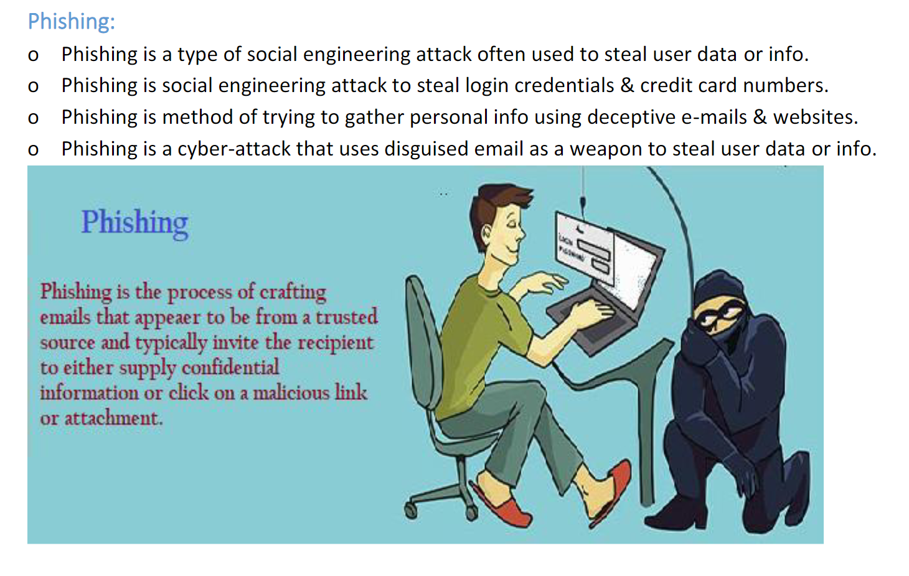
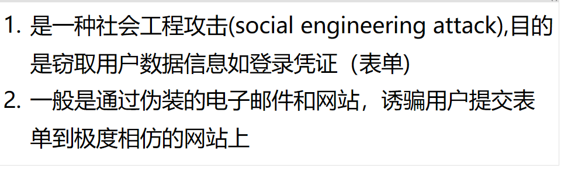
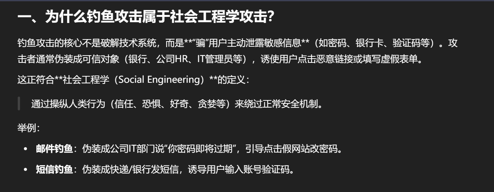
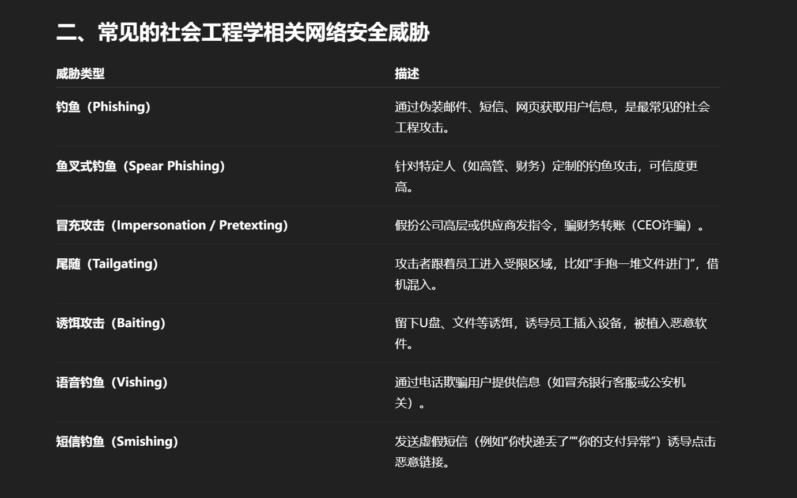
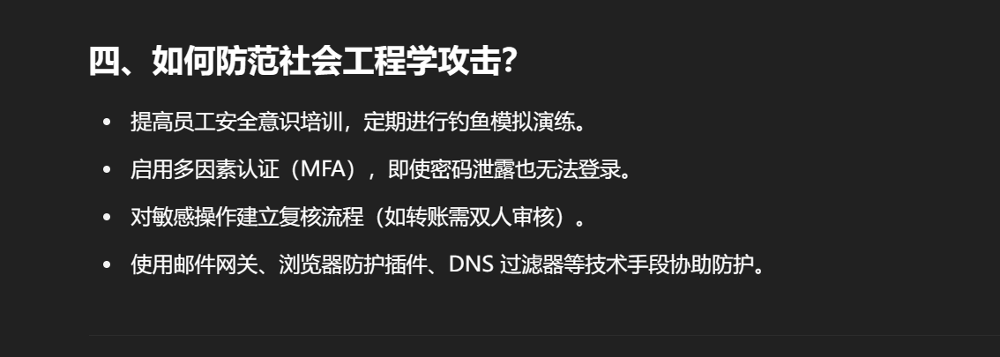
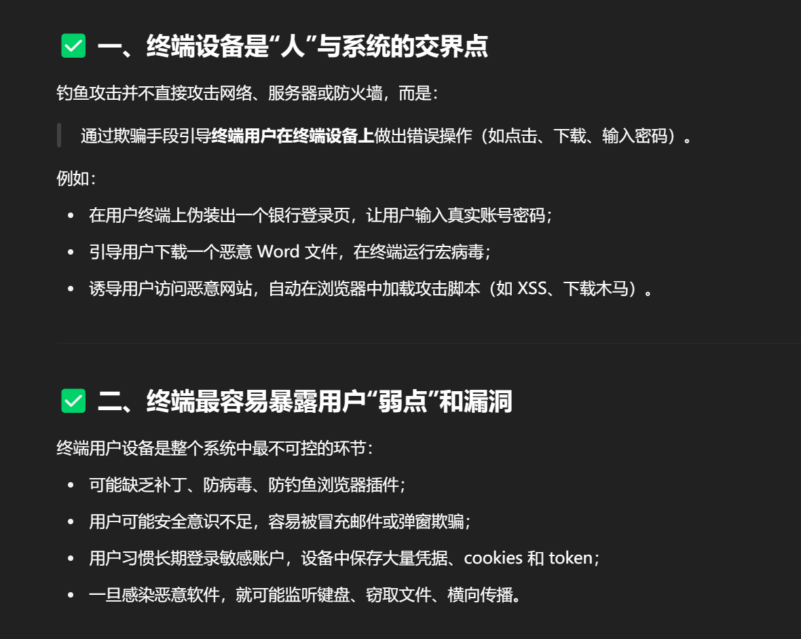
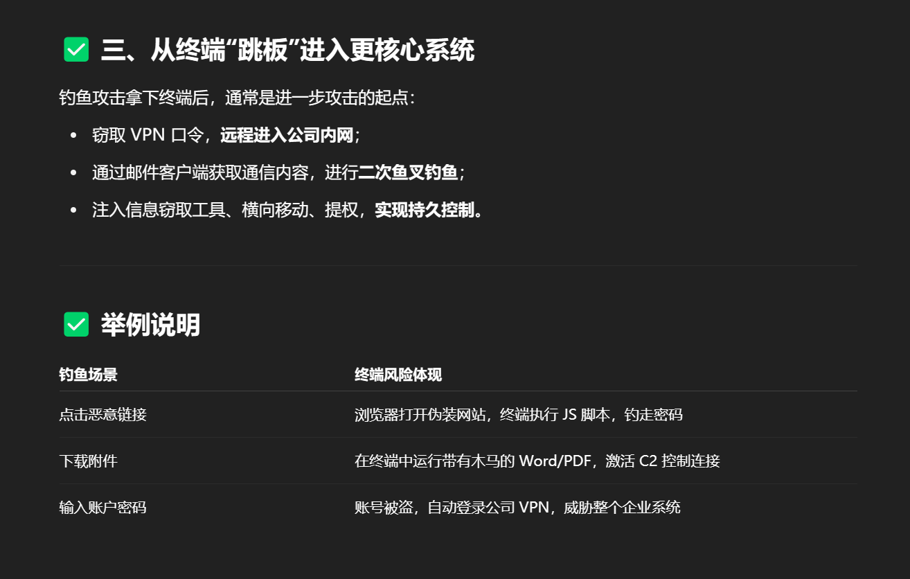
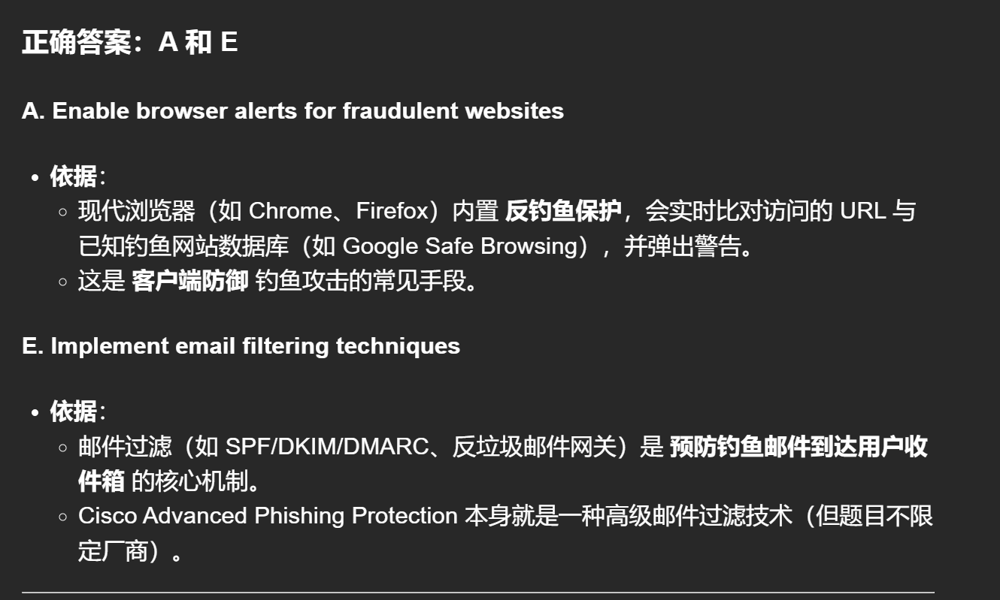

# 1. 什么是网络钓鱼攻击(Phishing)？

# 为什么说钓鱼攻击是一种社会工程学攻击？常见的社会工程学网络安全相关的威胁有哪些？

# 2. 怎么预防/解决钓鱼攻击(Phishing)?

“更改代理”能在某些情况下帮助**防止钓鱼攻击**，但它不是最主要或最常见的方法。我们来解释一下：

---

### 一、为什么说“更改代理”能防止钓鱼攻击？

钓鱼攻击通常是通过伪造的网页诱导用户输入敏感信息（如账号密码、信用卡信息等）。更改代理（如使用安全代理或企业级网关）可以在以下方面起到防御作用：

1. **拦截恶意网站：**

   - 使用有安全策略的代理服务器（如 Web 代理、防火墙、网关）可以识别并**拦截已知钓鱼网站**，避免用户访问。
   - 例如：将所有 HTTP/HTTPS 流量通过带安全策略的代理过滤。

2. **URL 重写与内容检查：**

   - 代理服务器可以对访问的内容进行**实时分析**，如检查 URL 中是否含有可疑参数、域名是否伪装等。

3. **DNS 代理增强验证：**

   - 如果通过代理使用了安全的 DNS（如 DNS over HTTPS，DoH），就能减少 DNS 欺骗等方式的钓鱼攻击。

⚠️ 注意：**更改代理并不能直接防止钓鱼攻击**，它只是防御体系中的一环，而且必须依赖于代理的安全策略和威胁情报能力。

---

### 二、流行的防御钓鱼攻击的方式（更常见且有效的）

| 防御方式                        | 说明                                                       |
| ------------------------------- | ---------------------------------------------------------- |
| **多因素认证（MFA）**           | 即使密码被钓鱼，攻击者没有第二因素也无法登录。             |
| **邮件过滤**                    | 使用反钓鱼邮件网关或安全服务，过滤带恶意链接的钓鱼邮件。   |
| **DNS 安全（DNSSEC、DoH）**     | 防止域名解析被劫持，引导用户访问钓鱼站点。                 |
| **浏览器安全插件 / 防钓鱼功能** | 浏览器（如 Chrome、Edge）会阻止访问已知的钓鱼网址。        |
| **用户安全培训**                | 定期教育员工识别可疑链接、虚假邮件和社会工程技巧。         |
| **零信任网络架构**              | 限制设备和账户的权限，钓鱼成功也难以横向移动。             |
| **域名监控和品牌保护**          | 监测是否有类似你企业品牌的钓鱼域名上线，及时封禁。         |
| **URL 沙箱分析**                | 在邮件或网页点击前将链接送入沙箱分析，判断是否为钓鱼页面。 |

---

### 总结

“更改代理”**并非主要防钓鱼手段**，但如果配合安全策略（如恶意 URL 拦截、HTTPS 检查等），确实可以起到一定辅助防御作用。真正有效的是多层次防护，包括技术手段、用户意识、网络策略等共同协作。

# 为什么说钓鱼攻击的目标是终端设备？

# 防御钓鱼攻击的最常见的两种方式？

