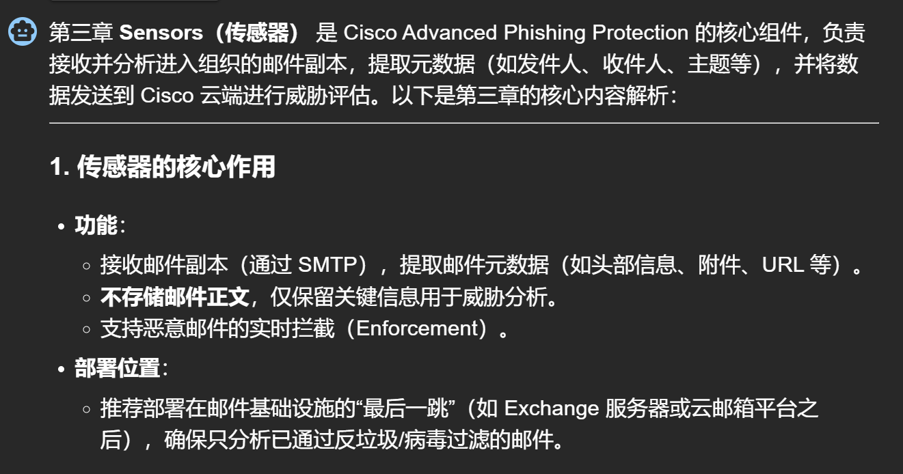
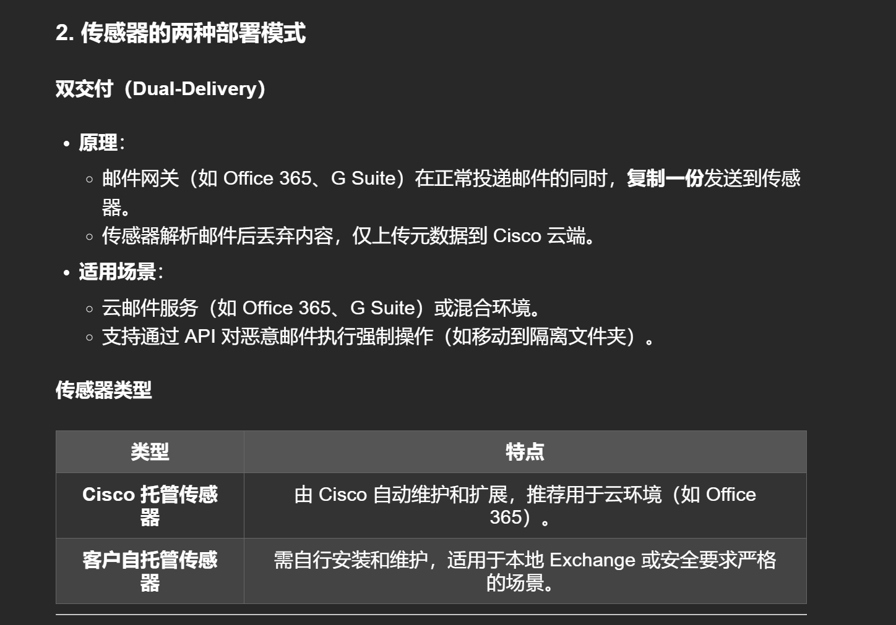
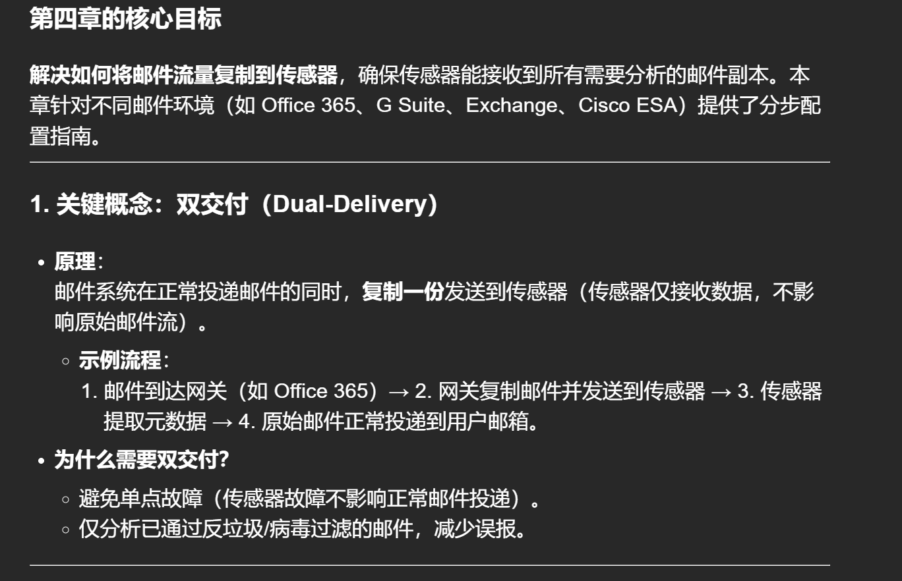
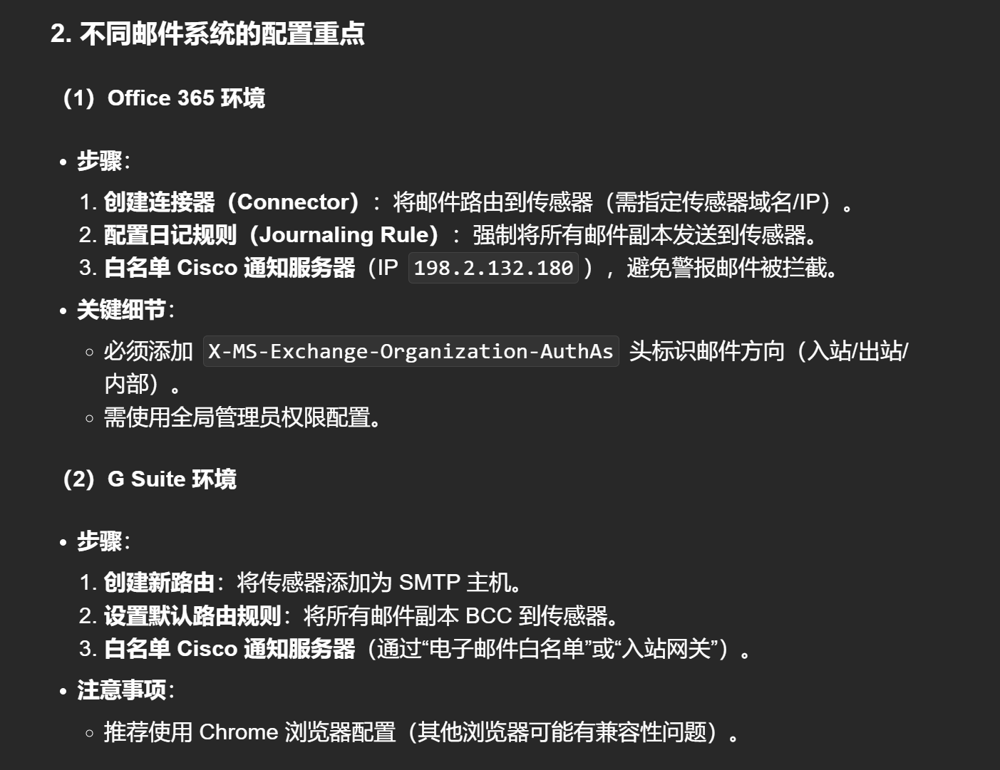
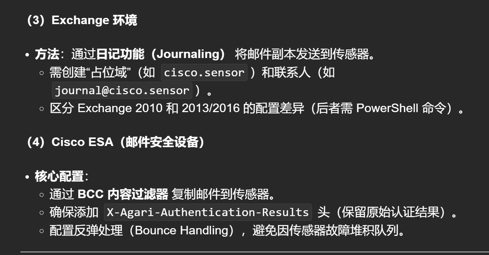
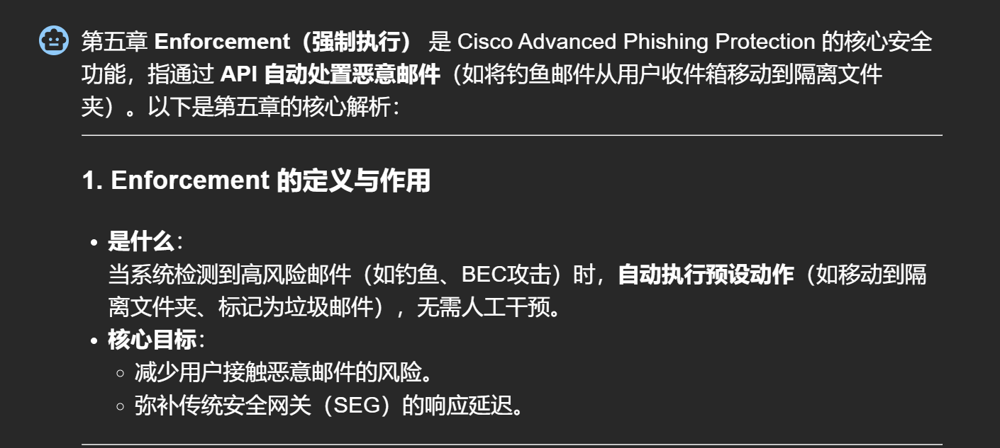
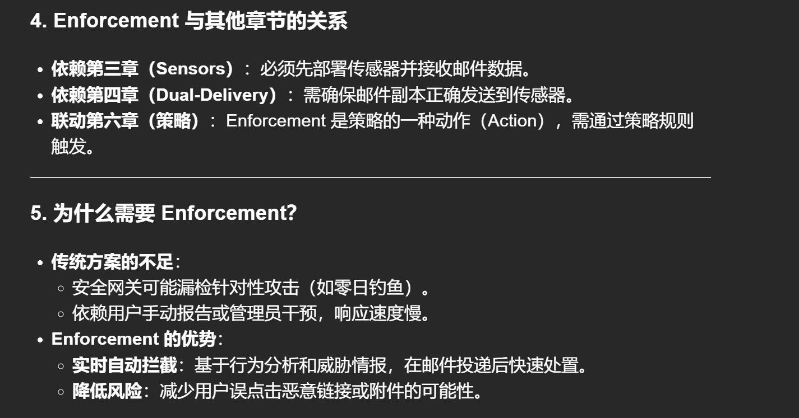
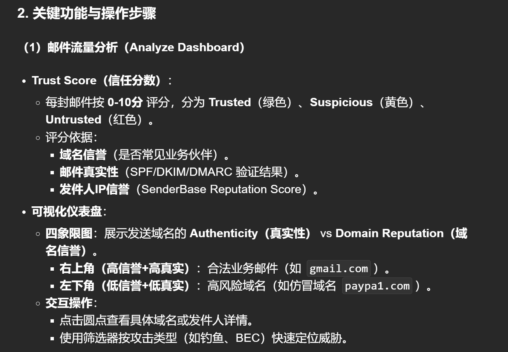
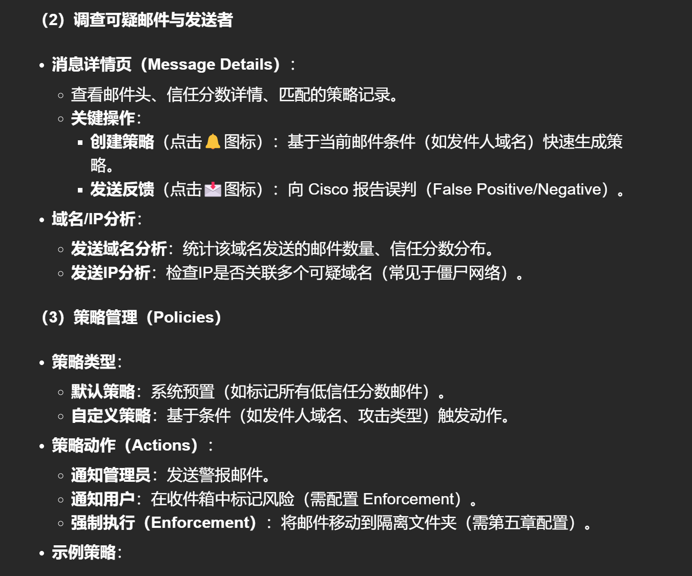
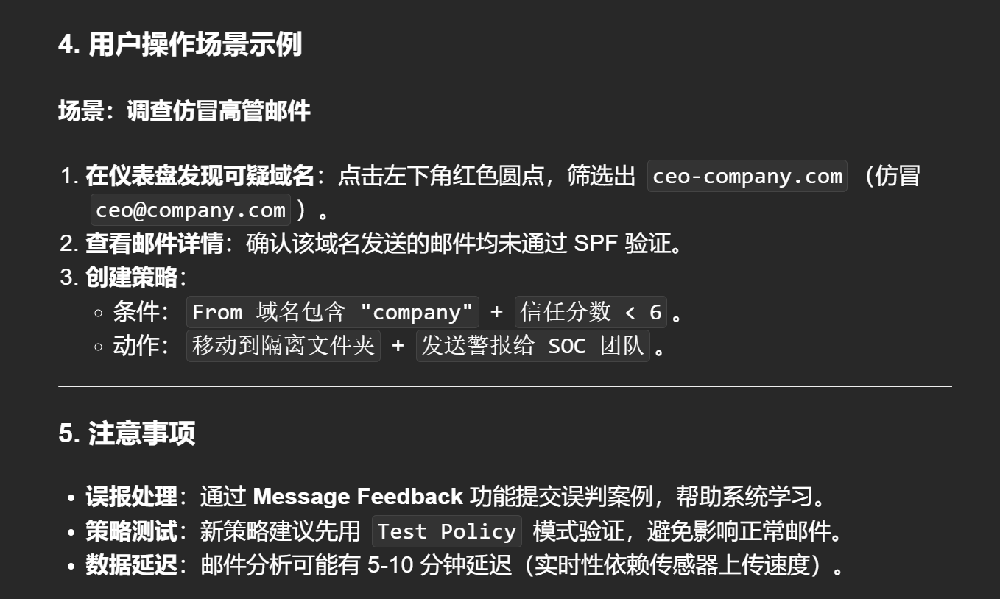

# advanced phishing protection 是一个产品，主要是利用机器学习的技术（Cisco Identity Intelligence），分析历史邮件流量，区分合法邮件与潜在恶意邮件。专注于捕获传统安全网关（SEG）可能漏检的针对性攻击（如钓鱼、BEC 商业邮件欺诈等）。

# 传感器(sensors)是什么？



# 传感器的两种部署模式？



# 双交付的重要性？



# 具体配置双交付？




# 什么是强制执行？




# 信誉评分 0-10，10 代表最高？



# 自定义策略和一些实施？




# 生成报告？

<details>

<summary>报告Reports</summary>
第七章 **Reports（报告）** 是 Cisco Advanced Phishing Protection 的数据分析和可视化模块，旨在帮助管理员 **量化威胁趋势**、**评估防护效果** 并 **生成合规性文档**。以下是第七章的核心内容解析：

---

### **1. 报告的核心功能**

- **目标**：
  - 提供攻击活动的历史数据统计。
  - 展示 Advanced Phishing Protection 的实际防护价值（如拦截的潜在损失）。
  - 支持导出 PDF/CSV 用于合规审计或管理层汇报。

---

### **2. 关键报告类型与使用场景**

#### **（1）威胁趋势报告（Threat Trends）**

- **功能**：
  - 按时间统计攻击数量、类型分布（如钓鱼、BEC、恶意附件）。
  - 支持自定义时间范围（最近 7 天/30 天/自定义日期）。
- **使用场景**：
  - 监控攻击高峰期（如节假日钓鱼活动激增）。
  - 对比不同阶段的威胁变化（如部署前后）。

**示例图表**：

- **攻击类型分布**：饼图显示域名仿冒（Domain Spoof） vs 显示名冒充（Display Name Impostor）。
- **时间趋势图**：折线图展示每日攻击量波动。

#### **（2）高管摘要报告（Executive Summary）**

- **功能**：
  - 用业务语言总结防护成果，例如：
    - **拦截的潜在损失**：估算已阻止的 BEC 攻击可能造成的资金损失（基于行业平均数据）。
    - **与同行对比**：显示组织的受攻击频率相对于同行业/规模企业的百分位。
- **使用场景**：
  - 向管理层汇报安全投资回报率（ROI）。
  - 合规审计（如证明符合 ISO 27001 或 NIST 标准）。

**关键指标**：

- **“How Much Have I Saved”**：根据配置的财务参数（如单次数据泄露成本）计算防护价值。
- **“How Attacked Am I”**：对比同行业组织的攻击频率。

#### **（3）策略执行报告（Policy Report）**

- **功能**：
  - 列出所有策略的匹配次数、执行动作（如通知/拦截）。
  - 显示 Enforcement 成功率（如“80%的匹配邮件被成功移动到隔离”）。
- **使用场景**：
  - 优化策略规则（如调整误报高的策略）。
  - 验证 Enforcement 配置是否生效。

---

### **3. 数据来源与配置**

- **依赖传感器数据**：所有报告基于传感器收集的邮件元数据（需确保第四章双交付配置正确）。
- **自定义参数**：
  - 在 `Manage > Organizations` 中设置组织属性（行业、规模、地区），用于同行对比报告。
  - 在报告中手动输入财务参数（如单次数据泄露成本）。

---

### **4. 操作指南**

#### **生成与导出报告**

1. **访问路径**：`Manage > Reports`。
2. **选择报告类型**：
   - **Threat Trends**：查看攻击趋势。
   - **Executive Summary**：下载高管摘要（PDF）。
3. **导出数据**：
   - 点击 **Download** 导出 CSV（用于进一步分析）或 PDF（用于汇报）。

#### **示例报告解读**

- **威胁趋势报告**：

  ```plaintext
  | 攻击类型           | 本周数量 | 上周数量 | 变化率 |
  |--------------------|----------|----------|--------|
  | 域名仿冒          | 120      | 85       | +41%   |
  | 恶意附件          | 32       | 45       | -29%   |
  ```

  **结论**：域名仿冒攻击显著增加，需加强相关策略。

- **高管摘要报告**：
  ```plaintext
  • 本月拦截潜在损失：$250,000（基于行业平均BEC损失$75,000/次）。
  • 受攻击频率：超过同行业75%的企业。
  ```

---

### **5. 与其他章节的关联**

- **依赖第五章（Enforcement）**：报告中 Enforcement 成功率数据来自传感器 API 执行日志。
- **联动第六章（策略）**：策略报告直接反映自定义策略的效果。
- **补充第四章（传感器）**：数据完整性依赖传感器的稳定运行。

---

### **6. 注意事项**

- **数据延迟**：报告数据可能有 1-2 小时延迟（非实时）。
- **财务参数配置**：需手动输入行业成本数据以生成准确的“节省金额”报告。
- **权限控制**：仅管理员角色（如 `Organization Administrator`）可访问完整报告。

---

### **总结**

第七章是 **安全运营的“仪表盘”**，通过：

1. **量化威胁**（攻击类型、趋势）。
2. **证明价值**（拦截损失、同行对比）。
3. **指导优化**（策略调整、资源分配）。

**下一步建议**：

- 定期导出报告用于合规存档。
- 结合第六章的威胁调查结果，动态调整策略规则。
</details>
