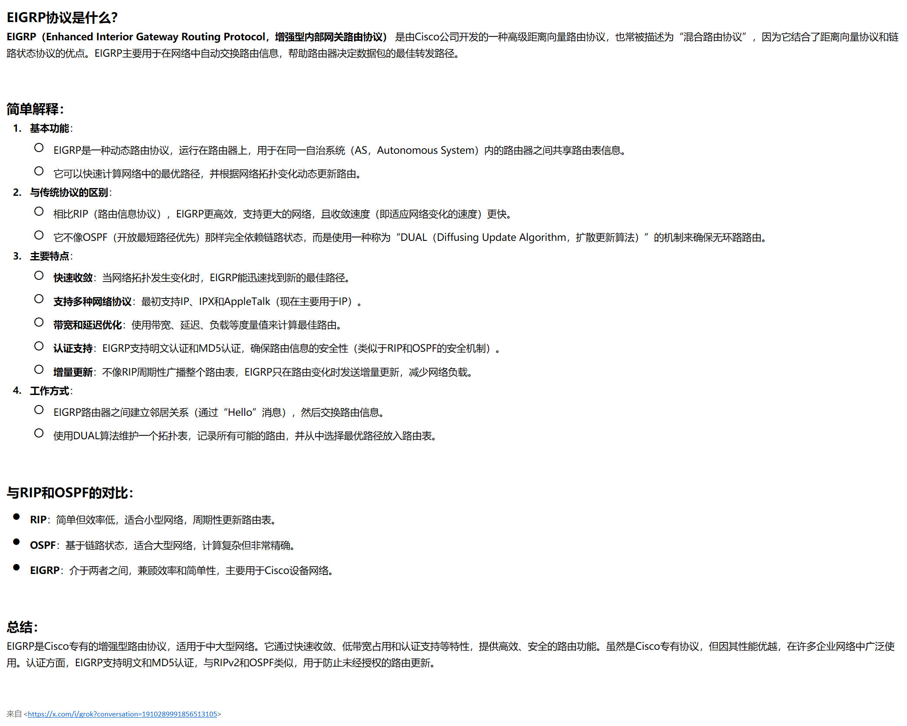
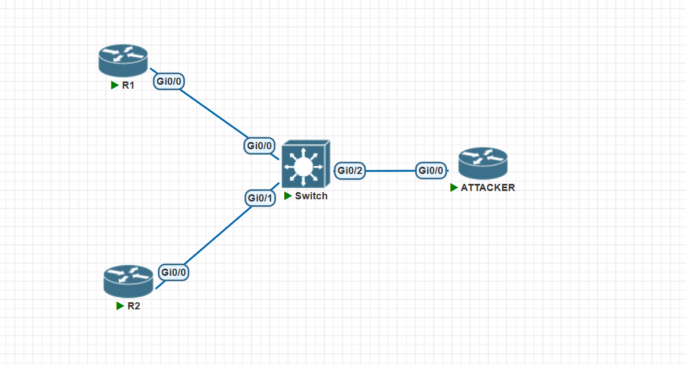
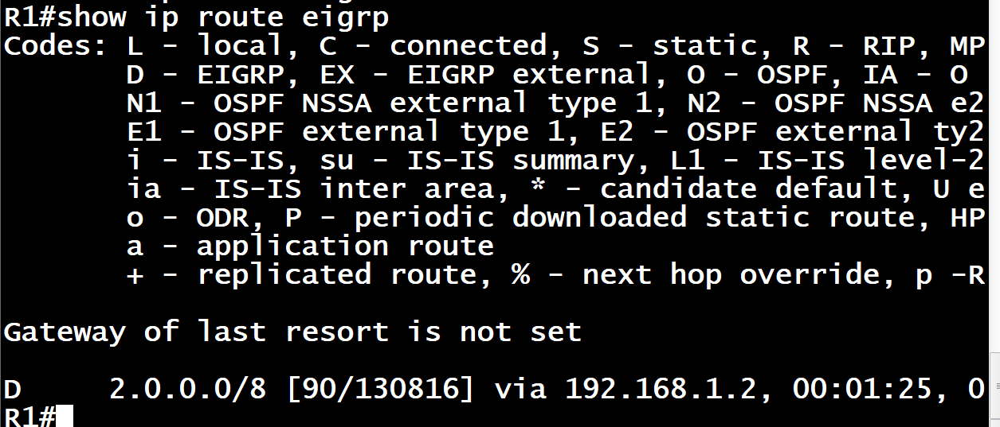
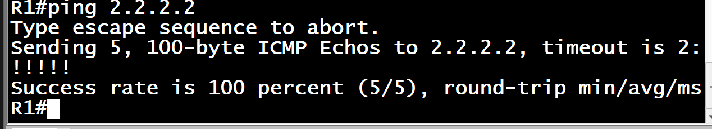
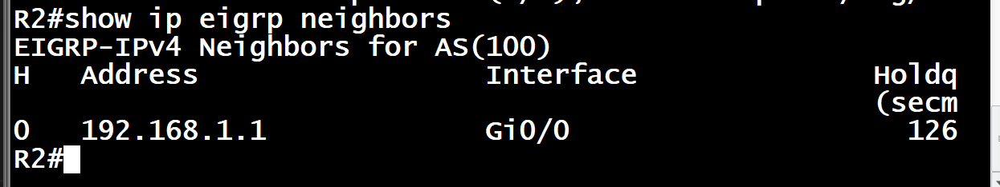

# 1. 什么是 EIGRP?



# 2. 实验



## 初始配 IP

### R1

```sh
enable
configure terminal
hostname R1
!
interface GigabitEthernet0/0
 ip address 192.168.1.1 255.255.255.0
 no shutdown
!
interface Loopback1
 ip address 1.1.1.1 255.0.0.0
 no shutdown
!
no logging console
end
write memory
```

### R2

```sh
enable
configure terminal
hostname R2
!
interface GigabitEthernet0/0
 ip address 192.168.1.2 255.255.255.0
 no shutdown
!
interface Loopback2
 ip address 2.2.2.2 255.0.0.0
 no shutdown
!
no logging console
end
write memory

```

## 配 EIGRP

### R1

```sh
enable
configure terminal
router eigrp 100
 network 192.168.1.0
 network 1.0.0.0
 no auto-summary
end
write memory
```

### R2

```sh
enable
configure terminal
router eigrp 100
 network 192.168.1.0
 network 2.0.0.0
 no auto-summary
end
write memory
```

## 能通




## 配验证

### R1/2

```sh
enable
configure terminal
key chain cisco
 key 1
  key-string cisco1
!
interface GigabitEthernet0/0
 ip authentication mode eigrp 100 md5
 ip authentication key-chain eigrp 100 cisco
end
write memory
```

## 验证配置正确

```sh
show ip eigrp neighbors
```


