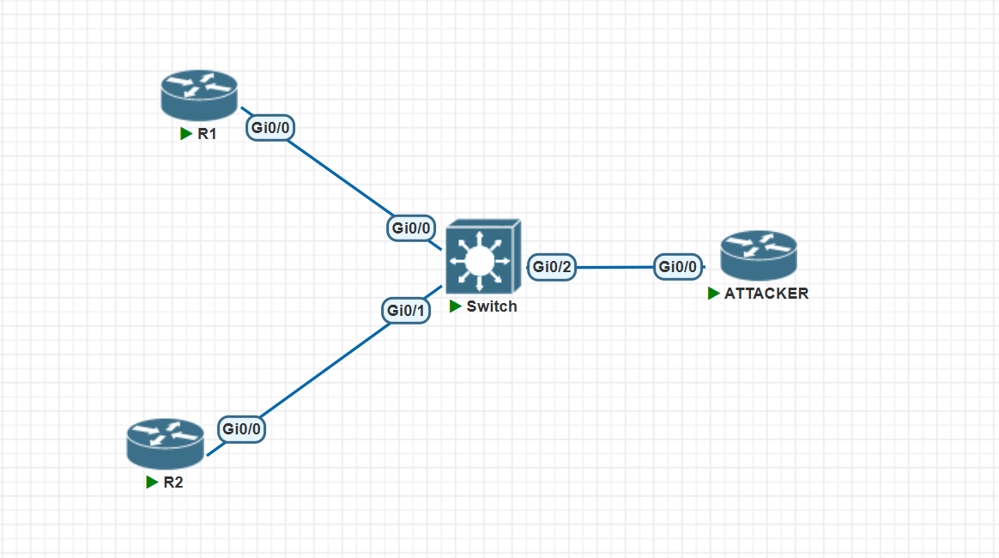
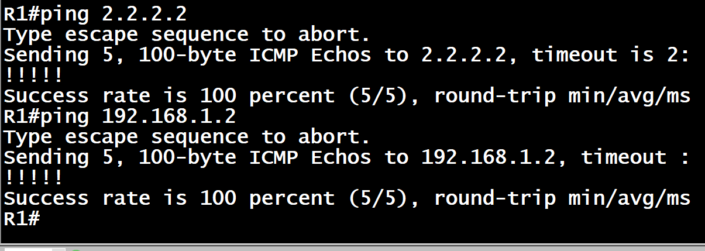
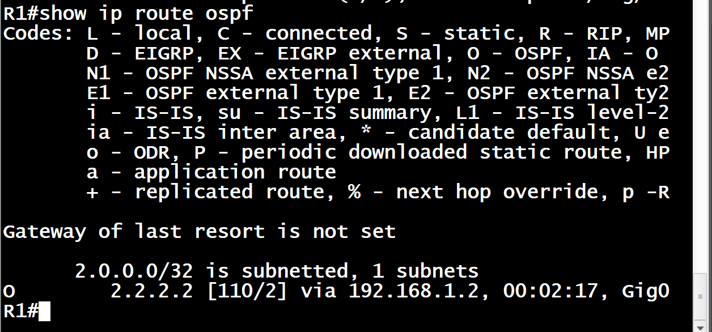
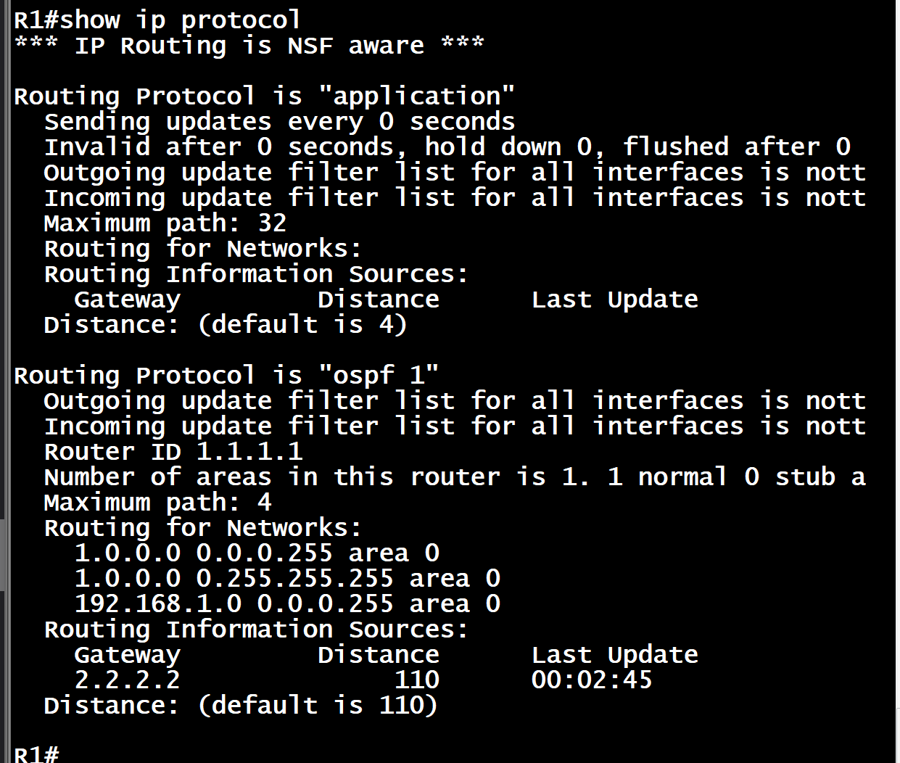
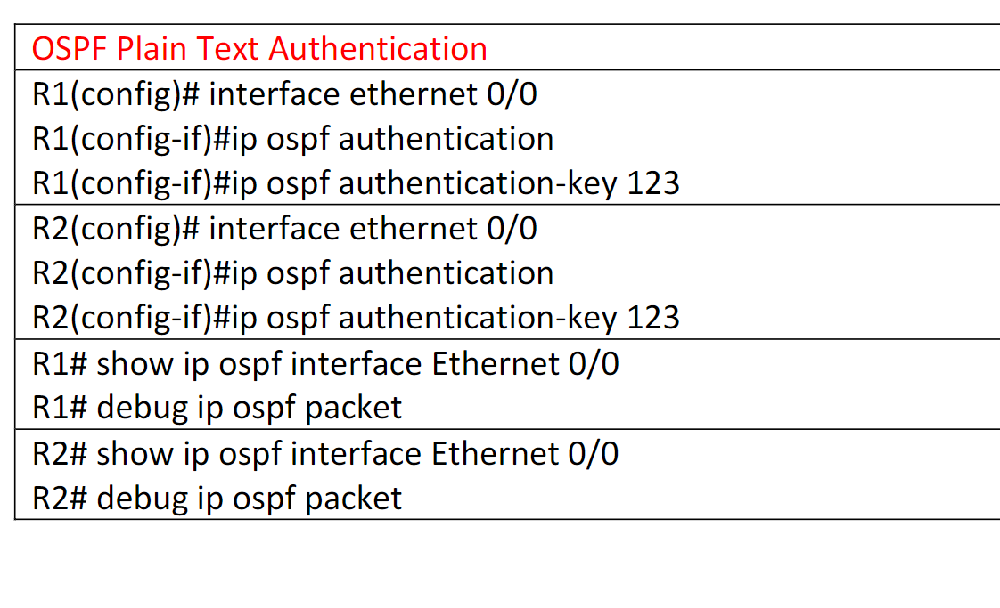
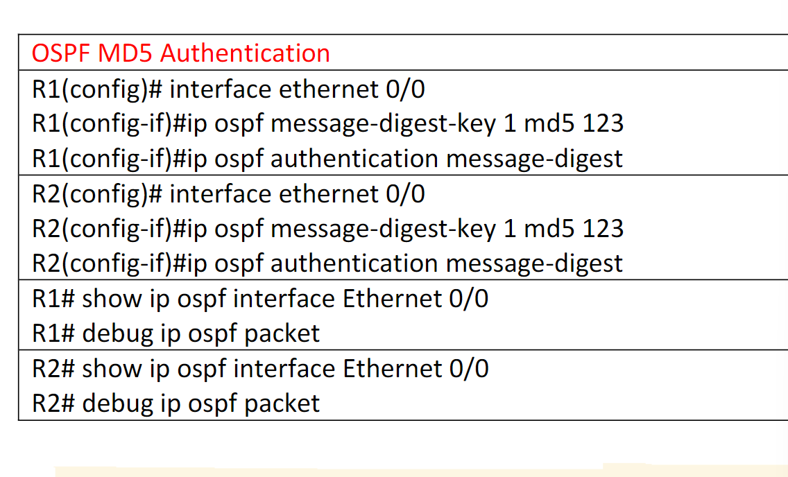

# 1. 拓扑



## 初始配 IP

### R1

```sh
enable
configure terminal
hostname R1
!
interface GigabitEthernet0/0
 ip address 192.168.1.1 255.255.255.0
 no shutdown
!
interface Loopback1
 ip address 1.1.1.1 255.0.0.0
 no shutdown
!
no logging console
end
write memory
```

### R2

```sh
enable
configure terminal
hostname R2
!
interface GigabitEthernet0/0
 ip address 192.168.1.2 255.255.255.0
 no shutdown
!
interface Loopback2
 ip address 2.2.2.2 255.0.0.0
 no shutdown
!
no logging console
end
write memory

```

## 配 OSPF

### R2

```sh
enable
configure terminal
router ospf 1
 network 192.168.1.0 0.0.0.255 area 0
 network 2.0.0.0 0.255.255.255 area 0
end
write memory
```

### R1

```sh
enable
configure terminal
router ospf 1
 network 192.168.1.0 0.0.0.255 area 0
 network 1.0.0.0 0.255.255.255 area 0
end
write memory
```

## 通了





## 配验证（MD5)

### R1/2

```sh
enable
configure terminal
key chain cisco
 key 1
  key-string cisco1
!
interface GigabitEthernet0/0
 ip ospf authentication message-digest
 ip ospf message-digest-key 1 md5 cisco1
end
write memory
```

## 配明文



