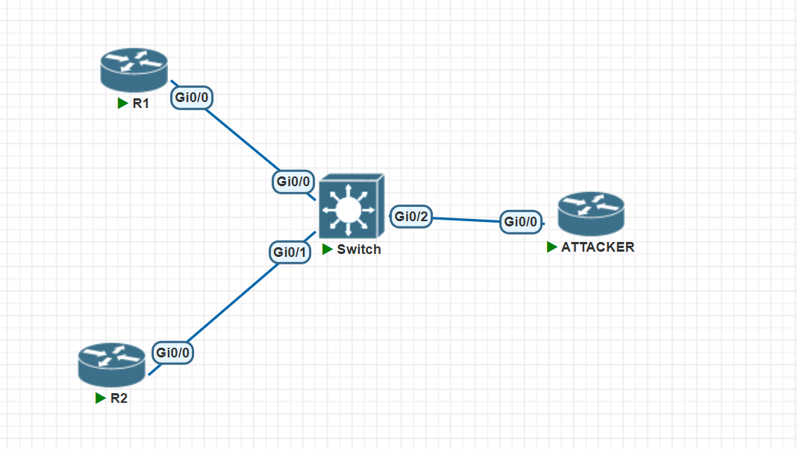
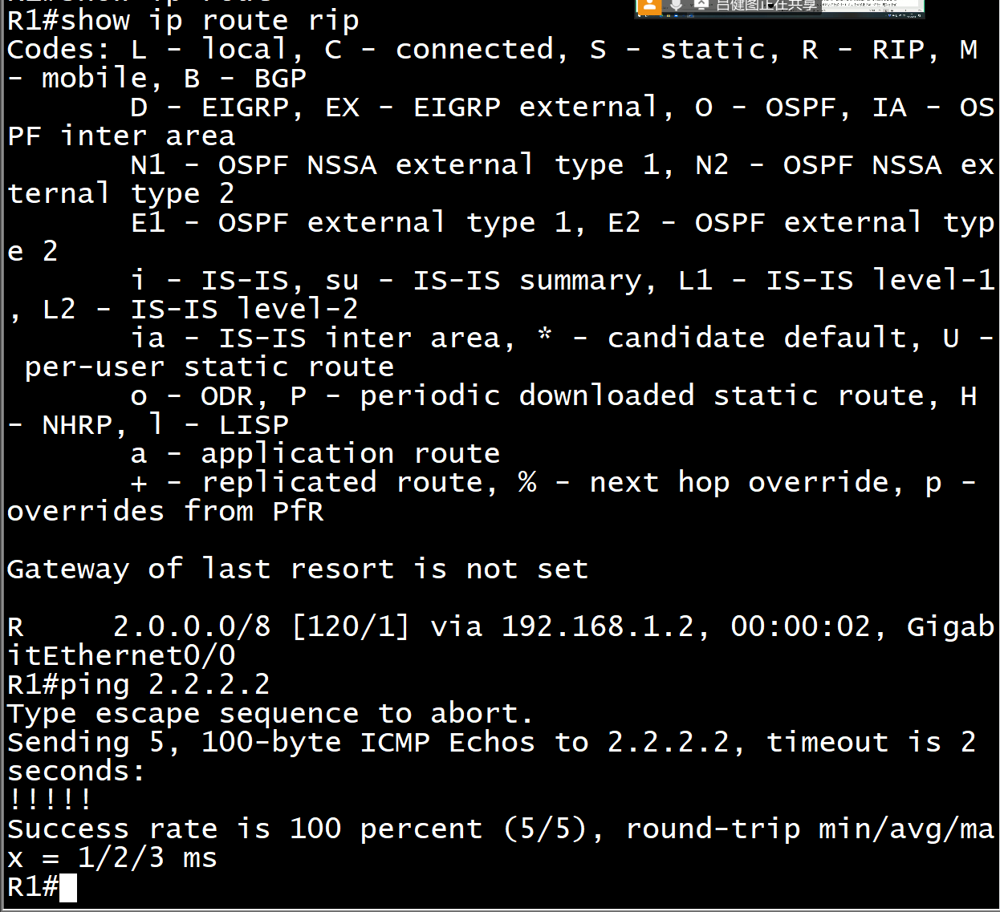
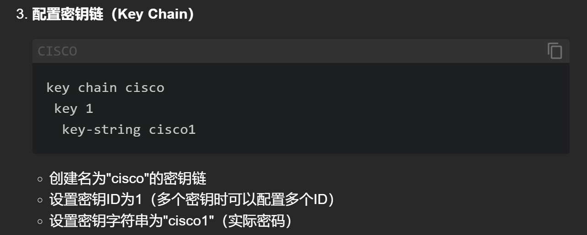
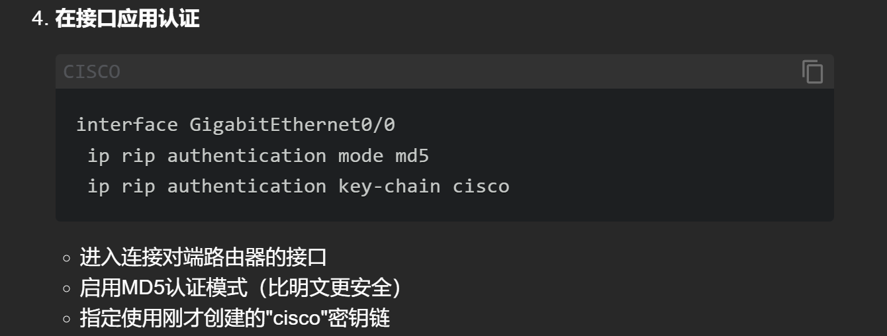
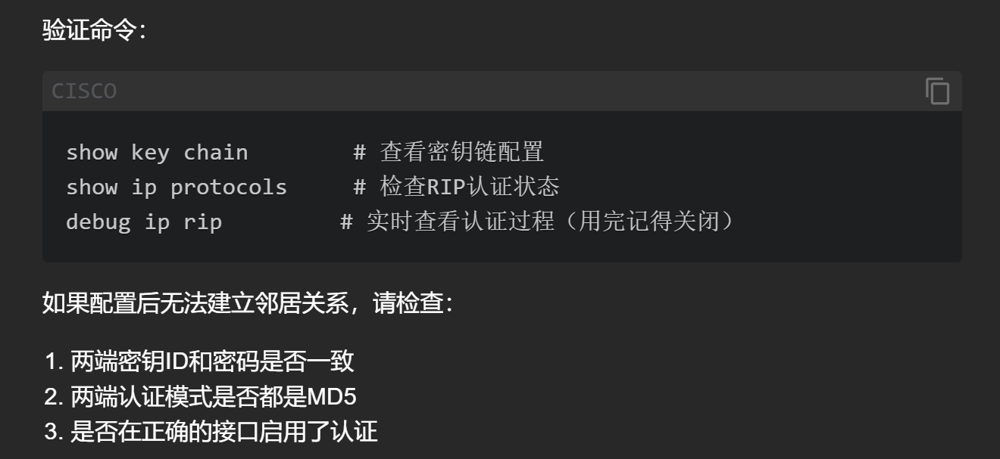
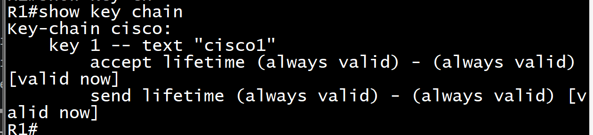
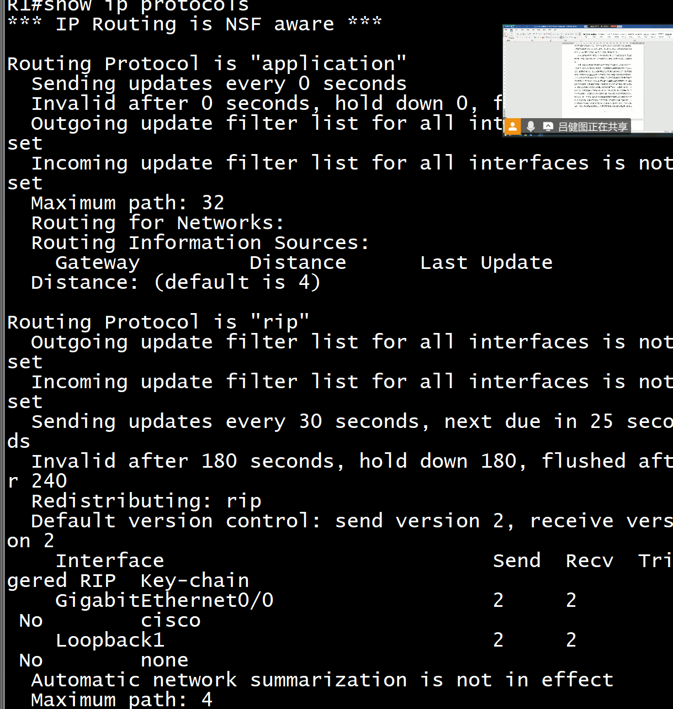
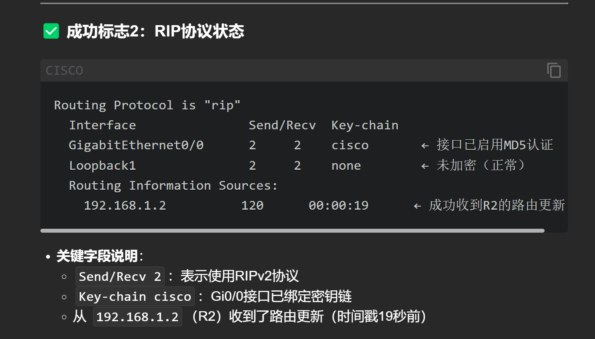
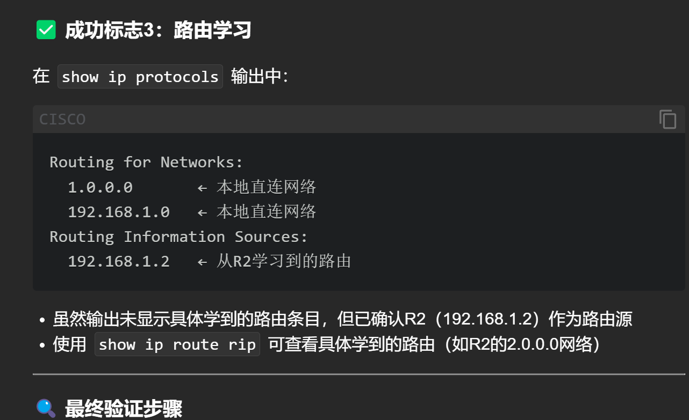
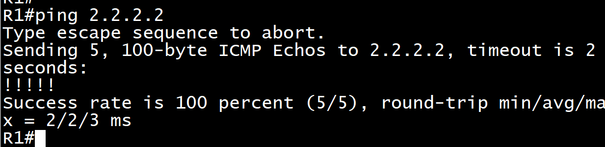

# 1. 知识点看[RIP](https://github.com/lushiheng123/Networking/blob/main/RIP%E4%B8%93%E9%A2%98/%E9%9D%A2%E8%AF%95%E9%A2%98---RIPv2.md)

# 2. 实验



## 常用指令

```sh
no logging console
write erase
    reload
```

## 第一步，配置简单地址

### R1

```sh
enable
configure terminal
hostname R1
!
interface GigabitEthernet0/0
 ip address 192.168.1.1 255.255.255.0
 no shutdown
!
interface Loopback1
 ip address 1.1.1.1 255.0.0.0
 no shutdown
!
no logging console
end
write memory
```

### R2

```sh
enable
configure terminal
hostname R2
!
interface GigabitEthernet0/0
 ip address 192.168.1.2 255.255.255.0
 no shutdown
!
interface Loopback2
 ip address 2.2.2.2 255.0.0.0
 no shutdown
!
no logging console
end
write memory

```

## 第二步，配 RIP

### R1

```sh
enable
configure terminal
router rip
 version 2
 network 192.168.1.0
 network 1.0.0.0
 no auto-summary
end
write memory
```

### R2

```sh
enable
configure terminal
router rip
 version 2
 network 192.168.1.0
 network 2.0.0.0
 no auto-summary
end
write memory

```

### `show ip route rip`验证+ping



## 第三步，设置 RIP 验证

### R1/R2

```sh
enable
configure terminal
!
! Configure MD5 authentication key chain
key chain cisco
 key 1
  key-string cisco1
!
! Apply authentication to Gig0/0 interface
interface GigabitEthernet0/0
 ip rip authentication mode md5
 ip rip authentication key-chain cisco
end
write memory

```




## 查看验证配置







