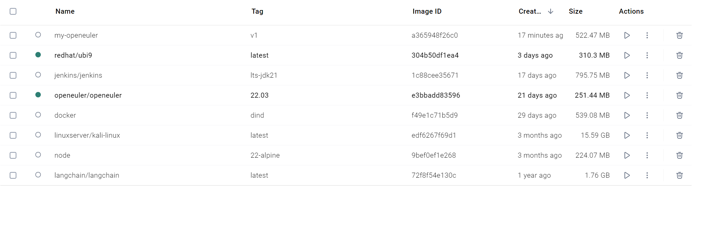
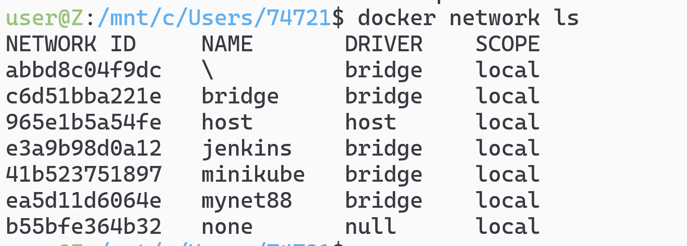
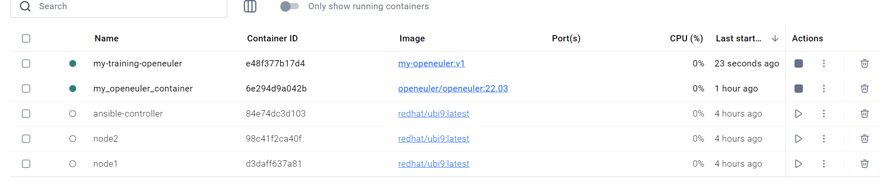
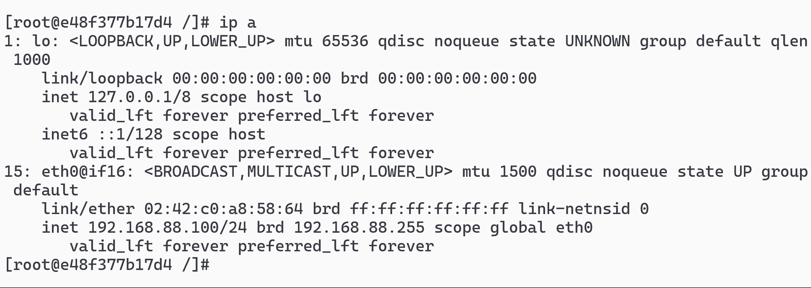
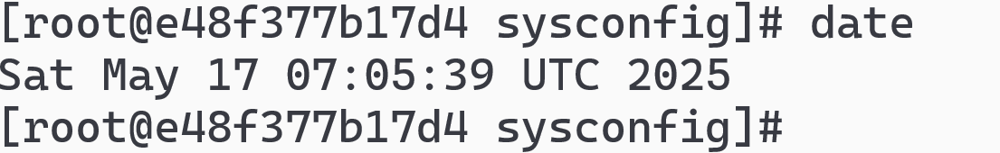
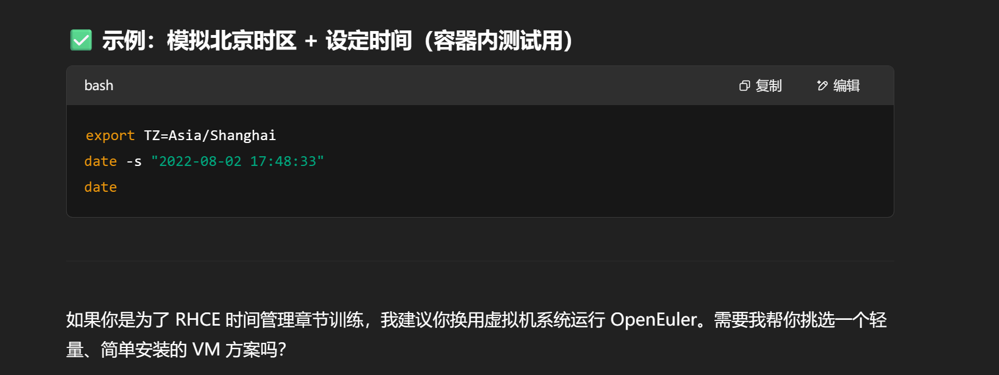
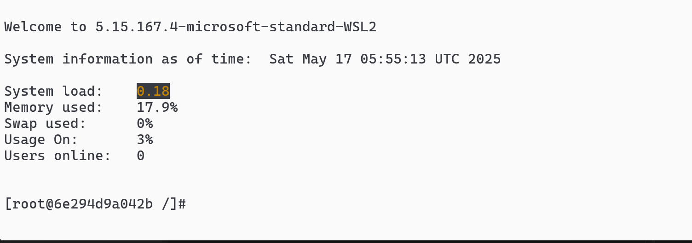

# 通过 Dockerfile 的方式创建原镜像的补充版本

```Dockerfile
# Dockerfile
# Dockerfile
FROM openeuler/openeuler:22.03

# 安装你日常需要的组件
RUN dnf update -y && \
    dnf install -y vim iproute net-tools iputils curl && \
    dnf clean all

# 设置默认命令
CMD ["/bin/bash"]

```

# docker build -t my-openeuler:v1 .



# 创建自定义 docker network

```sh
docker network create \
  --subnet=192.168.88.0/24 \
  --gateway=192.168.88.1 \
  mynet88
```



# 创建容器并指定网络

```sh
docker run -it --rm \
  --net=mynet88 \
  --ip=192.168.88.100 \
  --name=my-training-openeuler \
  my-openeuler:v1
```



# ip -a 测试



# 修改时间 ntp（时间弄不了只能模拟）




# docker run -it --name my_openeuler_container openeuler/openeuler:22.03 /bin/bash



# 安装相关套件

```sh
dnf install -y NetworkManager
dnf install -y iproute
dnf install -y less
dnf install -y vim
dnf update -y
```

# 或者写 dockerfile

```dockerfile
FROM openeuler/openeuler:22.03

RUN dnf update -y && \
    dnf install -y vim more less NetworkManager net-tools wget curl && \
    dnf clean all
```

```sh
docker build -t my_openeuler_full:22.03 .
```

#

```sh
TYPE=Ethernet
BOOTPROTO=static
DEFROUTE=yes
IPV4_FAILURE_FATAL=no
IPV6INIT=no
NAME=ens32
DEVICE=ens32
ONBOOT=yes
IPADDR=192.168.65.32
PREFIX=24
GATEWAY=192.168.65.1
DNS1=8.8.8.8
DNS2=8.8.4.4
```
