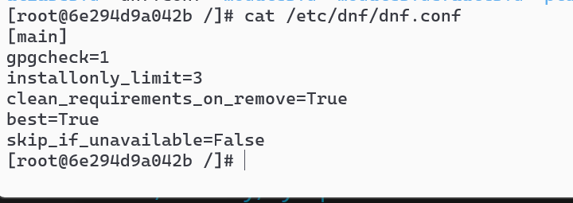
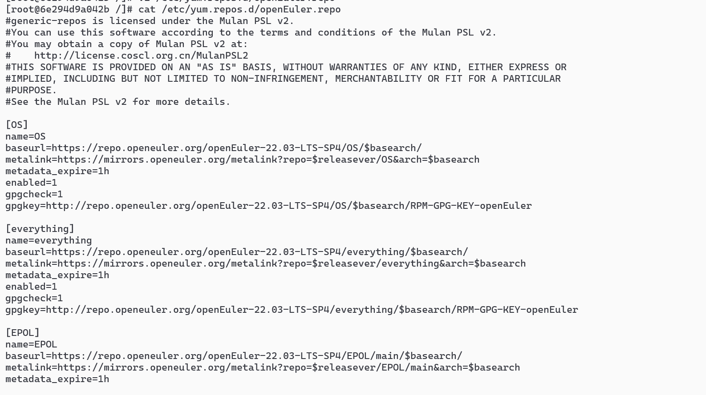
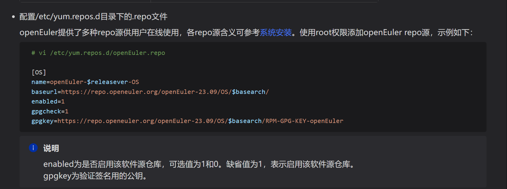
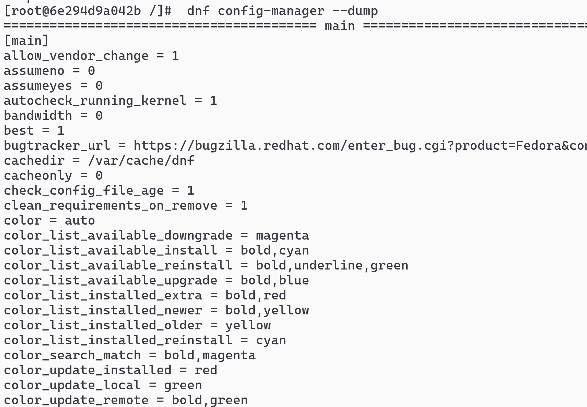
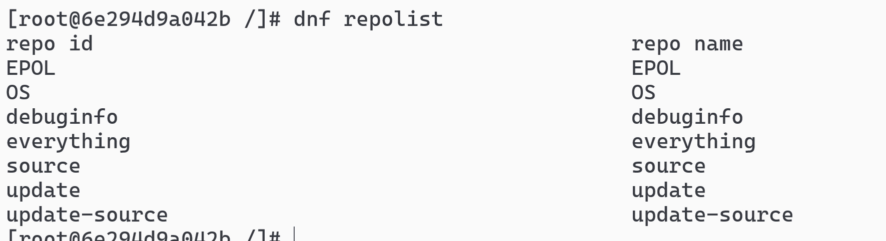
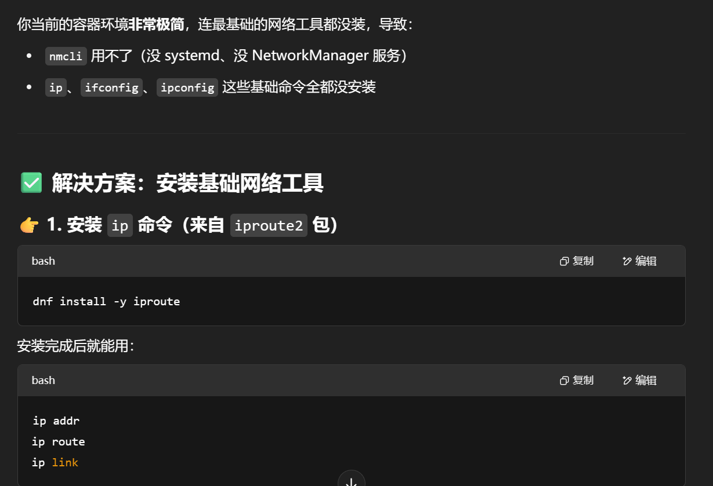
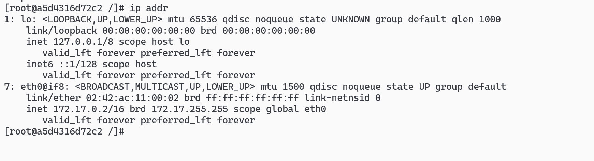
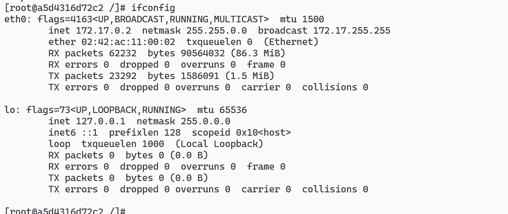

# dnf 的配置文件保存位置： /etc/dnf/dnf.conf



# 需要配置 yum 源的话，在/etc/yum.repos.d/openEuler.repo




# （dnf install dnf-plugins-core）安装好了工具后 dnf config-manager --dump 显示当前配置信息



# dnf repolist 显示相应软件源的配置



# nmcli 网络控制工具

```sh
 dnf install -y NetworkManager
 dnf install -y iproute
```





# （可选）安装 ifconfig 命令（来自 net-tools 包）


