# cat /etc/os-release 查看系统信息

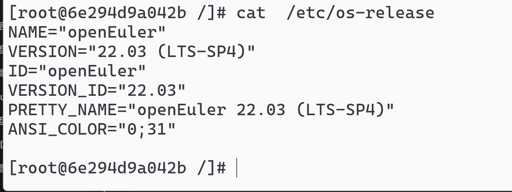

# lscpu 需要 dnf install -y util-linux

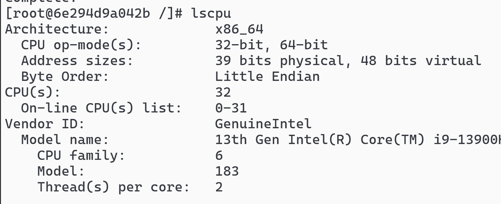

# free -h 查看内存

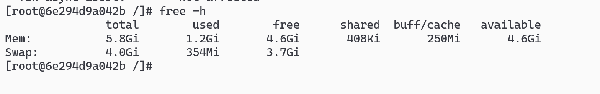

# fdisk -l 查看磁盘

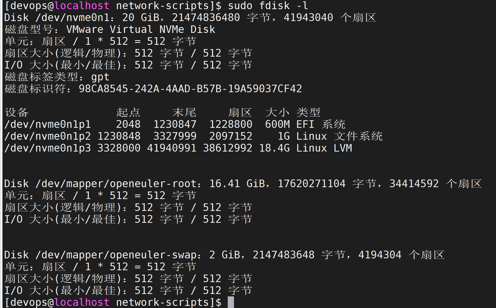

# top 查看实时运行系统信息

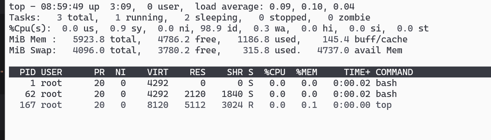

# localectl status 查看语言环境，在 cat /etc/locale.conf 这个文件目录下

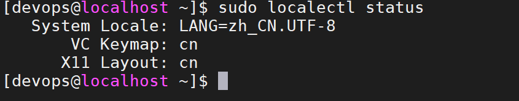
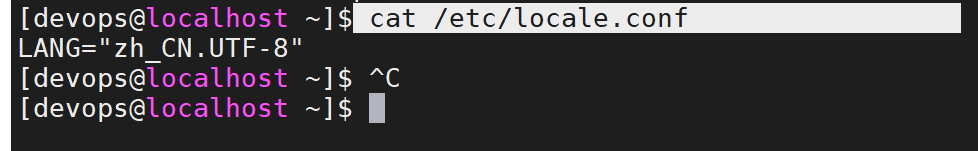

## localectl list-locales | grep zh 列出当前能用的中文环境

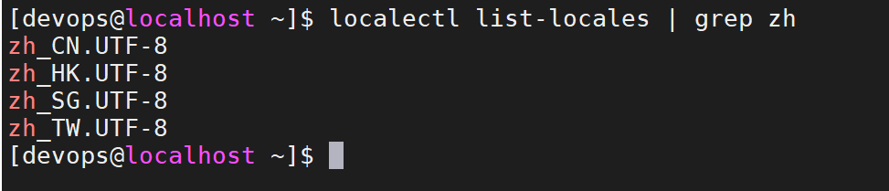

## 如何手动设置语言环境（记得 root 执行下 source /etc/locale.conf

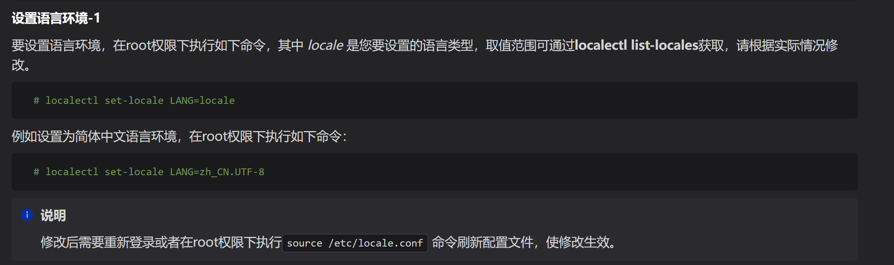

## localectl list-keymaps | grep cn 列出可用的键盘布局

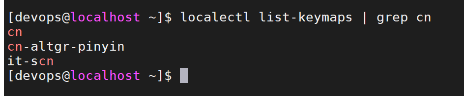

## 设置键盘布局

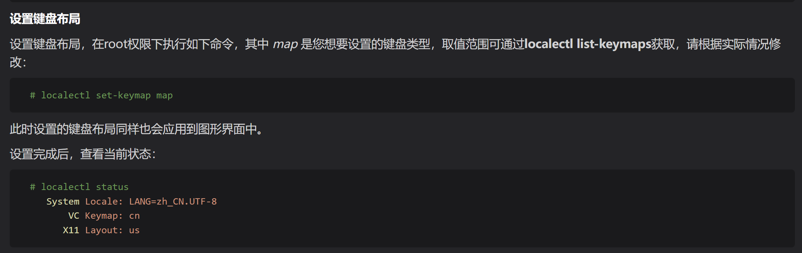

# timedatectl 查看当前时间

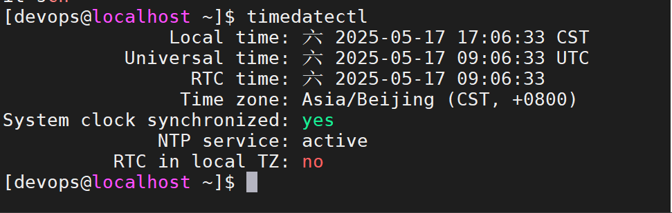

# useradd 添加用户，id + 用户名查看用户信息

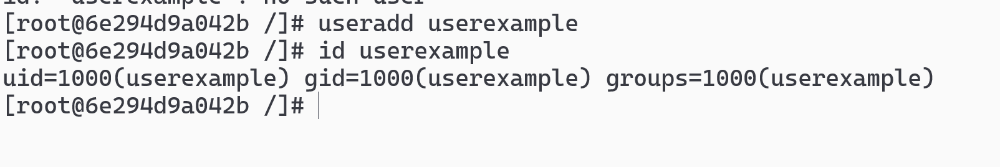

# （dnf install -y passwd）后 passwd 配置用户密码

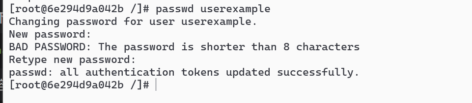

## 记住，一般密码不能在字典中

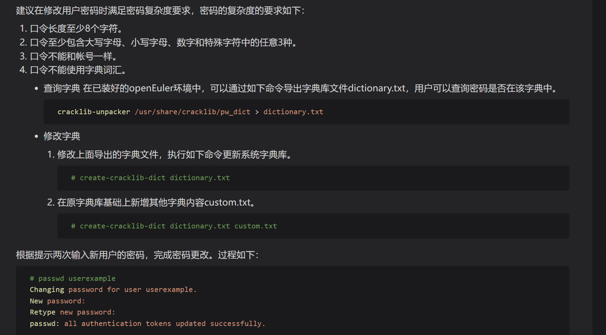
