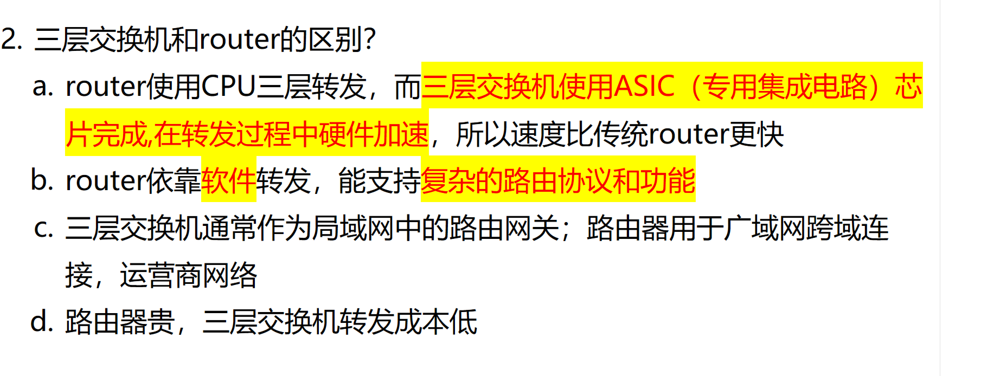
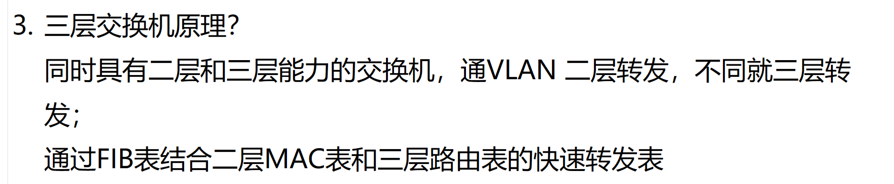
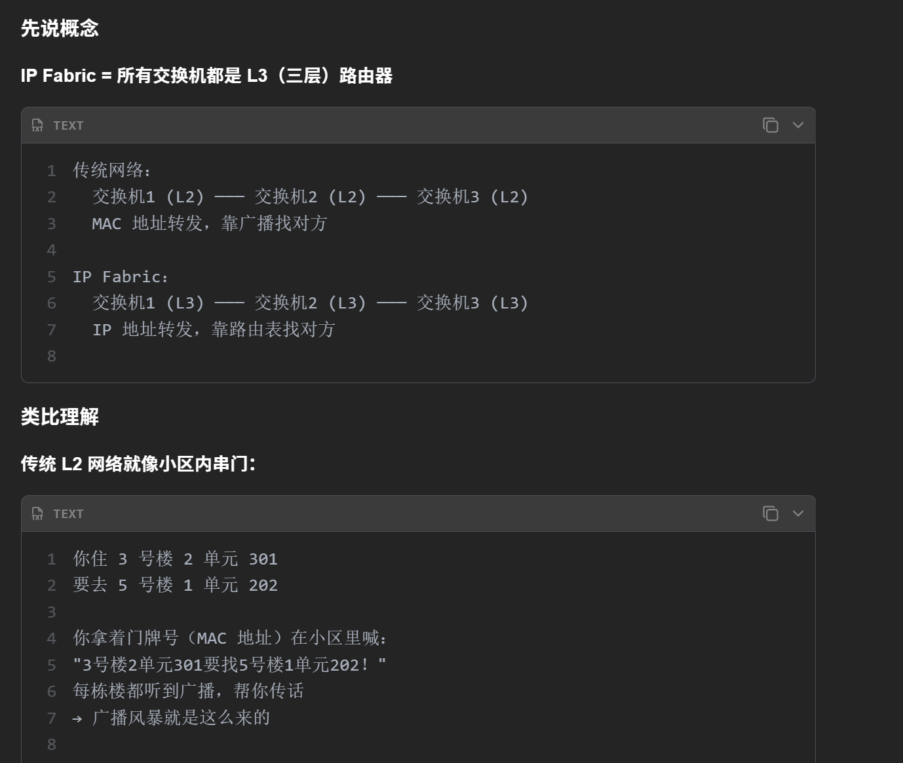
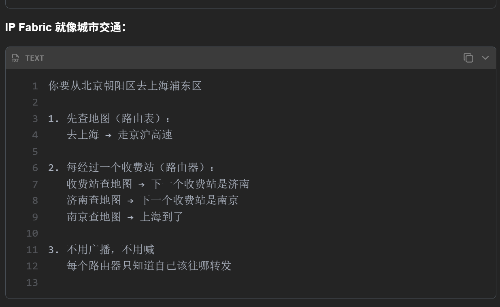

# 1. 三层交换机和路由器的区别？

**Question:** What are the key differences between a Layer 3 switch and a router?

**Answer:**

The main difference lies in forwarding performance and design purpose. Layer 3 switches are optimized（优化） for high-speed forwarding within LANs, using ASICs—specialized hardware chips（专用硬件芯片）—to perform routing decisions at wire speed. This hardware acceleration makes them much faster than traditional routers, which typically rely on CPU-based software forwarding. While routers are more flexible and support complex routing protocols like OSPF or BGP, ideal for WANs and carrier networks, Layer 3 switches are better suited for internal network segmentation and inter-VLAN routing. For example, in a corporate network, a Layer 3 switch might handle traffic between departments, while a router connects to the internet or other external networks. Additionally, Layer 3 switches are generally more cost-effective for local routing tasks, whereas high-end routers come with higher costs due to their advanced features and processing power. So, in short: Layer 3 switches are fast and efficient for local routing, while routers offer greater flexibility and scalability for complex, wide-area networks.

# 2. 三层交换机原理？

**Question:** What is the principle of a Layer 3 switch?

**Answer:**

A Layer 3 switch combines the functionalities of both Layer 2 switching and Layer 3 routing. Its core advantage is enabling fast packet forwarding across different VLANs without relying on a separate router. When packets are received, the switch first checks if the source and destination are within the same VLAN. If so, it forwards the packet at Layer 2 using the MAC address table, just like a traditional switch. However, if they belong to different VLANs, the switch performs Layer 3 routing. This is achieved through a specialized forwarding table called the FIB (Forwarding Information Base), which integrates both the Layer 2 MAC address table and the Layer 3 routing table. The FIB allows the switch to make forwarding decisions at wire speed, significantly improving performance. For example, when a device in VLAN 10 sends data to a device in VLAN 20, the Layer 3 switch uses the FIB to look up the best route and forwards the packet with IP routing, while still maintaining the speed of hardware-based switching. This makes Layer 3 switches ideal for large enterprise networks needing high-speed inter-VLAN communication.

# 3. 三层交换机也叫 IP Fabric

**Question:** What is an IP Fabric, and how does it differ from traditional Layer 2 networking?

**Answer:**

An IP Fabric essentially means that all switches in the network operate as Layer 3 routers, enabling IP-based forwarding instead of relying on Layer 2 MAC address broadcasting. In traditional networks, switches work at Layer 2, so when a device wants to communicate with another, it broadcasts its MAC address to find the destination — which can lead to broadcast storms, especially in large environments. But in an IP Fabric, every switch is a Layer 3 device, so data is forwarded using IP addresses and routing tables. Think of it like city traffic: if you’re traveling from Beijing to Shanghai, you don’t shout your destination to every driver — you check a map (routing table) and follow a route through toll booths (routers), each deciding the next hop. This way, no broadcast is needed, and each switch only needs to know where to forward the packet next. It’s more scalable, efficient, and reduces network congestion. This design is especially useful in modern data centers and large enterprise networks.
