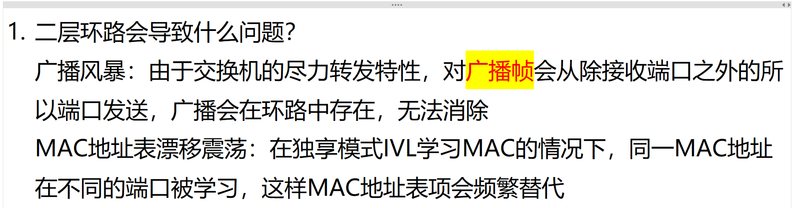
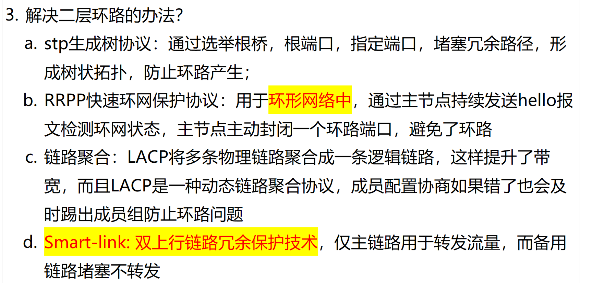
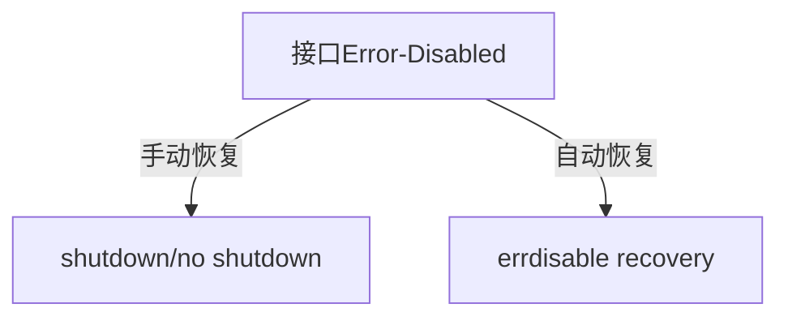

# 1. 二层环路问题？



# 2. 解决二层环路的方法？



# 接口因为广播风暴被 error-down 了，怎么恢复？

<details>
<summary>手动和配置自动</summary>
### **正确答案：C 和 E**  
（**C. 手动执行 shutdown/no shutdown** 和 **E. 配置 error-disable 检测与恢复**）

### **题目解析**

#### **问题背景：接口因流量风暴被 error-disabled**

当交换机检测到 **BPDU Guard、Port Security 违规、Loopback 风暴** 等问题时，接口会进入 **error-disable** 状态并发送 SNMP Trap。恢复接口需以下两步：

1. **手动重启接口（C）**

   - **作用**：立即恢复接口服务（无需等待定时器）。
   - **命令**：
     ```bash
     interface GigabitEthernet1/0/1
       shutdown
       no shutdown
     ```

2. **配置自动恢复（E）**
   - **作用**：避免手动操作，设置接口自动恢复（如 300 秒后）。
   - **命令**：
     ```bash
     errdisable recovery cause all  # 启用所有原因的自动恢复
     errdisable recovery interval 300  # 设置恢复间隔为300秒
     ```

#### **选项分析**

| 选项  | 描述                        | 是否有效    | 原因                    |
| ----- | --------------------------- | ----------- | ----------------------- |
| **C** | 手动 `shutdown/no shutdown` | ✅ **是**   | 直接恢复接口            |
| **E** | 配置 error-disable 恢复     | ✅ **是**   | 长期解决方案            |
| A     | Cisco Prime 发 SNMP Set     | ❌ 不是     | Prime 无法直接恢复端口  |
| B     | 用 EEM 自动恢复             | ❌ 部分有效 | 需额外脚本，非标准方法  |
| D     | 启用 SNMP Trap 并等待       | ❌ 不是     | Trap 仅告警，不触发恢复 |

#### **关键配置示例**



#### **排除其他选项的理由**

- **A（SNMP Set）**：  
  SNMP Set 用于配置参数（如 VLAN），**无法直接恢复 error-disable 端口**。
- **B（EEM）**：  
  需自定义脚本（如监控日志触发恢复），**非题目要求的“必须”操作**。
- **D（SNMP Trap）**：  
  Trap 仅通知管理员，**不参与恢复流程**。

#### **Cisco 官方建议**

> **Error-Disable 恢复指南**:
>
> - "For immediate recovery, **manually restart the interface (C)**. For automation, configure **errdisable recovery (E)**."

### **总结**

- **正确选项**：**C 和 E**
- **关键结论**：
  - **手动重启** 是即时解决方案，**自动恢复配置** 是长期最佳实践。
  - 其他选项（A/B/D）要么无效，要么非标准方法。
- **典型错误**：  
  误选 SNMP 或 EEM（需明确题目问的是 **必须操作**）。

**正确答案：C 和 E ✅**

</details>
