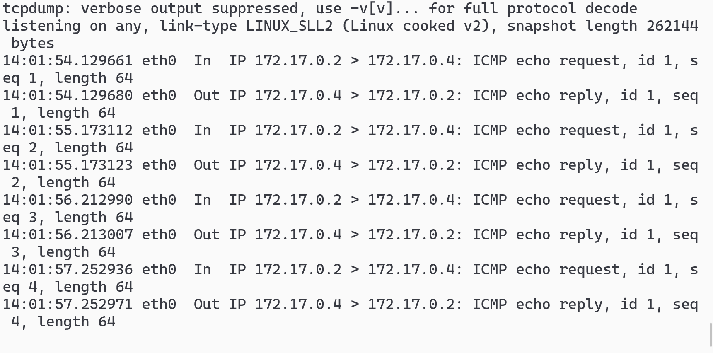
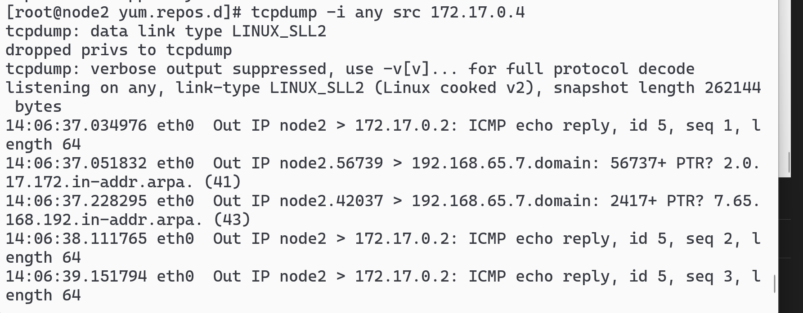
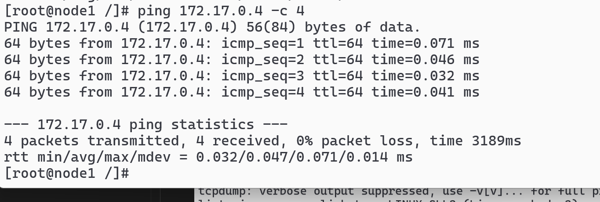

# 节点 2：tcpdump -ni any icmp（监听所有接口 any，过滤 ICMP）：）

## 节点 1 去 ping，`ping 172.17.0.4 -c 4`

## （控制器可选） tcpdump -ni any host 172.17.0.2 在控制器上抓 host 的包

## tcpdump -i any src 172.17.0.4 抓如源 IP 的包

## tcpdump -i any dst 172.17.0.4 抓目的 IP 的包
