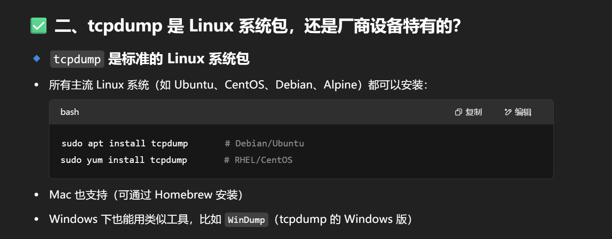
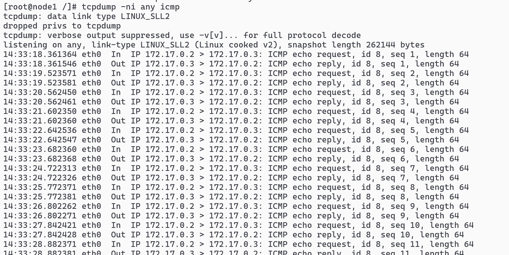
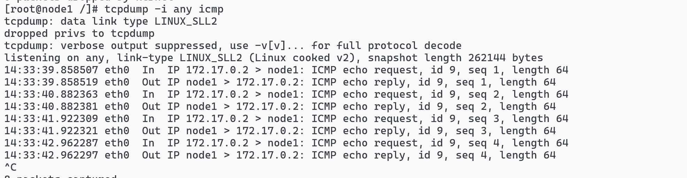

# ping 172.17.0.3 -c 4

# tcpdump 的参数

## -n 显示实际 IP 还是用户名？

## 加-n 显示实际 IP:`tcpdump -ni any icmp`



## 不加 ：`tcpdump -i any icmp`



# -c 指定多少个包

```sh
system tcpdump -ni any icmp -c 10   抓10个icmp包
```
