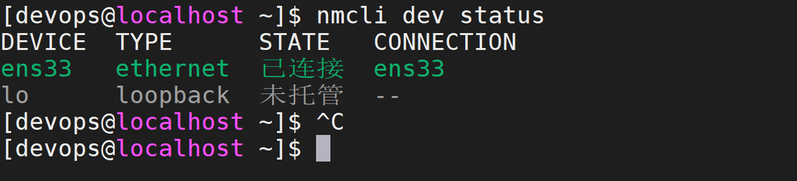
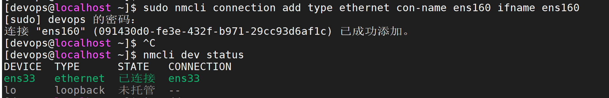
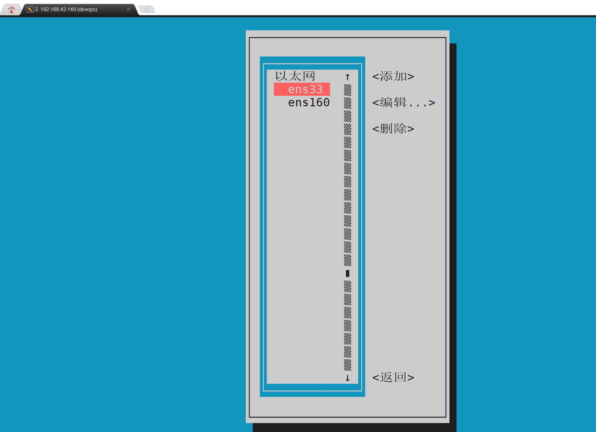
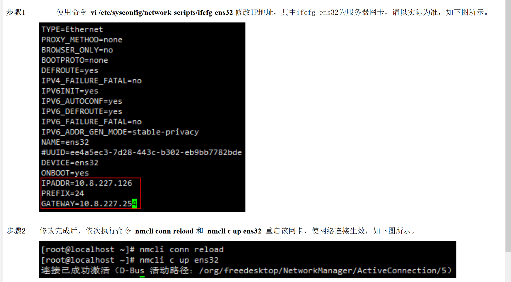

# nmcli dev status 查看网络服务

# 创建 ens160 网卡并配置

## sudo nmcli connection add type ethernet con-name ens160 ifname ens160

## 注意这里 nmcli dev status 还看不见网卡

## nmtui 图形化配置一下

# nmcli conn reload 和 nmcli c up ens32 重启该网卡
