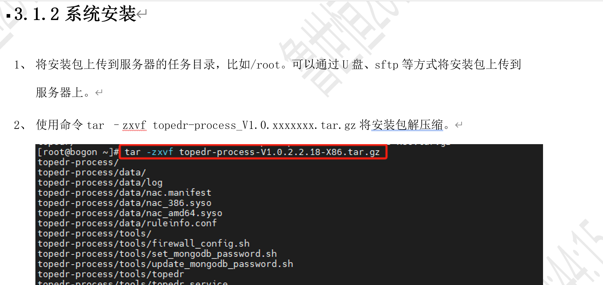
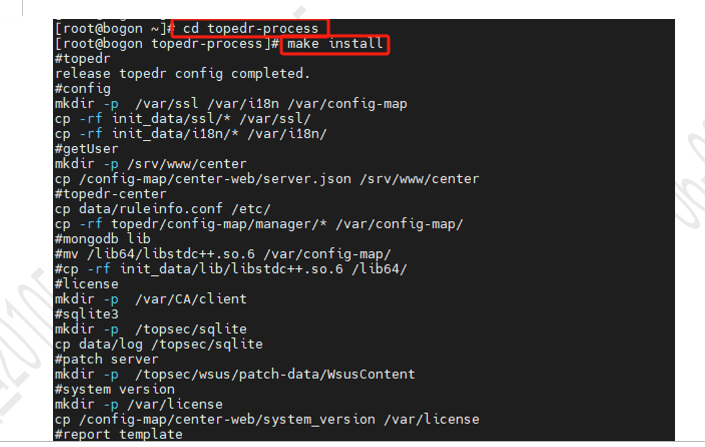
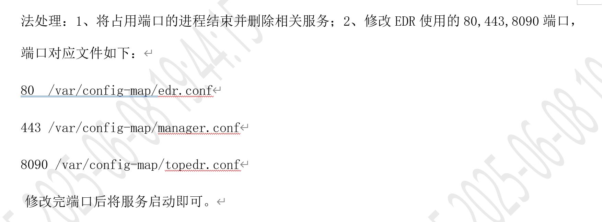
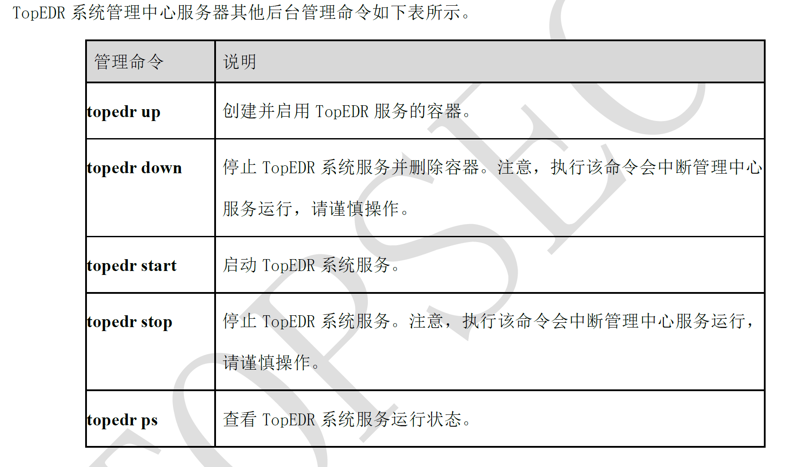
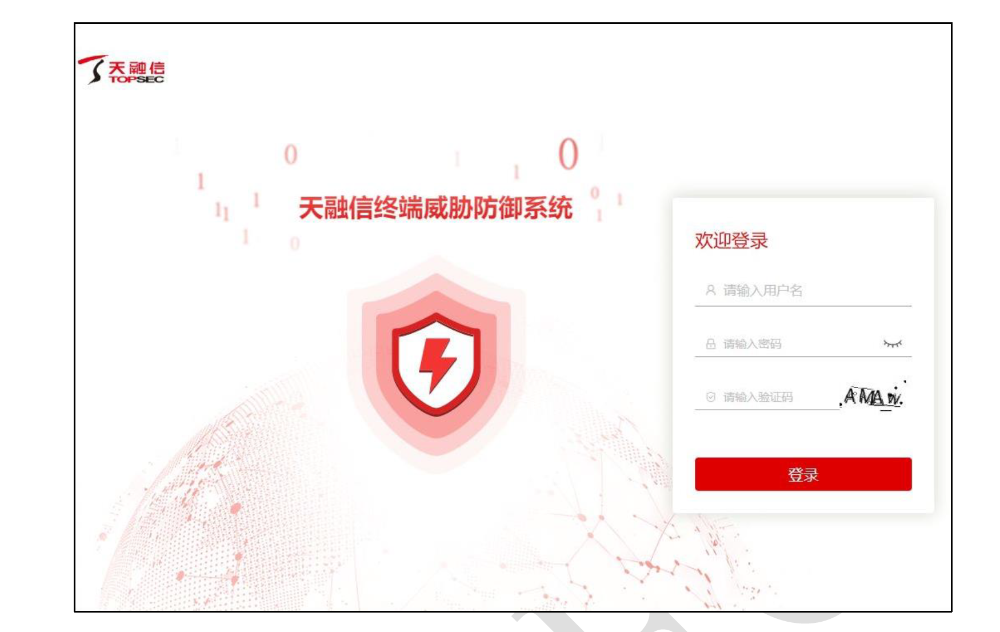
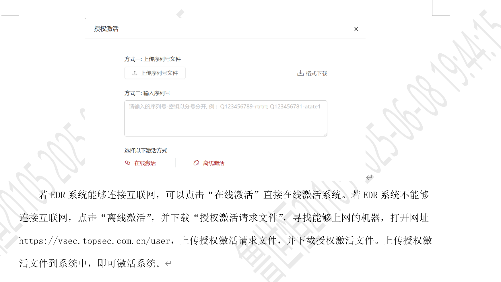

# 默认密码啥的 `admin/EDR@talent123`

# 首先要一个 EDR 服务端（管理端的 IP），作为服务端的地址

# x86 的 tar 文件，root 权限下 tar –zxvf topedr-process_V1.0.xxxxxxx.tar.gz 解压

# cd 解压后的文件夹，make install 安装

## 这里可能会有因为系统内存不够用的情况，可以 df -h 看一下内存

# systemctl status topedr 查看服务端的状态

# systemctl enable topedr 设置开机启动

# 此时需要进入 https://IP 看看是否能访问 UI 界面，443 端口是 webui 的 https，80 是提供给客户端，8090 是客户端和服务端的互联短端口

# 可以用 topedr up 等指令看后台服务器

# 默认密码啥的 `admin/EDR@talent123`

# 授权激活在https://vsec.topsec.com.cn/user界面，注意要导入导出的时候，征求客户同意

