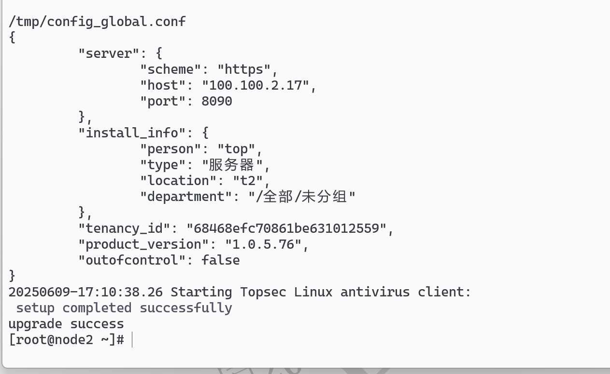
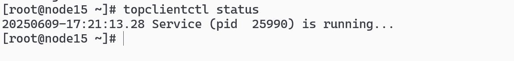
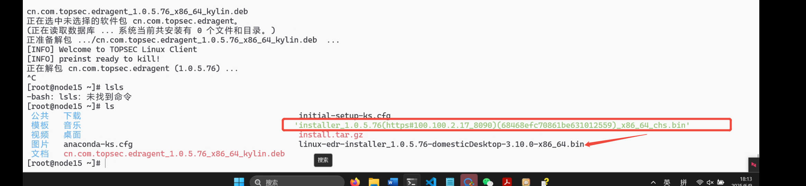
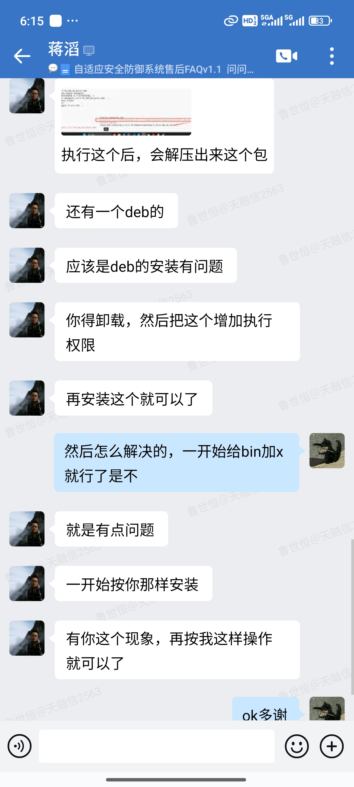

# 国产化系统 x86 客户端安装，执行 bin 文件时，出现 success 但是不上线的情况，

## 通过 topclientctl 发现有进程

## 执行`./installer_1.0.5.76\(https#100.100.2.17_8090\)\(68468efc70861be631012559\)_x86_64_chs.bin`二进制文件后，出现的`linux-edr-installer 1.0.5.76-domesticDesktop-3.10.0-x86 64.bin`文件加一下 chmod+x 的执行权限

