# 路由模式抓包

## （1） 抓取经过防火墙的 ICMP 数据包 system tcpdump -ni any host 6.6.6.6 and icmp

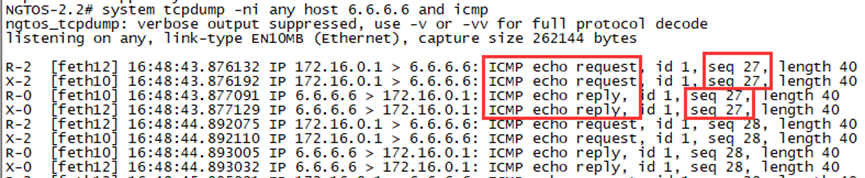
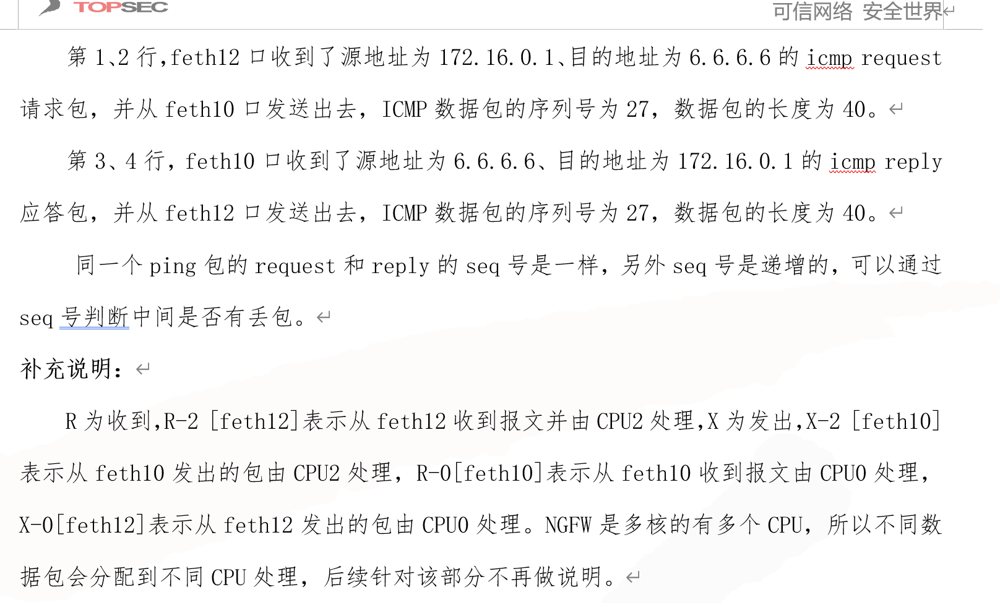
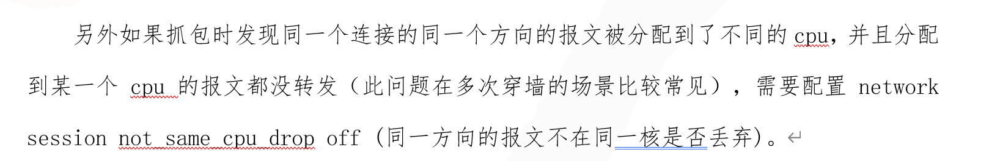

## （2） 抓取经过防火墙的 TCP 包 system tcpdump -ni any host 6.6.6.6 and port 23

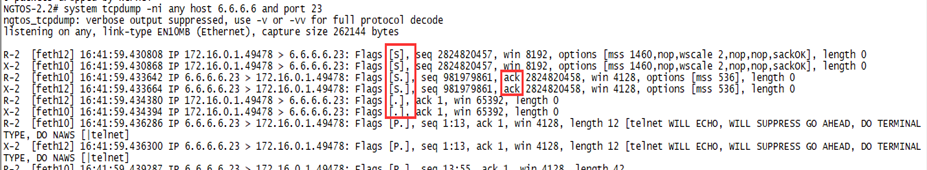

# 透明模式抓包（只要带 vlan 标签，统一带 vlan 抓包）

## （1） 收发接口都为 acess 模式 system tcpdump -ni any host 6.6.6.6 and icmp

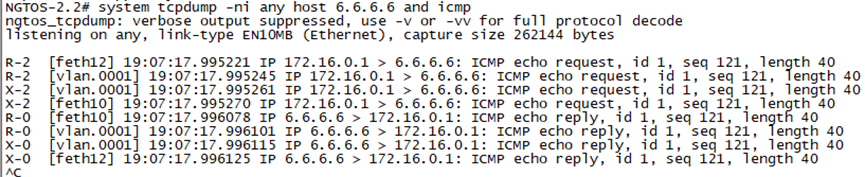

## （2） 收发接口都为 trunk 模式要带 vlan system tcpdump –ni any `vlan` and host 10.0.0.2 and host 10.0.0.1 and icmp。

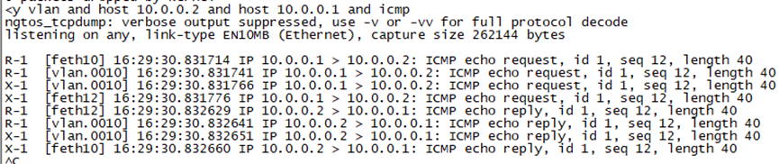

### TAG 子接口同等于 trunk 的 vlan，所以抓包时按照 trunk 的方式抓包

## （3） 收发接口为 acess+trunk 模式

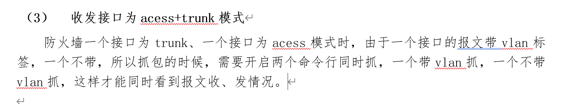

# 3. 聚合模式抓包

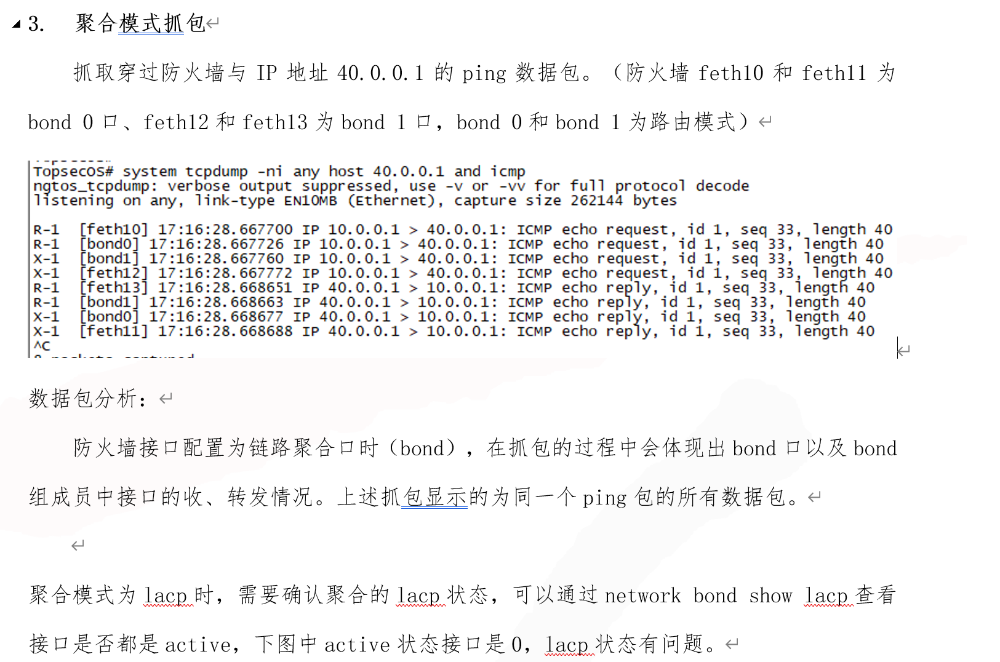

## 要 network bond show lacp 查看接口是否都是 active，下图中 active 状态接口是 0，lacp 状态有问题

# 虚拟线抓包

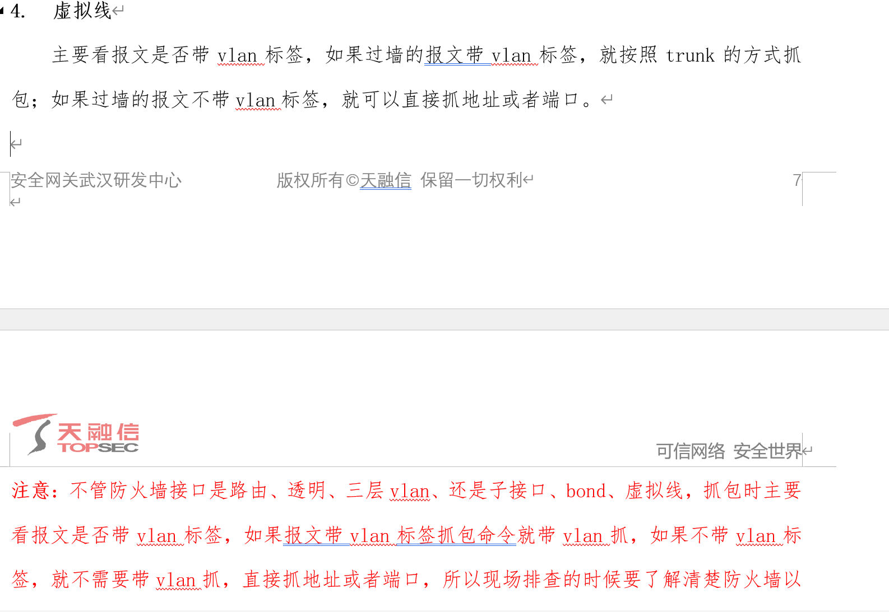

# NAT 抓包

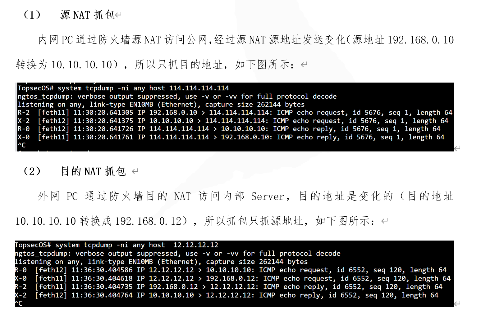
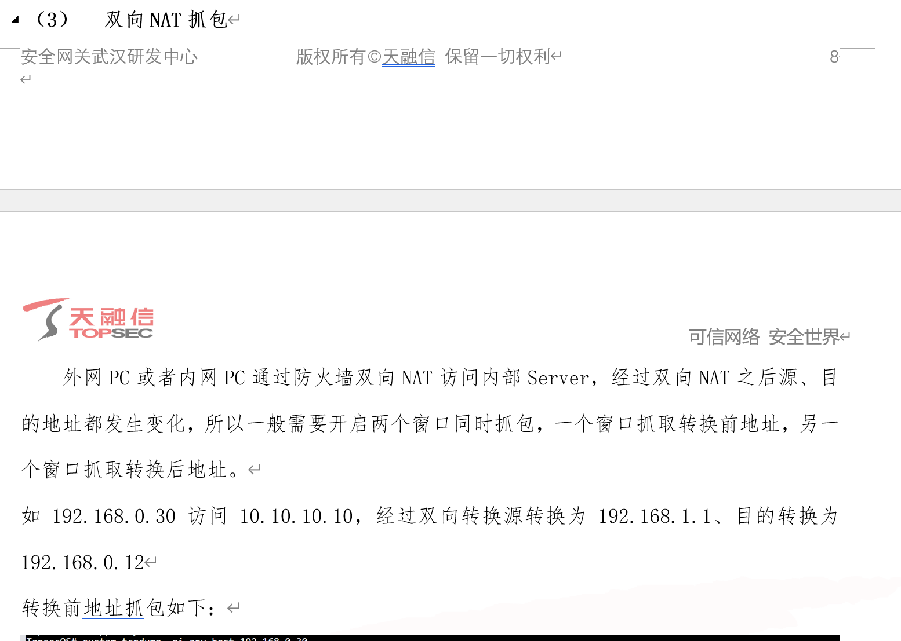
