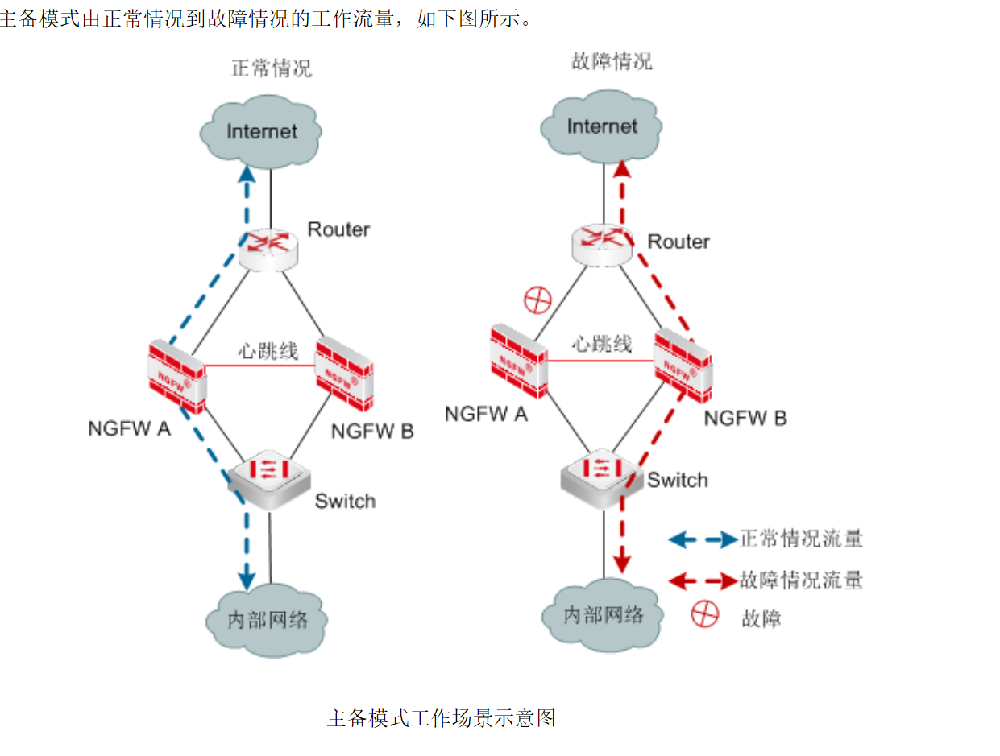
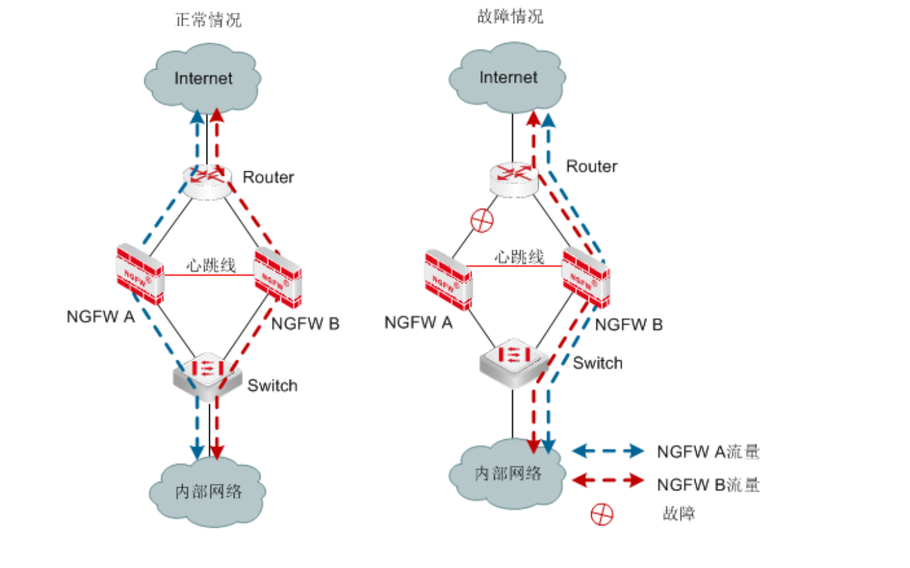
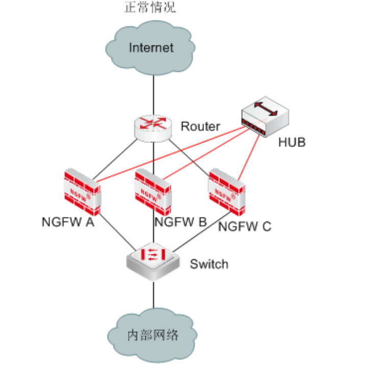

# 主备模式(AS,Active-to-Standby，由 2 台 NGFW 设备组成管理组，有一台主设备处于工作状态，其他设备处于备份状态。

## 心跳口和管理口的接口属性必须要勾选“非同步地址”选项，否则心跳口和管理口的 IP 地址信息会在主从设备运行状态同步时被对方覆盖。

## 配置其他通信接口。互为备份的接口必须配置相同的 IP 地址。

## 配置高可用性的相关参数，并启用高可用性功能。

# 负载均衡(AA,active-to-active，至少需由 2 个管理组组成，每个管理组中有一台主设备处于工作状态，另外一台设备处于备份状态

# 在连接保护模式(SP,session protect)

