# SSL 网关配置，DHCP 网段尽量写 16 位的

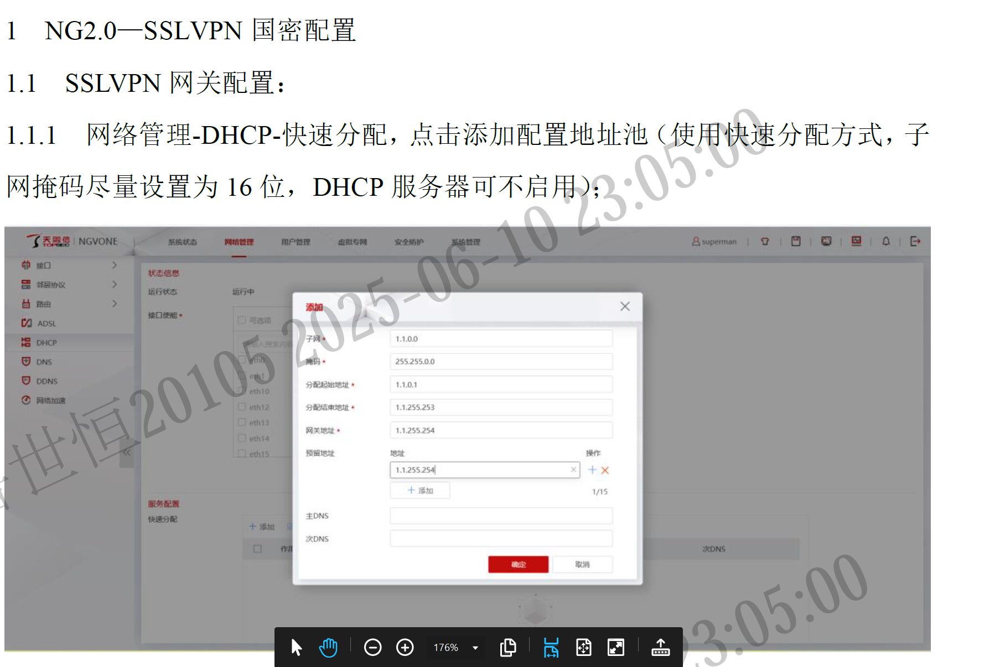

# 常规设置-IPSEC 加密协议选择国密

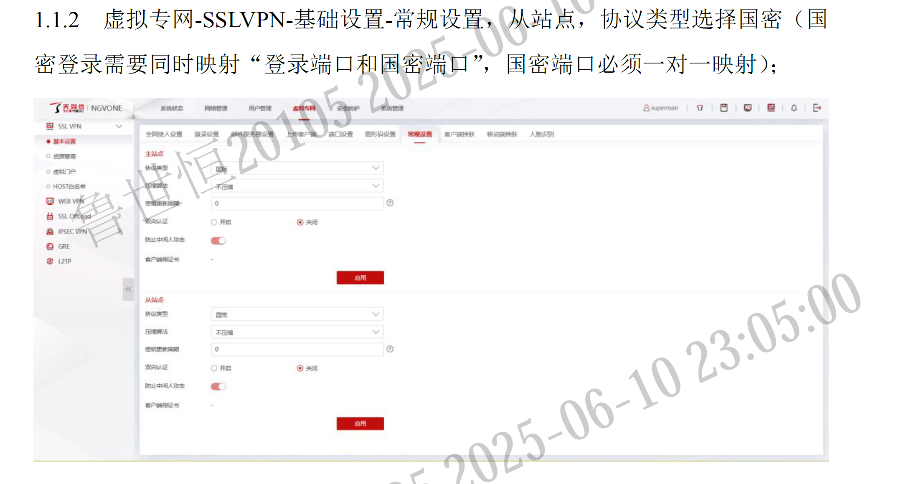

# 加资源组/区域

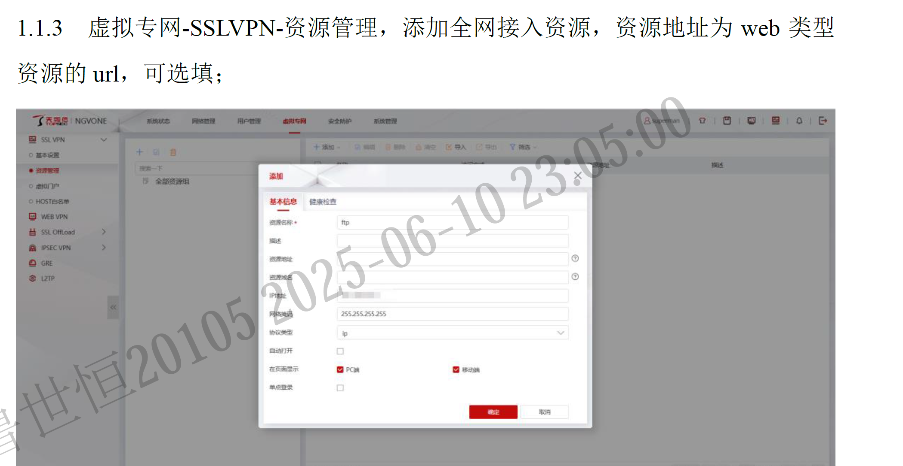
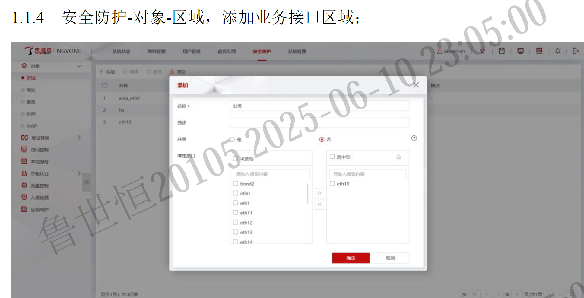
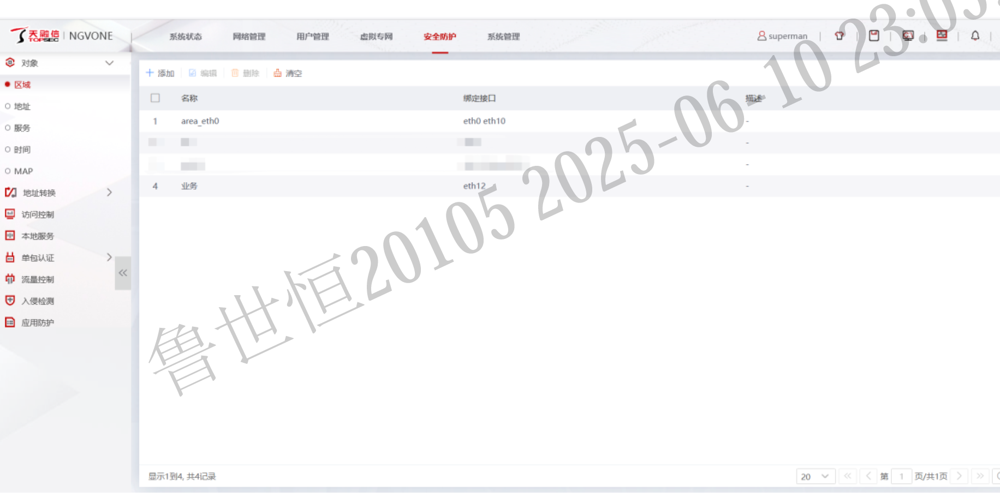

# 本机服务（可信主机）开启 ssl-vpn 服务

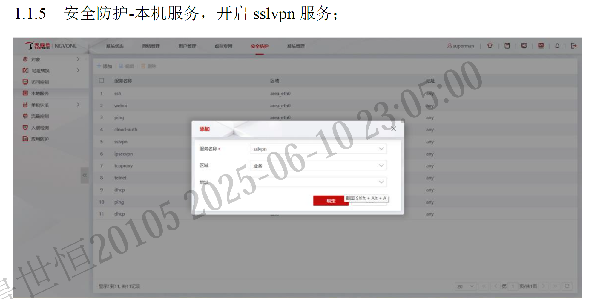

# 对象地址子网添加---NAT44

# 国密证书认证

## 用户管理-本地用户，选中 default 组，绑定地址池

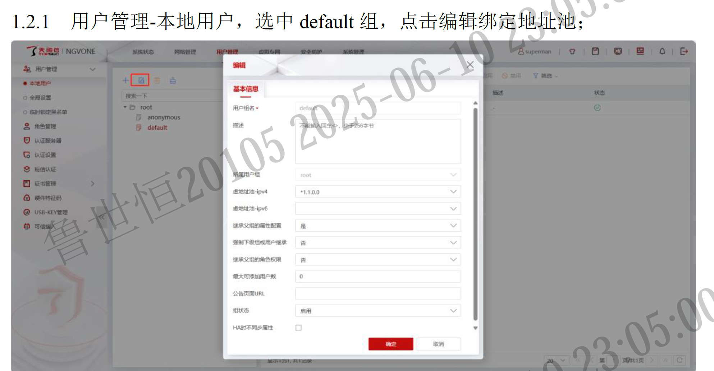

## 用户管理-全局设置里，选择“证书认账”或者“口令活证书认证”

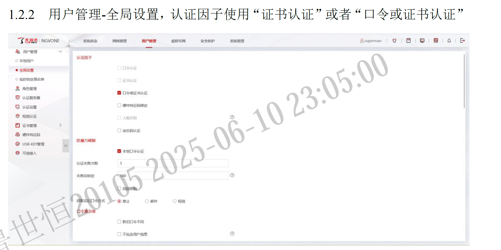

## 用户管理-角色管理，添加“证书”角色

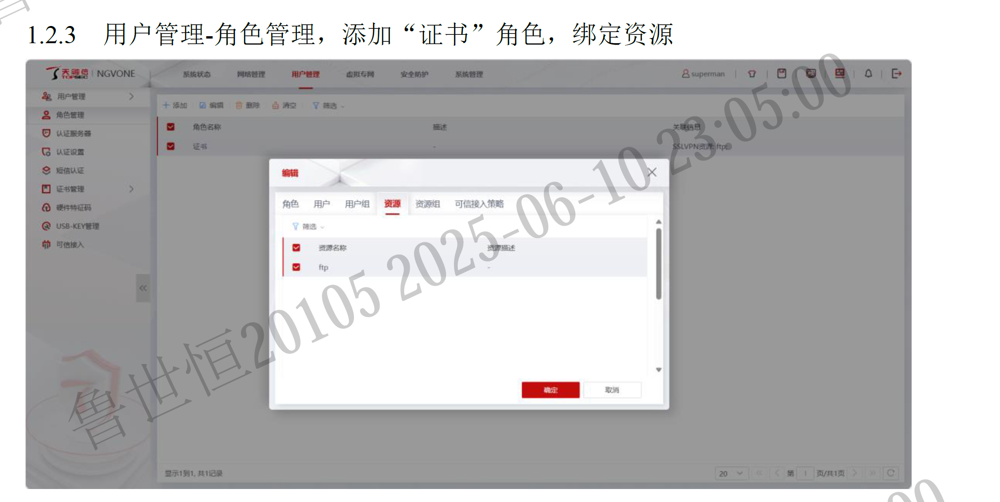

## 用户管理-认证设置，服务器"cert"，配置授权策略为整体，类型为“角色”

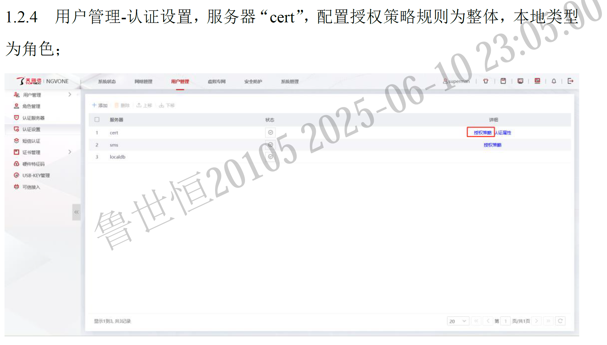
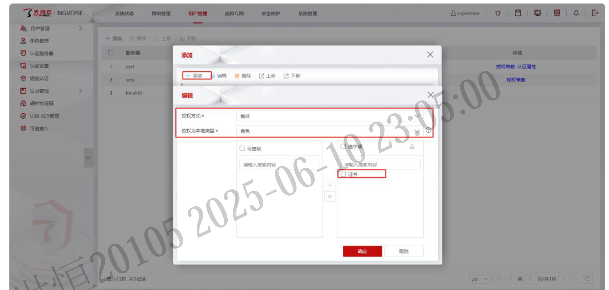
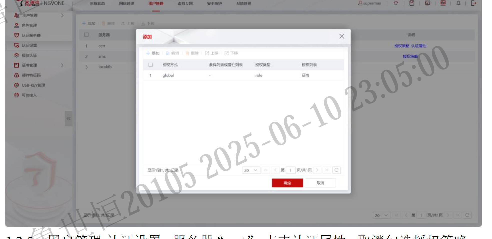

## 用户管理-认证设置，服务器"cert"，认证属性取消授权策略

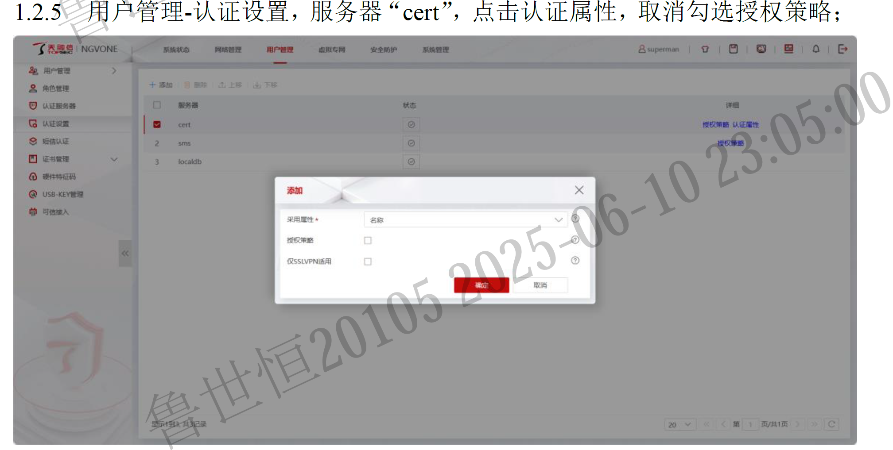

## 用户管理-证书管理-第三方 CA 证书

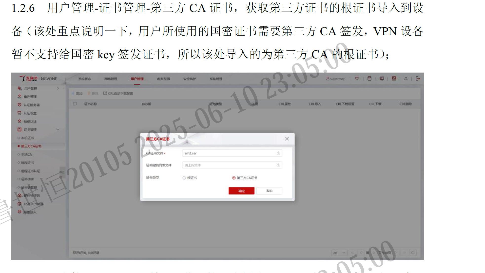

## key 驱动添加

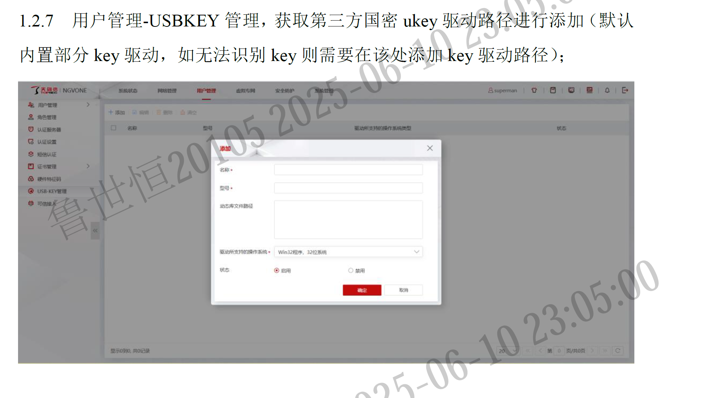

## 客户端 PC 配置，插入 ukey 就可读取证书

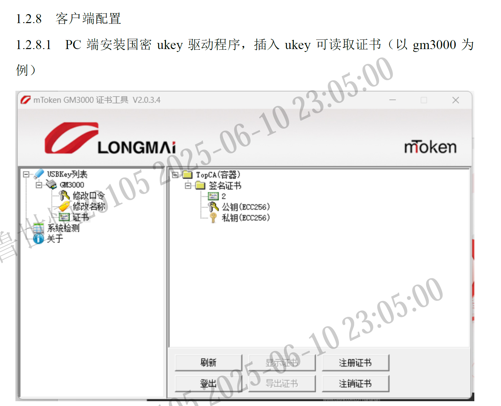

## 用 NG 客户端，选择证书登录

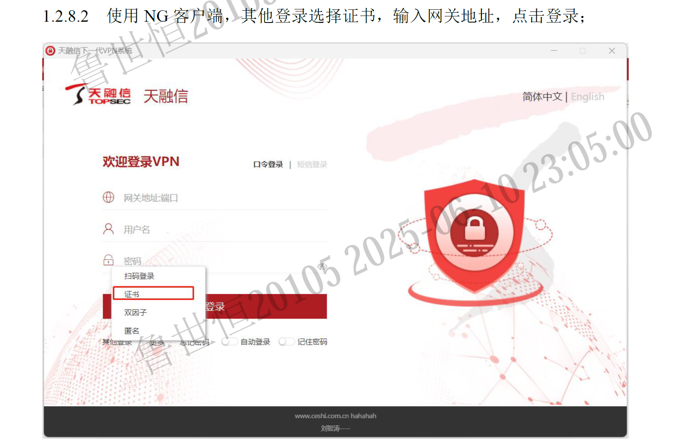
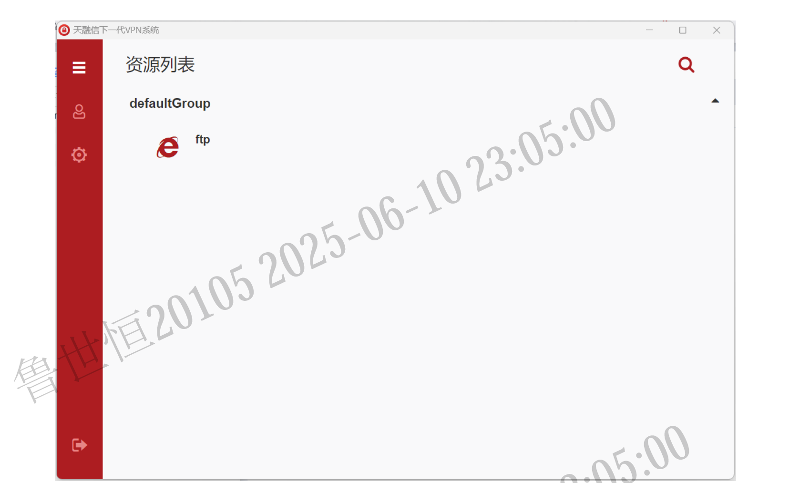
