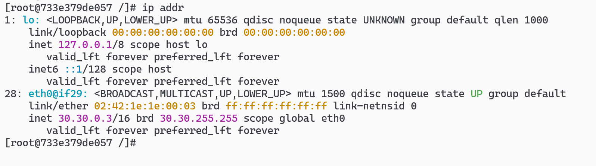

# docker network create --subnet=172.20.0.0/16 ipsec-net 创建测试网络

# 通过镜像创建容器

```sh
docker run -dit --name  vpn1 --net ipsec-net  --ip 30.30.0.2 --privileged ubuntu:22.04 bash

docker run -dit --name  vpn2 --net ipsec-net  --ip 30.30.0.3  --privileged ubuntu:22.04 bash
```

# docker -it vpn1 /bin/bash 进入容器 ip addr 查看地址



# 配 apt 源

```sh
cat > /etc/apt/sources.list <<EOF
deb http://mirrors.ustc.edu.cn/ubuntu/ jammy main restricted universe multiverse
deb http://mirrors.ustc.edu.cn/ubuntu/ jammy-updates main restricted universe multiverse
deb http://mirrors.ustc.edu.cn/ubuntu/ jammy-backports main restricted universe multiverse
deb http://mirrors.ustc.edu.cn/ubuntu/ jammy-security main restricted universe multiverse
EOF
```

# 安装包

```sh
apt update
apt install -y strongswan iproute2 iputils-ping tcpdump
```
