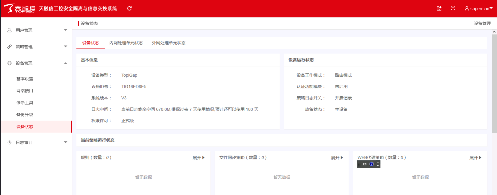
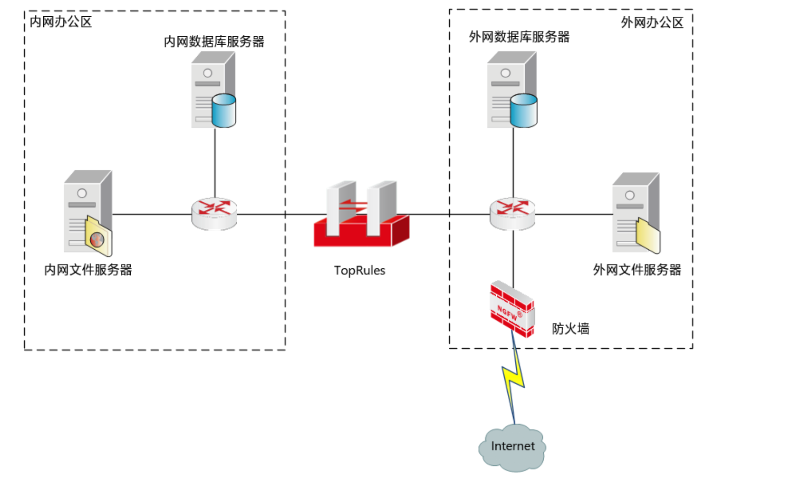
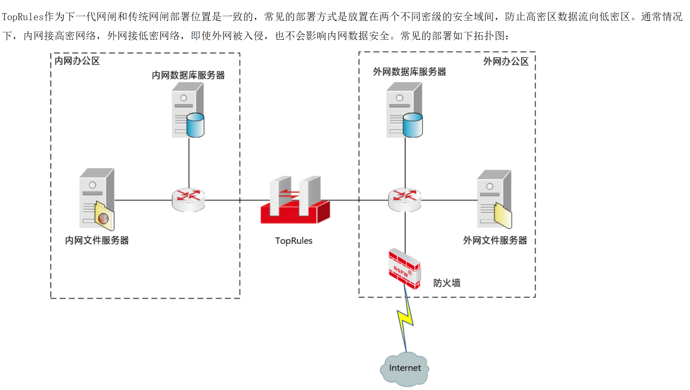
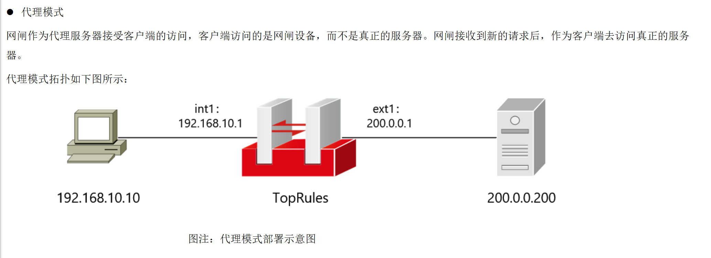
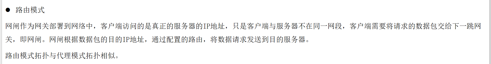
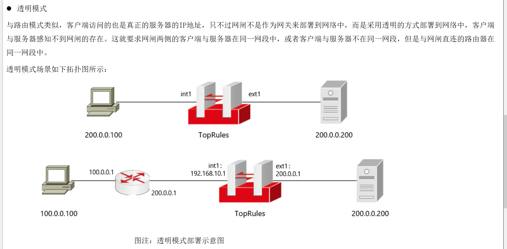
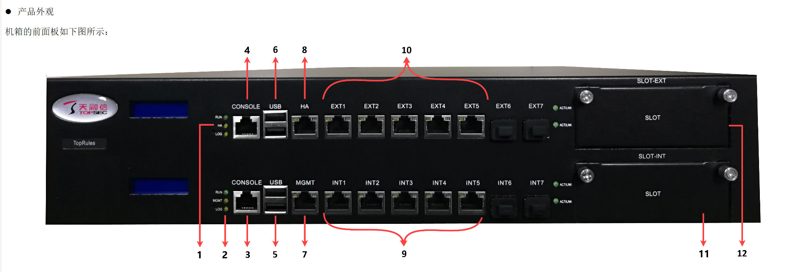
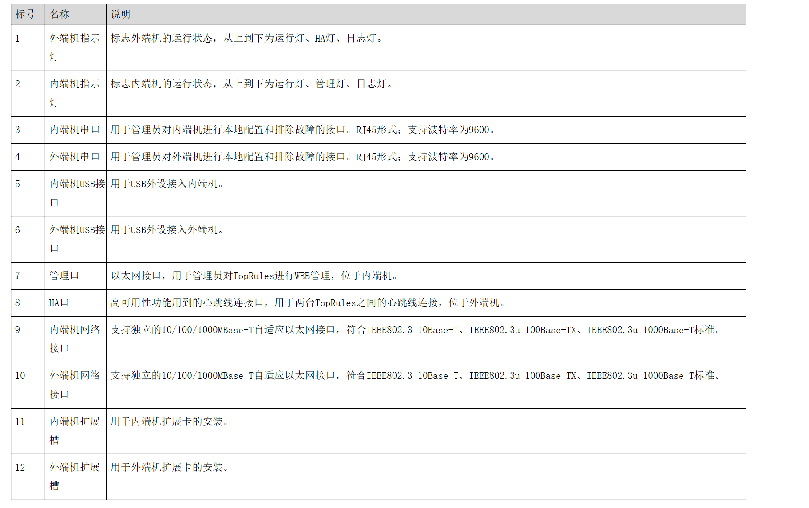

# TopRules:安全隔离与数据交换系统

# 系统界面

# TopRules 作为下一代网闸和传统网闸部署位置是一致的，常见的部署方式是放置在两个不同密级的安全域间，防止高密区数据流向低密区。通常情况下，内网接高密网络，外网接低密网络，即使外网被入侵，也不会影响内网数据安全。常见的部署如下拓扑图：

# 部署模式

# 代理模式

# 路由模式

# 透明模式

# 产品面板

