# 原理

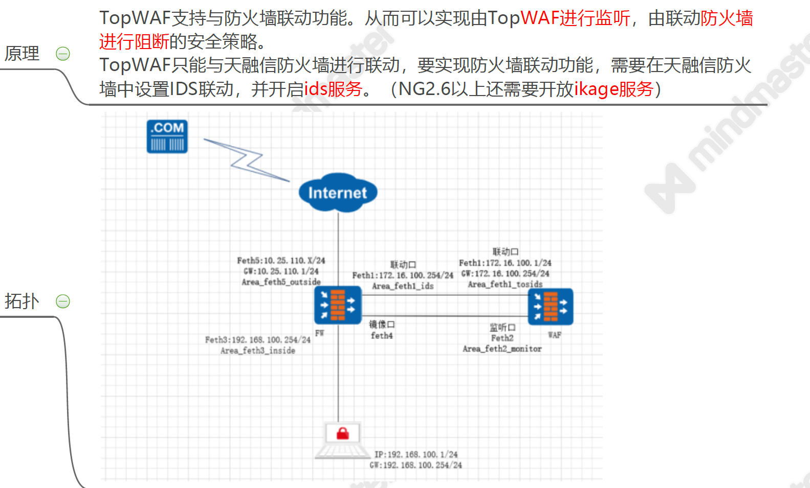

# NGTOS 用证书？老 tos 用密钥？

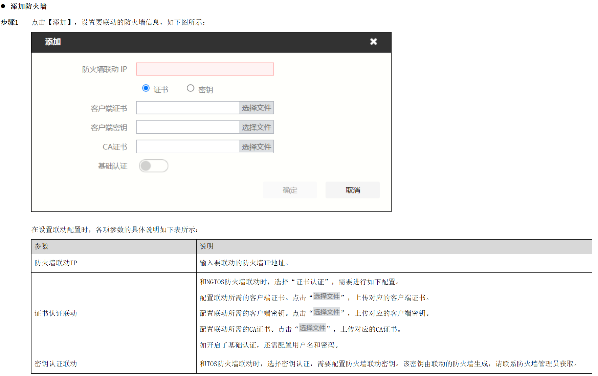

# 防火墙上配置

## 配置接口

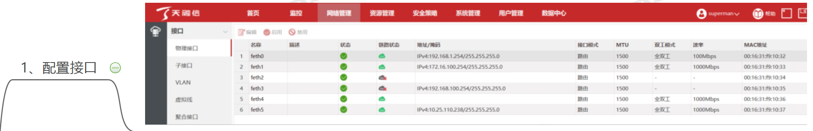

## 配置路由

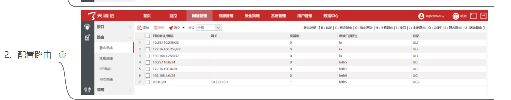

## 配区域（ids)和服务（ids）

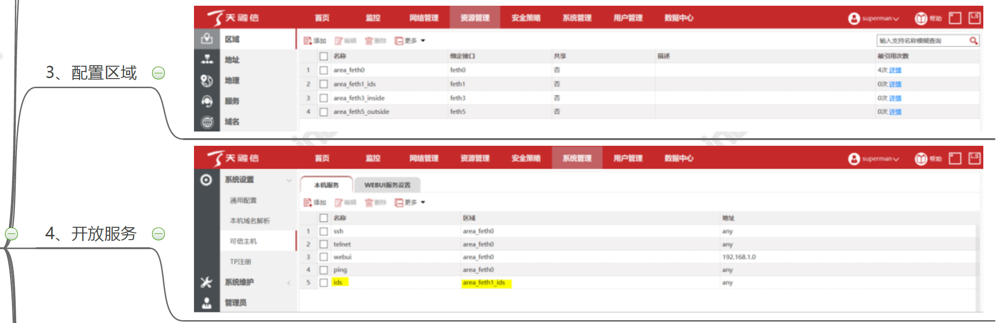

## 对 PC 进行 NAT 地址转换

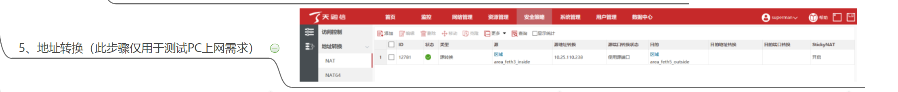

## 配端口镜像

## 点 IDS 联动

# WAF 上配置

## 配置接口

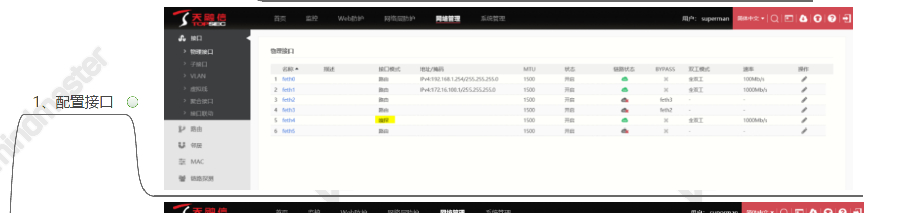

## 配置路由

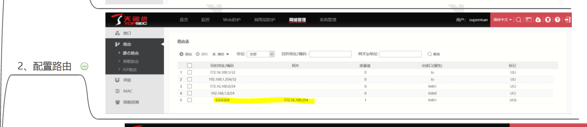

## 配安全策略（点击联动策略）

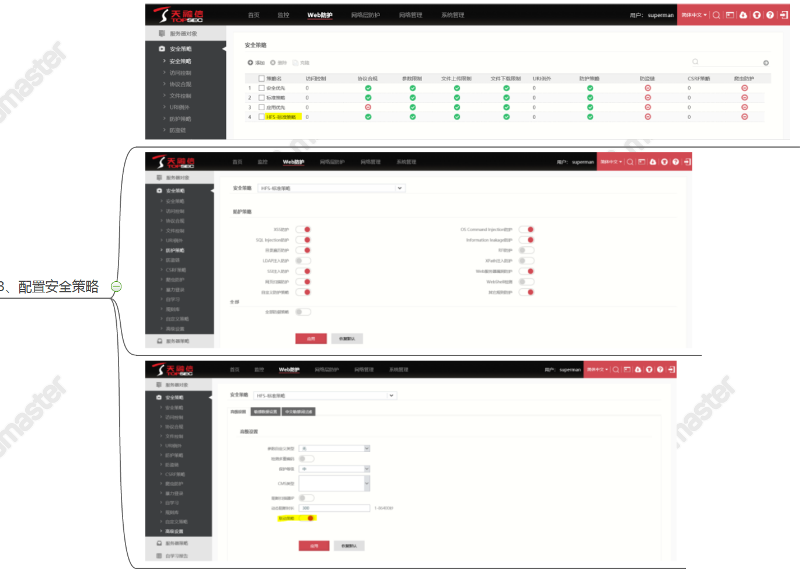

## 配服务器策略和防火墙联动

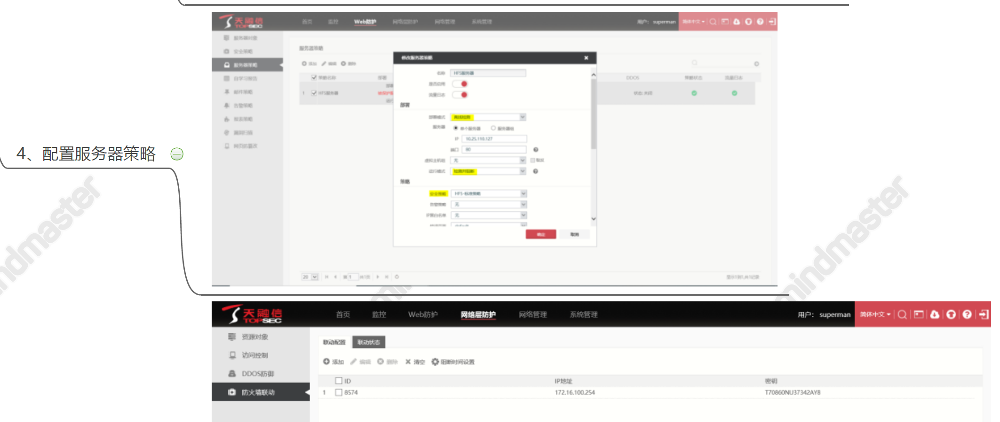

# 测试

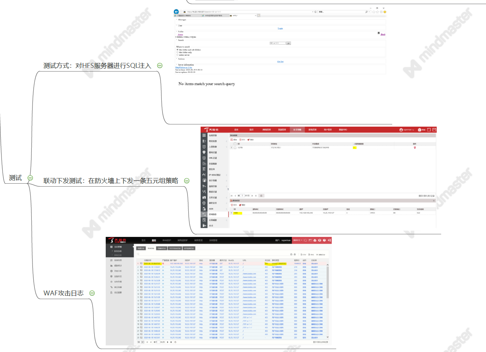
