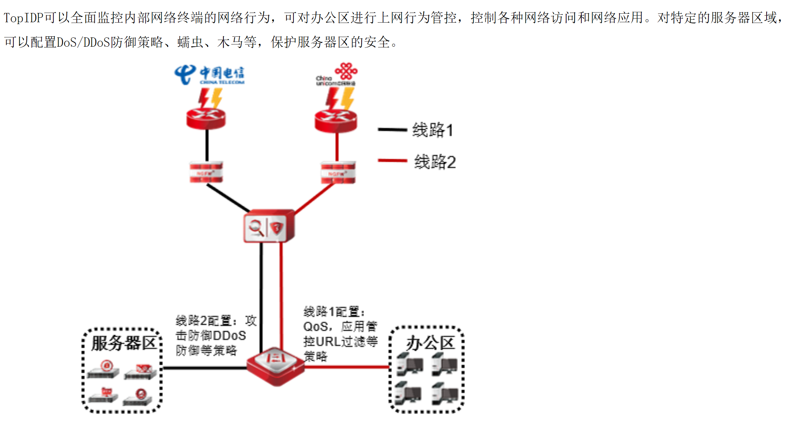
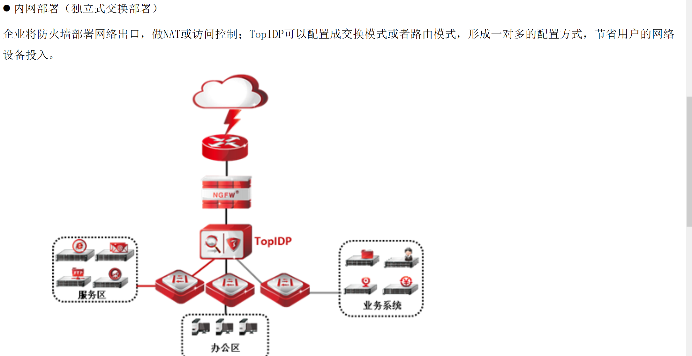
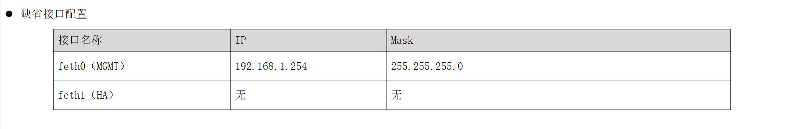
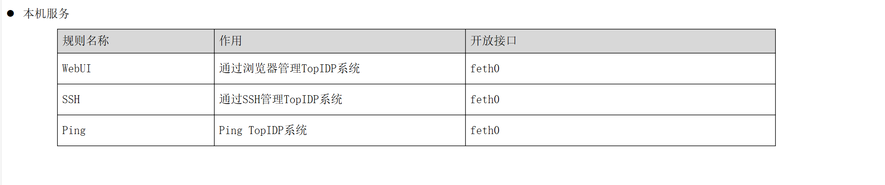
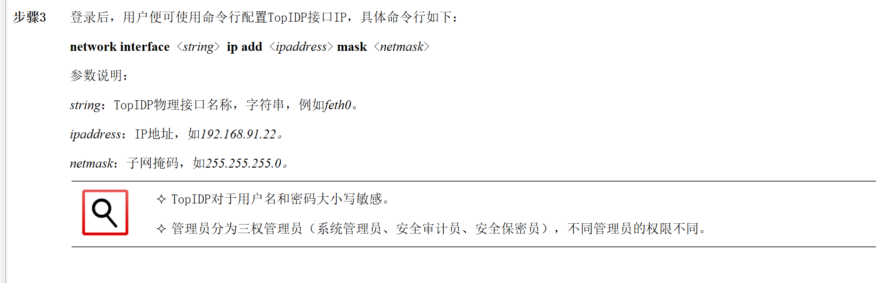
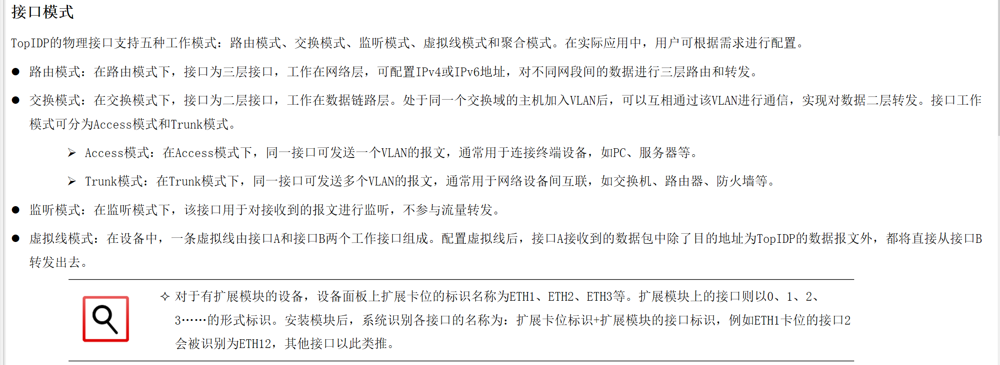

# IDP 入侵防御，系统管理员 （admin/talent）、 安全审计员（auditor/talent）、 安全保密员（grantor/talent）。
# 缺省eth0(MG)：192.168.1.254

## 操作系统：天融信自主知识产权的下一代安全操作系统—NGTOS

## 经典模式

## 内网模式（独立式交换部署）

## 混合部署

# 缺省管理模式

## 缺省管理用户

## 系统管理员 （admin/talent）、 安全审计员（auditor/talent）、 安全保密员（grantor/talent）。

## 缺省接口配置

## 缺省区域对象:area_feth0,绑定接口 feth0

## 默认服务

# CLI 改变网卡/控制接口 IP

# 接口分为物理接口和逻辑接口

## 物理接口的五种模式：路由模式、交换模式、监听模式、虚拟线模式和聚合模式

