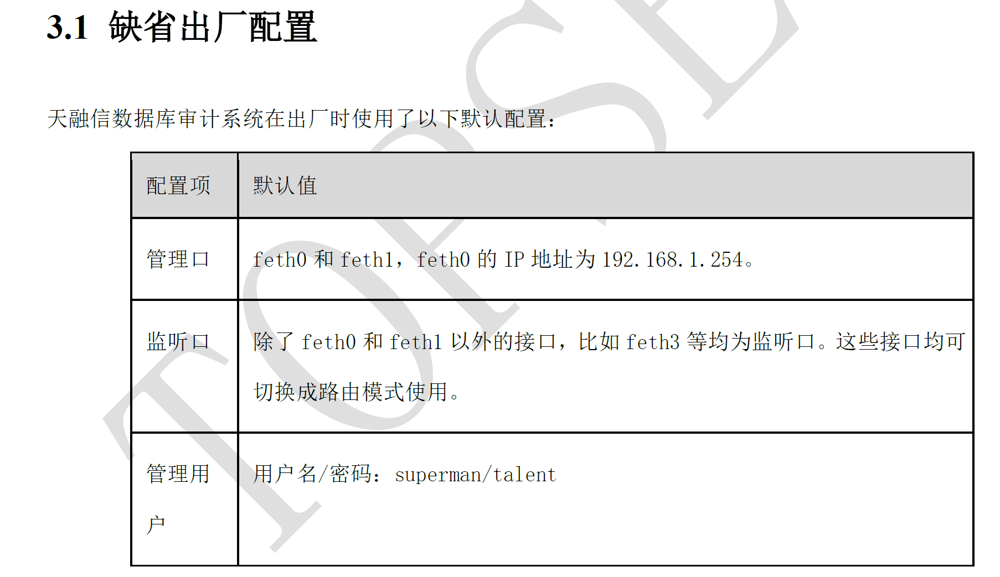
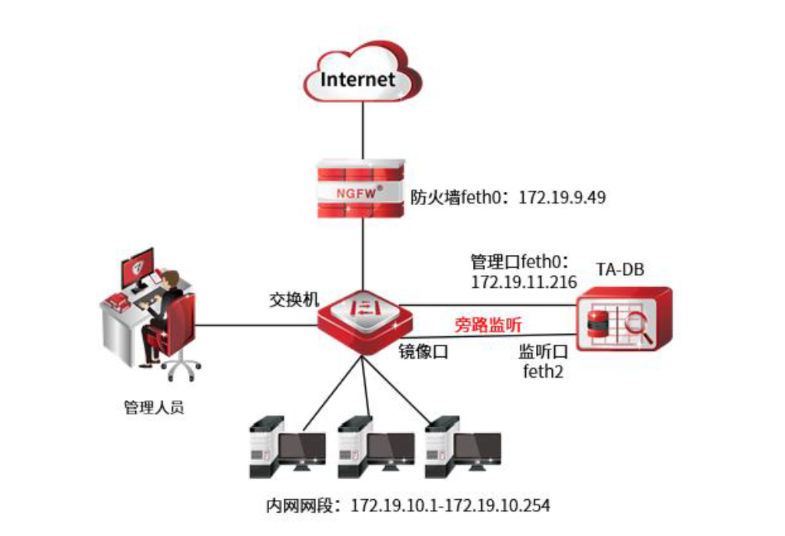
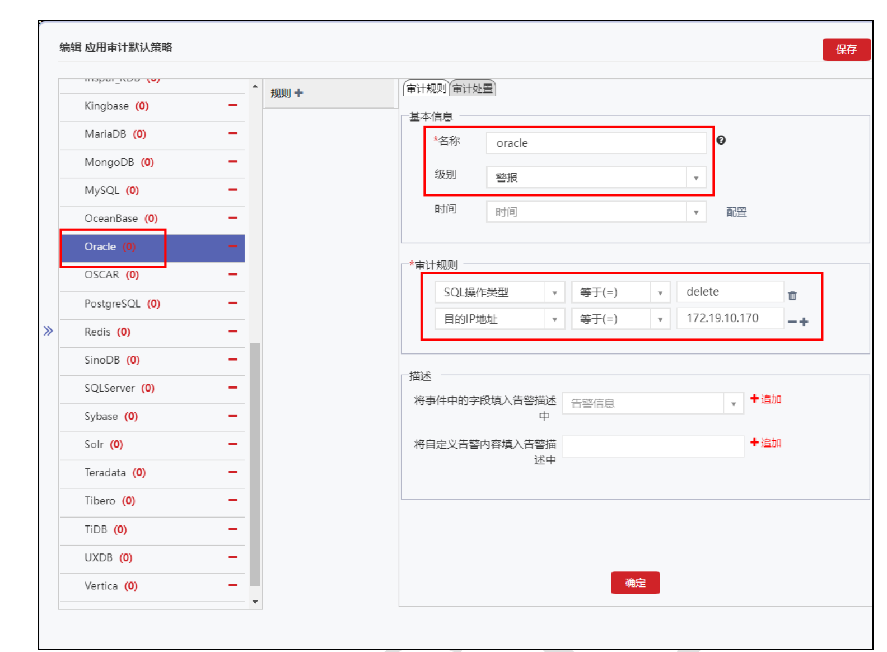
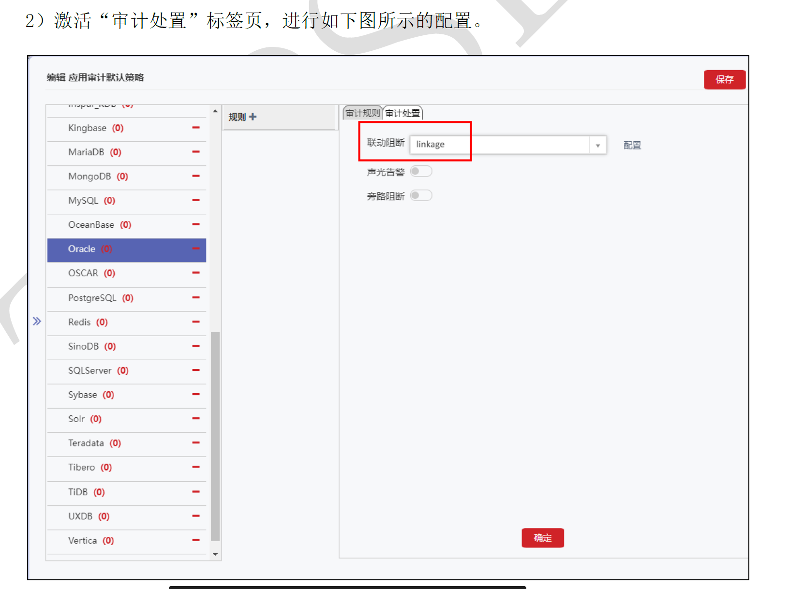
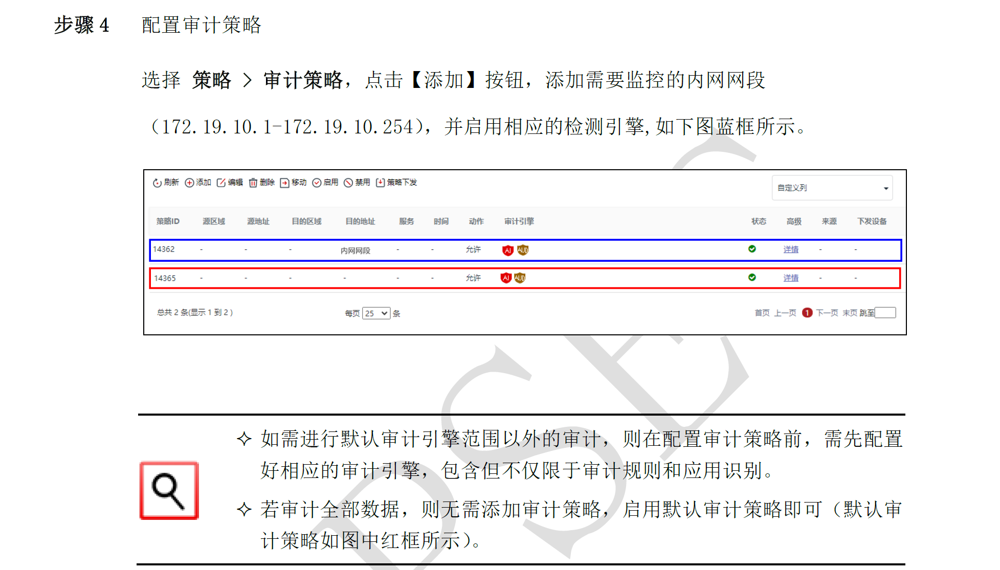

# 管理口缺省是 feth0 和 feth1，superman/talent ,192.168.1.254

# 配管理地址记得带外配网关路由

# 旁路部署+防火墙联动（[防火墙配置](../WAF/实施1-配置防火墙联动.md/#防火墙上配置)防火墙也要做联动的配置）

# 配接口和出口网关路由

# 配联动：策略->设备联动->添加（可能会有证书）

# 配置审计规则，比方说数据库 oracle 删除表

## 激活审计处置

# 配置审计策略

# 