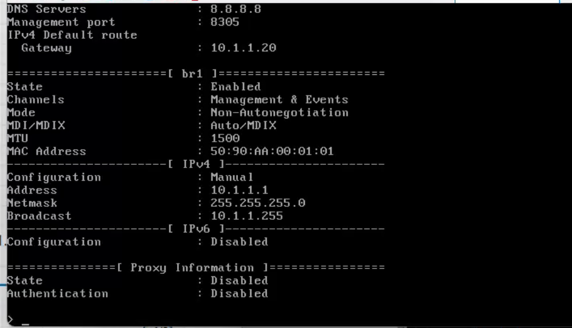
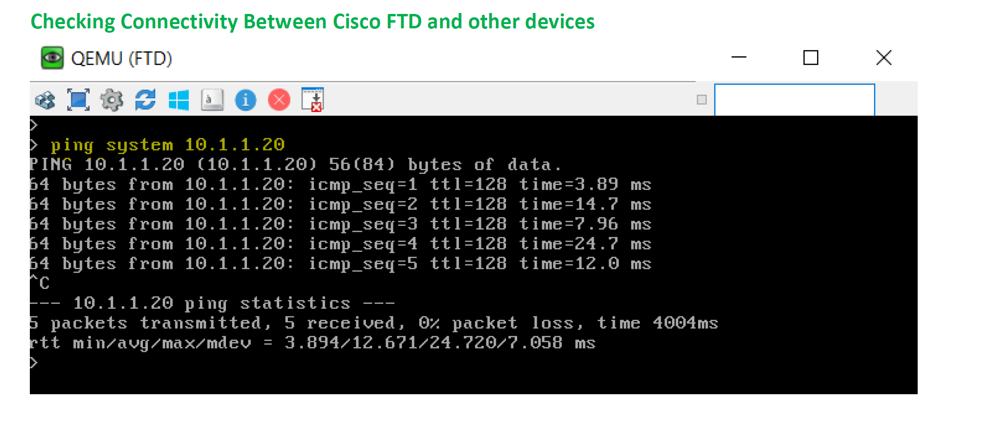
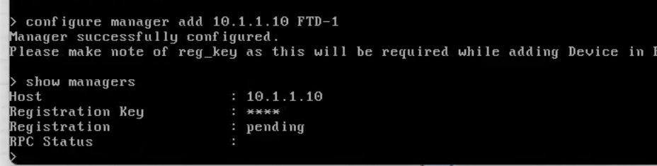
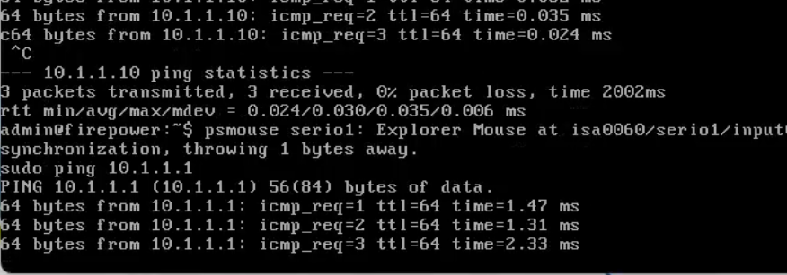

# 拓扑图


# 配 IP

## PC 网关在 FTD 上

```sh
ip addr 192.168.1.1 255.255.255.0 192.168.1.100
```

## FTD 和 FMC 就按照实验手册配（admin/Admin123）

## FTD 的账号密码 admin/Abc@123,FMC 也是如此


## FTD：show network



## 测试 ping 一下



## 配置管理员 show managers 查看当前管理员


## 配置管理眼 `configuer manager add 10.1.1.10 FTD-1`



## FTD 和 FMC 互通


