# 1. 实验拓扑+配地址

`show version检查路由器型号`
`路由器型号：C7200-ADVENTERPRISEK9-M`


# 2. 手动添加静态路由


### `show ip route `检查路由表，R1,R3 ping 一下通了


# 3. 配置 ACL

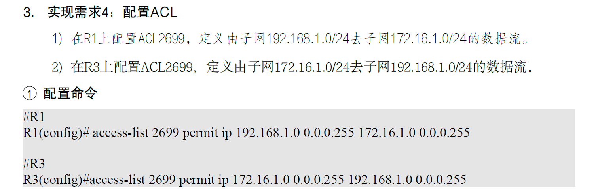
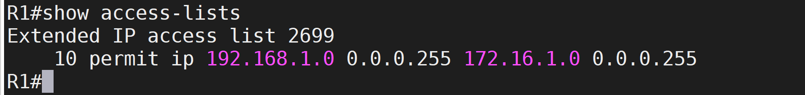
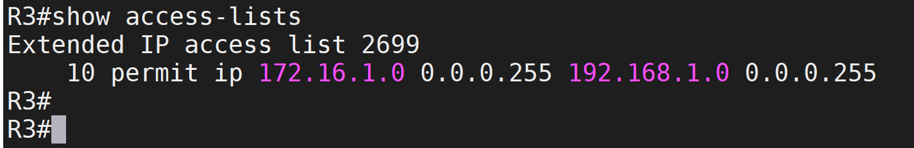

# 4. 配置 IKE 参数(先不做)

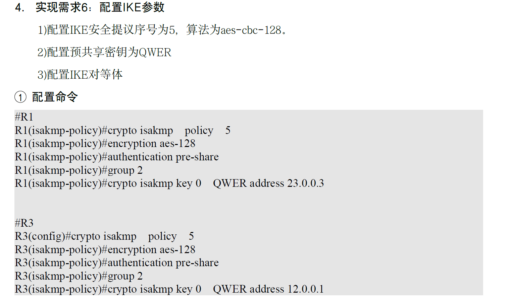

# 5. `show crypto isakmp policy`检查配置

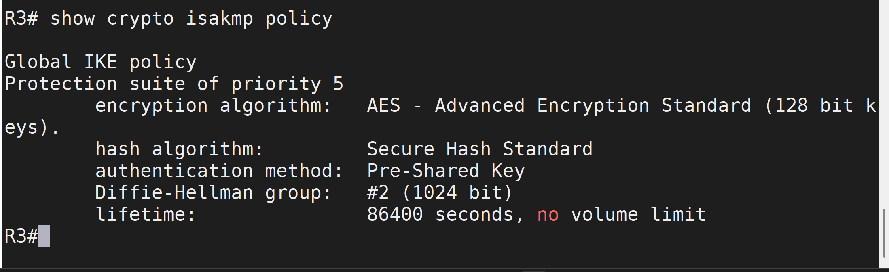

> ### `crypto isakmp policy 5`定义 IKE 策略(policy)，优先级为 5，数字越小优先级越高
>
> ### `encryption aes-128`指定 IKE 策略的加密算法为 AES-128。
>
> ### `authentication pre-share`指定 IKE 认证方式为预共享密钥（Pre-Shared Key, PSK），其他方式还有`rsa-sig（基于证书）和rsa-encr(RSA加密)`
>
> ### `group 2`指定 Diffie-Hellman（DH）密钥交换组为 Group 2。Diffie-Hellman 算法用于 IKE Phase 1 中生成共享密钥。group 2 表示使用 1024 位的 DH 密钥交换，安全性适中。更高的组（如 group 5 或 group 14）提供更强的安全性，但计算开销更大。Cisco 7200 支持多种 DH 组，但 group 2 是常见的选择，适合实验环境。
>
> ### `crypto isakmp key 0 QWER address 23.0.0.3`定义预共享密钥为 QWER，并指定对等体的 IP 地址为 23.0.0.3

# 6. 配置 IPSec 安全提议

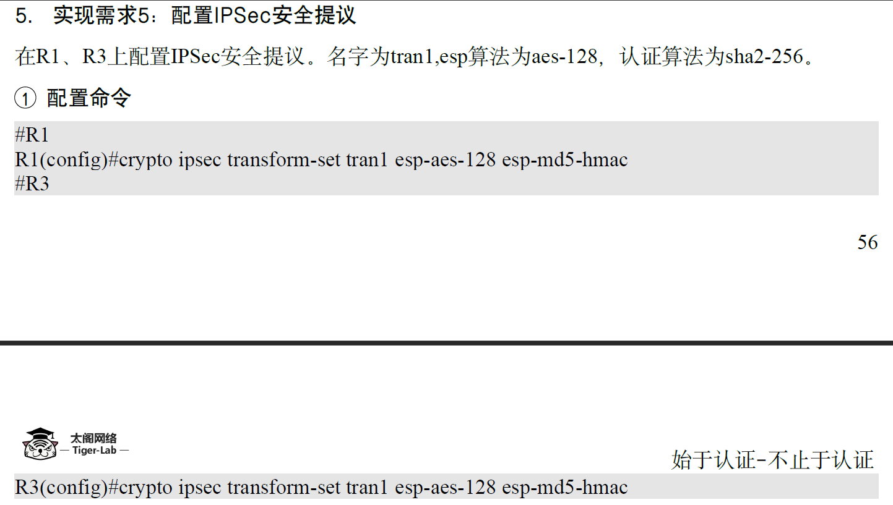

```sh
crypto ipsec transform-set tran1 esp-aes-128 esp-md5-hmac
```

### `crypto ipsec transform-set tran1`定义一个名为 tran1 的 IPSec 变换集。`esp-aes-128`指定封装安全有效载荷（ESP）的加密算法为 AES-128。`esp-md5-hmac`指定 ESP 的认证算法为 MD5-HMAC

# 7. 配置安全策略并应用

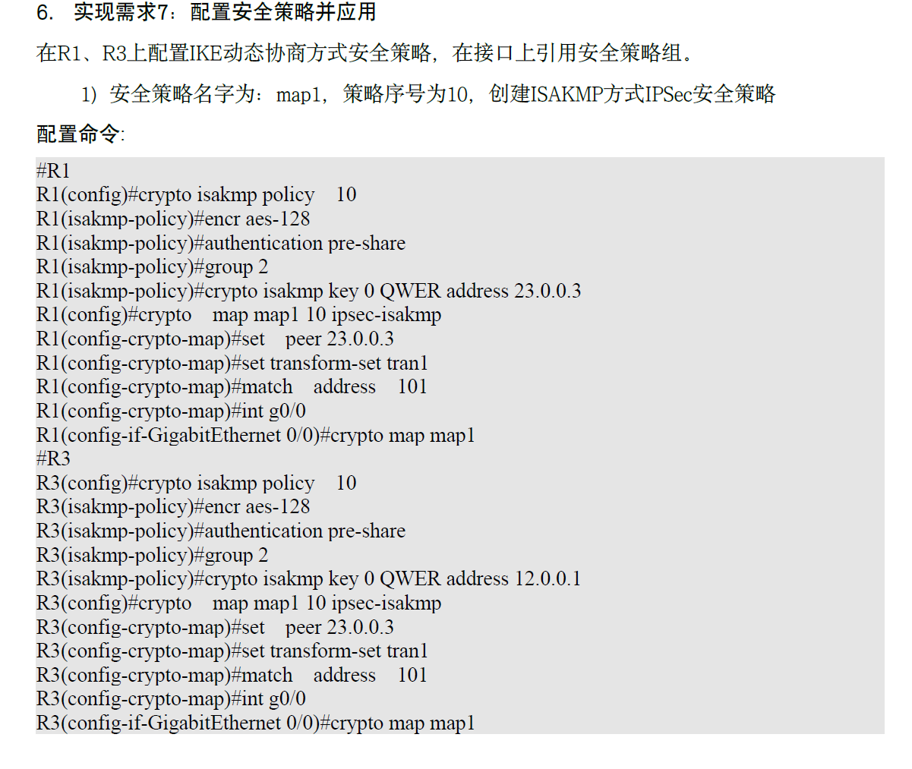

### 效果

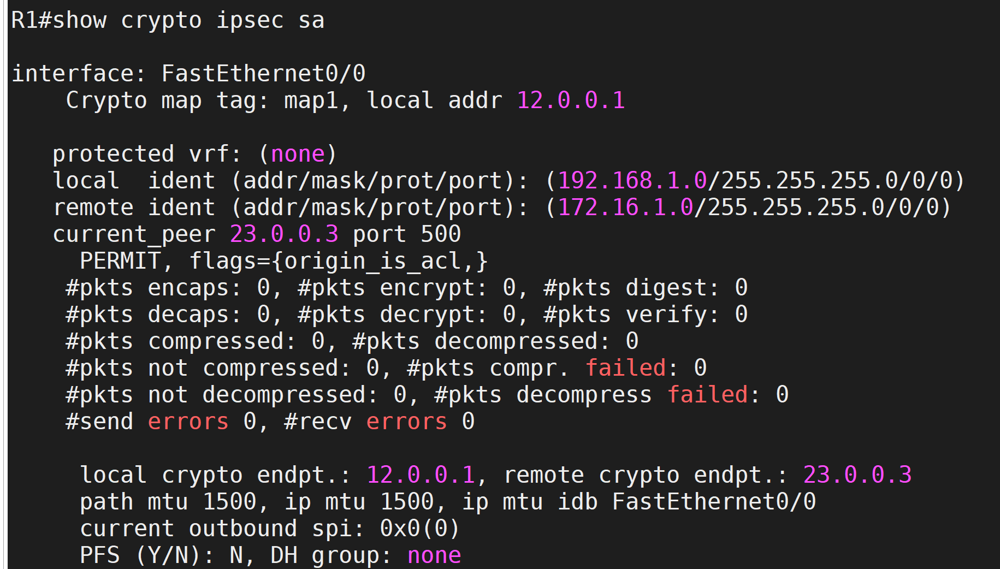
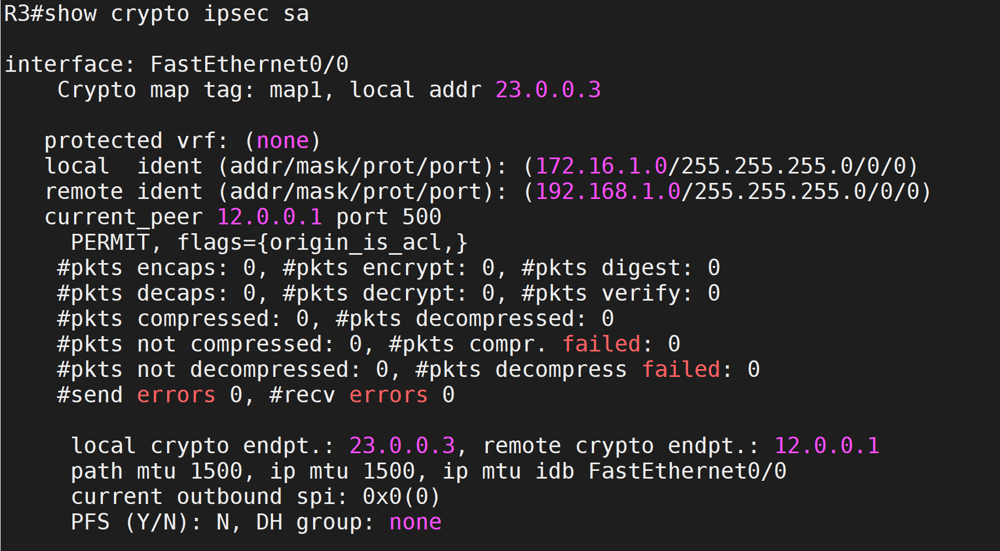
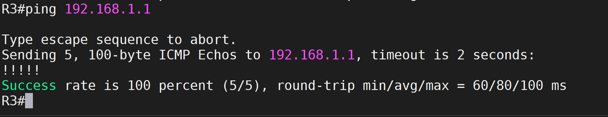
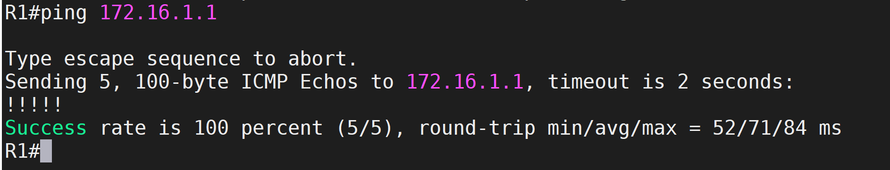
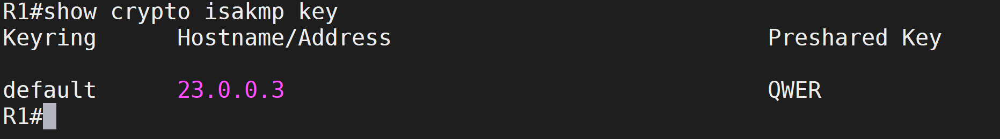
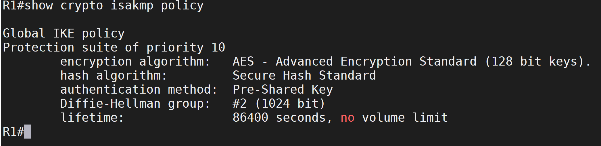
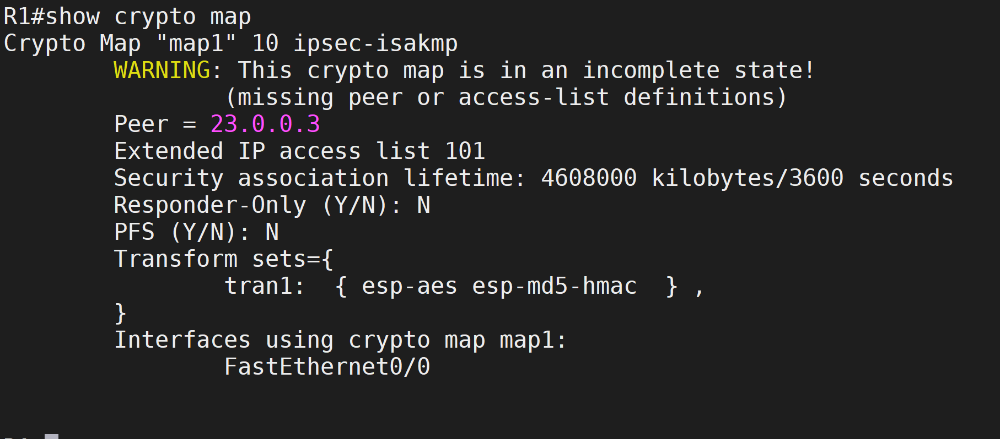

# 8. 在带有 source 的 ping 后才出现 sa

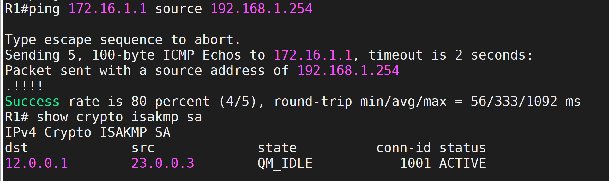
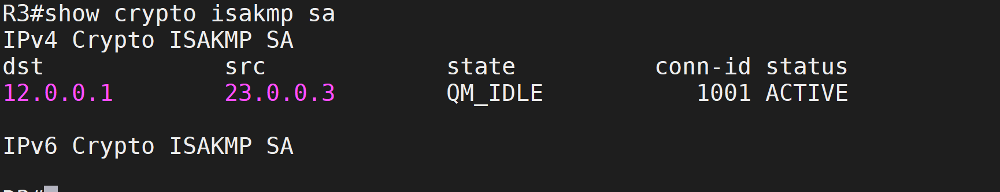
