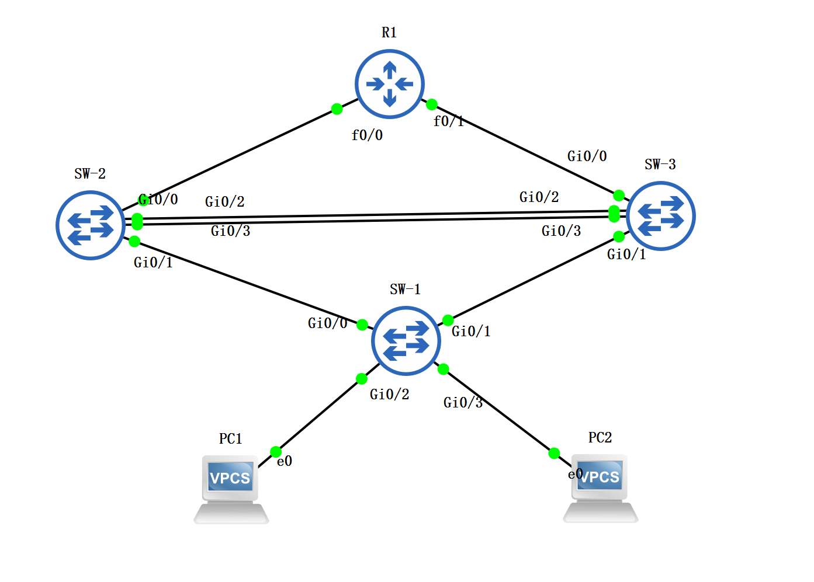
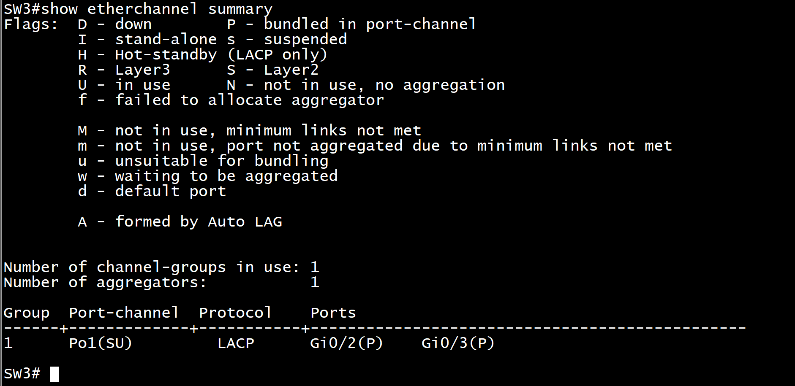
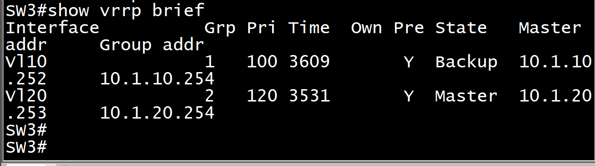
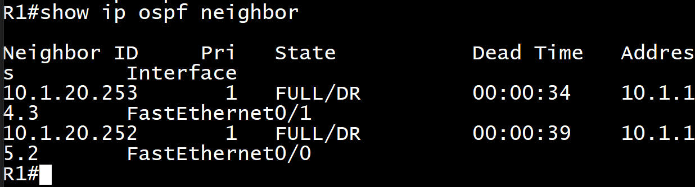
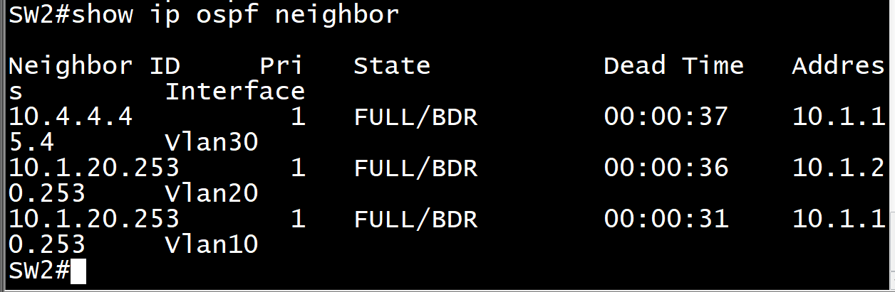
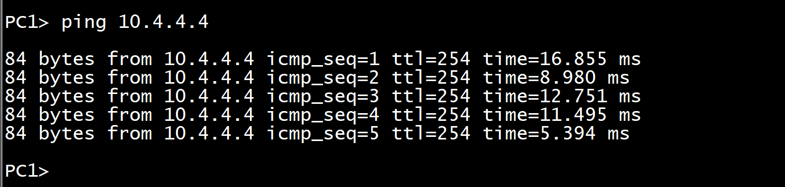
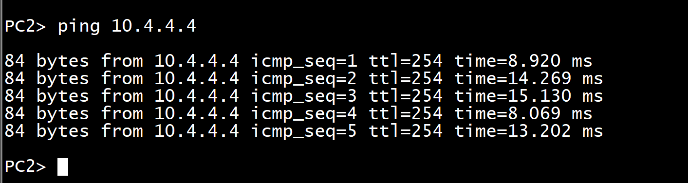
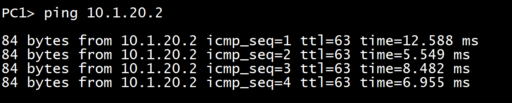

```sh
no logging console关闭日志
```

```sh
show running-config interface Vlan10查看SVI接口的配置信息
```

# 基础配置

## R1

```sh

enable
configure terminal
!
hostname R1
!
interface Loopback0
 ip address 10.4.4.4 255.255.255.255
 no shutdown
!
interface FastEthernet0/0
 ip address 10.1.15.4 255.255.255.0
 no shutdown
!
interface FastEthernet0/1
 ip address 10.1.14.4 255.255.255.0
 no shutdown
!
end
write memory
```

## SW1

```sh
enable
configure terminal
hostname SW1
vlan 10,20
exit
spanning-tree vlan 10,20 priority 32768
end
write memory
```

## SW2

```sh
enable
configure terminal
hostname SW2
!
vlan 10,20,30
!
spanning-tree vlan 10,20 priority 4096
!
interface Vlan10
 ip address 10.1.10.252 255.255.255.0
 no shutdown
!
interface Vlan20
 ip address 10.1.20.252 255.255.255.0
 no shutdown
!
no logging console
end
write memory

```

## SW3

```sh
enable
configure terminal
hostname SW3
!
vlan 10,20,30
!
spanning-tree vlan 10,20 priority 8192
!
interface Vlan10
 ip address 10.1.10.253 255.255.255.0
 no shutdown
!
interface Vlan20
 ip address 10.1.20.253 255.255.255.0
 no shutdown
!
no logging console
end
write memory
```

## PC1

```
ip 10.1.10.1 255.255.255.0 10.1.10.254
save
```

## PC2

```
ip 10.1.20.2 255.255.255.0 10.1.20.254
save
```

# 配 vlan，trunk access，链路聚合

## SW2/SW3

```sh
enable
configure terminal
!
interface range GigabitEthernet0/2-3
 channel-group 1 mode active
 no shutdown
!
interface Port-channel1
 switchport trunk encapsulation dot1q
 switchport mode trunk
 switchport trunk allowed vlan 10,20
 no shutdown
!
end
write memory

```

## 查看聚合情况



# 配 VRRP

## SW2

```sh
enable
configure terminal
!
! 配置接口跟踪
track 1 interface GigabitEthernet0/0 line-protocol
!

interface Vlan10
 ip address 10.1.10.252 255.255.255.0
 vrrp 1 ip 10.1.10.254
 vrrp 1 priority 120
 vrrp 1 track 1 decrement 30
 no shutdown
!

interface Vlan20
 ip address 10.1.20.252 255.255.255.0
 vrrp 2 ip 10.1.20.254
 no shutdown
!
end
write memory

```

## SW3

```sh
enable
configure terminal
!

track 1 interface GigabitEthernet0/0 line-protocol
!

interface Vlan10
 ip address 10.1.10.253 255.255.255.0
 vrrp 1 ip 10.1.10.254
 no shutdown
!

interface Vlan20
 vrrp 2 ip 10.1.20.254
 vrrp 2 priority 120
 vrrp 2 track 1 decrement 30
 no shutdown
!
end
write memory
```

## 验证现象



# OSPF 配置

## SW1

```sh
enable
configure terminal
interface GigabitEthernet0/2
switchport mode access
switchport access vlan 10
interface GigabitEthernet0/3
switchport mode access
switchport access vlan 20
vlan 10,20,30
end
write memory
```

## SW2

```SH
enable
configure terminal
!

interface Vlan30
 no shutdown
 ip address 10.1.15.2 255.255.255.0
!

interface GigabitEthernet0/0
 switchport mode access
 switchport access vlan 30
 no shutdown

router ospf 1
 network 10.1.10.252 0.0.0.0 area 0
 network 10.1.20.252 0.0.0.0 area 0
 network 10.1.15.2 0.0.0.0 area 0
!
end
write memory
```

## SW3

```sh
enable
configure terminal
interface Vlan30
no shutdown
ip address 10.1.14.3 255.255.255.0
interface GigabitEthernet0/0
switchport mode access
switchport access vlan 30
router ospf 1
network 10.1.10.253 0.0.0.0 area 0
network 10.1.20.253 0.0.0.0 area 0
network 10.1.14.3 0.0.0.0 area 0
end
write memory
```

## 查看现象






