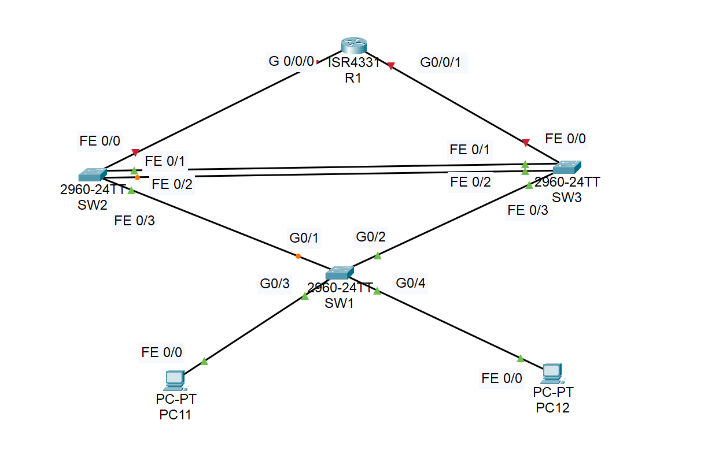
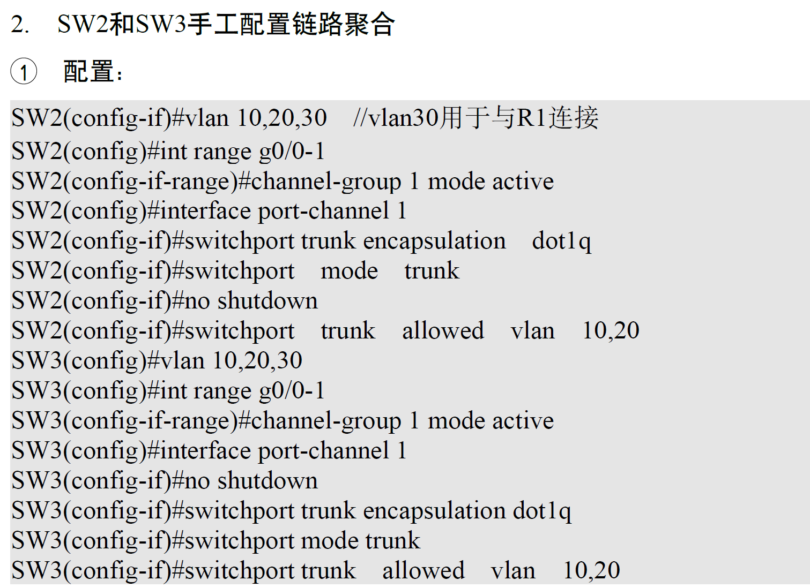
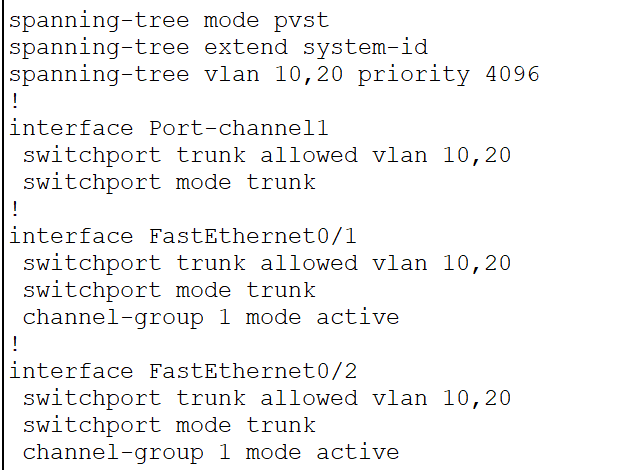
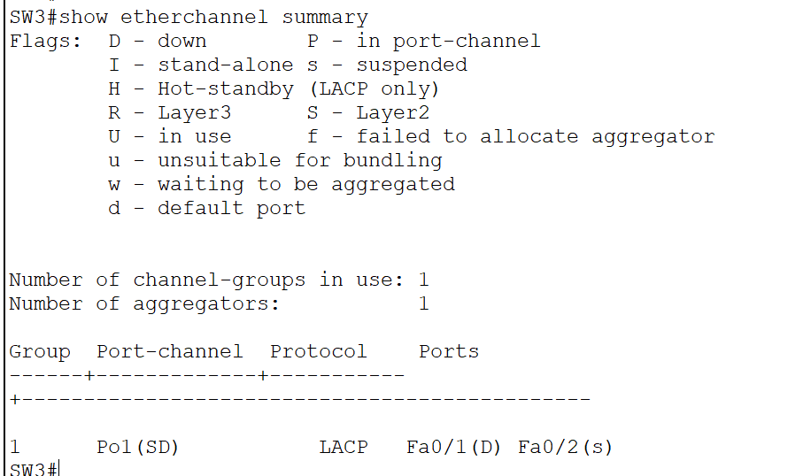

# 1. 配置 STP 模式及桥 ID



> ## SW1

```cli
enable
configure terminal
spanning-tree vlan 10,20 priority 32768
```

> ## SW2

```cli
enable
configure terminal
spanning-tree vlan 10,20 priority 4096
```

> ## SW3

```cli
enable
configure terminal
spanning-tree vlan 10,20 priority 8192
```

# 2.配置 SW2，SW3 链路聚合

### _注意，这里可能 switchport trunk encapusulation dot1q 的封装类型不用配置_



### 基本用 _show running-config_ 查看实验现象（差不多，后续再拍错就是）



### 用 *show ehterchannel summary*也能看



# 3.配置 VRRP(track 先不做)
