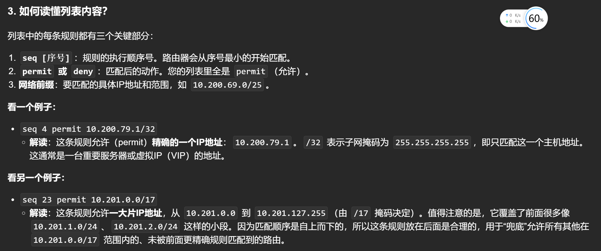
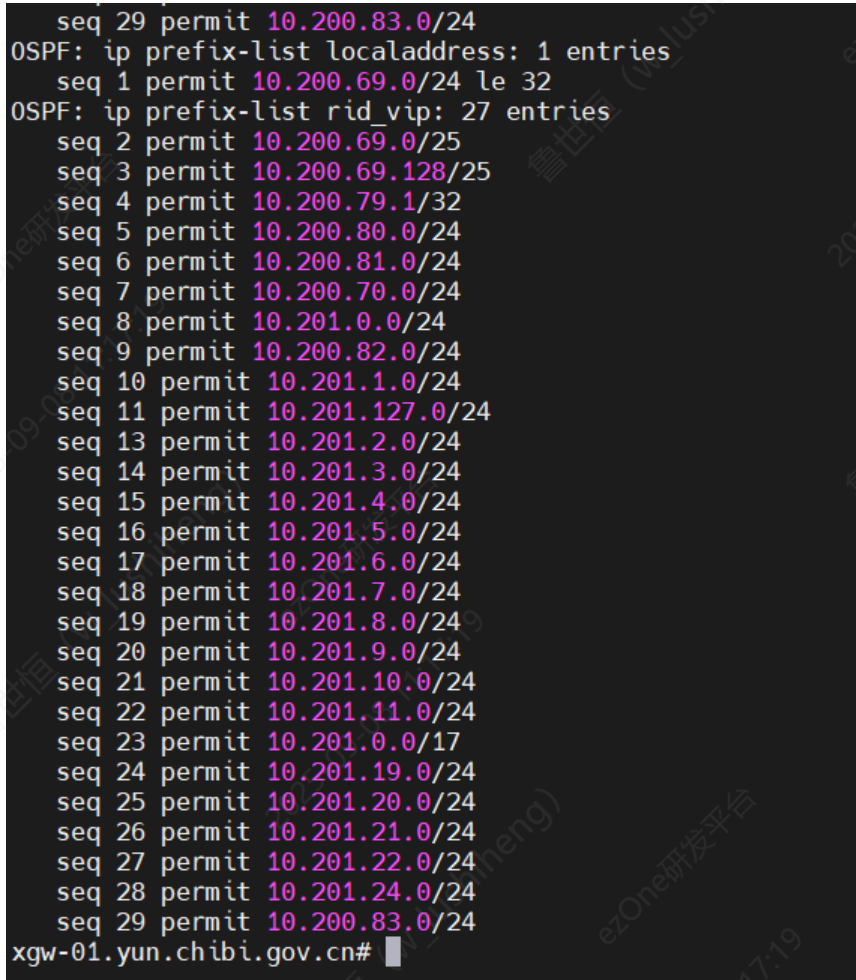
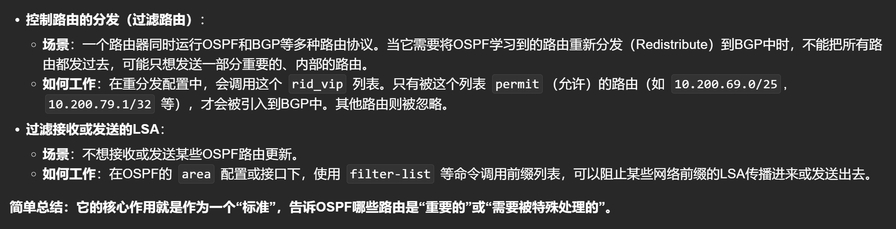

# 1. ip-prefix 作用？



## 场景举例，一个需要ospf和bgp路由引入的场景
# rid_vip是一个前缀列表，包含了许多条目

# 他并不会直接全部重分发到BGP网络中，而是会通过路由策略工具(route-policy/route-map)进行路由过滤

# 2. ip prefix 怎么配置？


# 3. Acl 和 ip 前缀列表的区别？


# 一个典型的配置案例
```sh
! 第一部分：定义匹配内部重要路由的“工具”
ip prefix-list rid_vip seq 5 permit 10.200.80.0/24
ip prefix-list rid_vip seq 10 permit 10.201.1.0/24
! ... (您的其他前缀列表条目)
ip prefix-list rid_vip seq 23 permit 10.201.0.0/17

! 定义一个Route-map，用于在重分发时调用上述Prefix-list
route-map OSPF-to-BGP permit 10
 match ip address prefix-list rid_vip 
! 只有被rid_vip匹配的路由才会执行这个route-map的permit动作

! 第二部分：定义匹配外部BGP路由的“工具”（可选，但强烈建议）
! 创建一个前缀列表或ACL，只允许引入特定的、安全的外部路由
ip prefix-list BGP-to-OSPF seq 5 permit 203.0.113.0/24
ip prefix-list BGP-to-OSPF seq 10 deny 0.0.0.0/0 le 32
! 创建一个Route-map来使用它
route-map BGP-to-OSPF permit 10
 match ip address prefix-list BGP-to-OSPF

! 第三部分：OSPF基础配置
router ospf 1
 ! 首先，宣告路由器自身的直连网段到OSPF区域
 network 10.200.69.0 0.0.0.255 area 0
 network 10.200.70.0 0.0.0.255 area 0
 
 ! 最关键的一步：将BGP路由引入OSPF
 ! 使用我们上面定义的route-map 'BGP-to-OSPF' 进行过滤
 redistribute bgp 65001 subnets route-map BGP-to-OSPF

! 第四部分：BGP基础配置
router bgp 65001
 ! 配置BGP邻居，比如运营商给的邻居地址是192.0.2.1，其AS号是64500
 neighbor 192.0.2.1 remote-as 64500
 
 ! 宣告本地的网络（可选，另一种方式）
 ! network 10.200.80.0 mask 255.255.255.0
 
 ! 最关键的步骤：将OSPF路由引入BGP
 ! 使用我们上面定义的route-map 'OSPF-to-BGP' 进行过滤
 redistribute ospf 1 match internal external 1 external 2 route-map OSPF-to-BGP
 ! 注解: 
 ! `internal` - 引入OSPF区域内部路由
 ! `external 1/2` - 引入OSPF类型1和类型2的外部路由
 
 ! 通常还会加上以下命令，防止将私有IP地址传播到互联网
 no auto-summary
 no synchronization

```