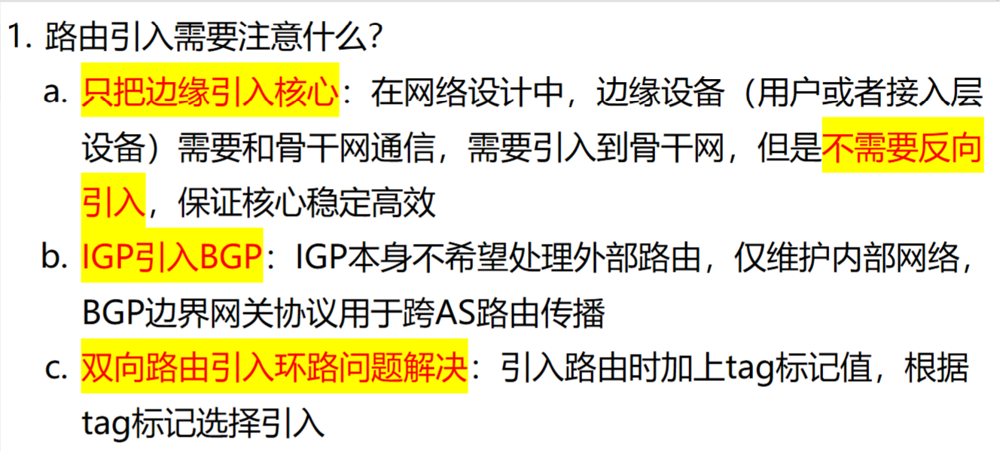
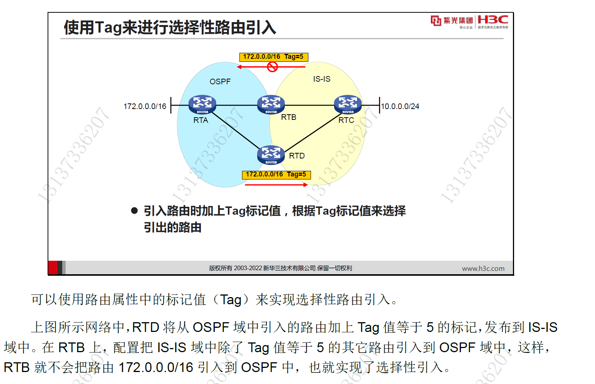
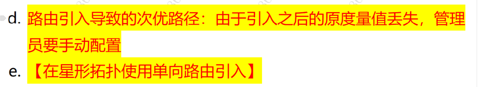
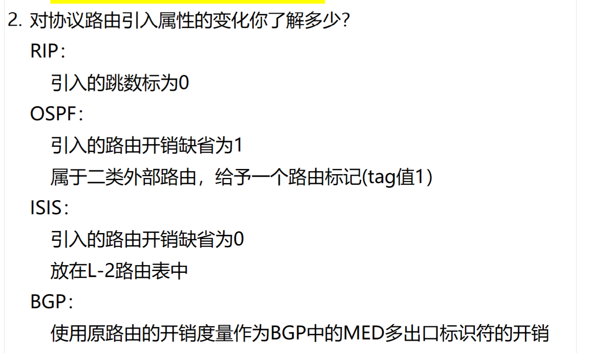

# 1. 路由引入需要注意什么？

<!-- en-interview -->
### English Interview

**Question:** What are the key considerations when performing route redistribution in a network?

**Answer:**

When doing route redistribution, the main goal is to ensure network stability and avoid routing loops. First, it's best to only redistribute from edge to core, not the reverse, to keep the core stable and efficient. Second, we usually don’t redistribute from IGP to BGP because IGP is designed for internal routing, while BGP handles external routes across ASes. Third, to prevent routing loops from bidirectional redistribution, we can use route tags. For example, when redistributing from OSPF to IS-IS, we tag the routes with a specific value like 5. Then, on the other side, we configure the router to ignore routes with that tag when redistributing back, preventing loops. Also, redistribution can cause suboptimal paths because the original metric is lost, so we may need to manually adjust metrics. In star-topology networks, unidirectional redistribution is recommended to avoid complexity. Overall, careful planning with tags and direction control is essential.

# 2. 路由协议引入的属性变化？

<!-- en-interview -->
### English Interview

**Question:** What are the attribute changes when routes are imported into different routing protocols?

**Answer:**

When routes are imported into different routing protocols, each protocol assigns specific default attributes to maintain routing consistency and control. For RIP, the imported route’s hop count is set to 0 by default, which means it’s treated as directly connected. In OSPF, the imported route is assigned a default metric of 1 and classified as Type 2 external route, with a tag value of 1 for identification. For IS-IS, the default metric is 0, and the route is placed in the Level-2 routing table, typically used for inter-area routing. In BGP, the original route’s metric is used as the MED (Multi-Exit Discriminator) value, which helps influence inbound traffic selection from external ASes. These default behaviors ensure that imported routes are properly integrated and prioritized within each protocol’s domain. Understanding these default attributes is crucial for troubleshooting and designing stable routing policies, especially in multi-protocol environments.
