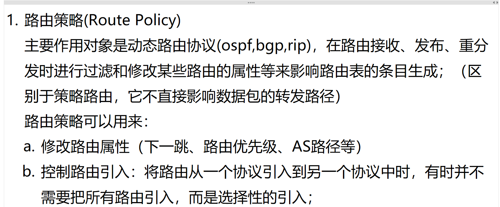
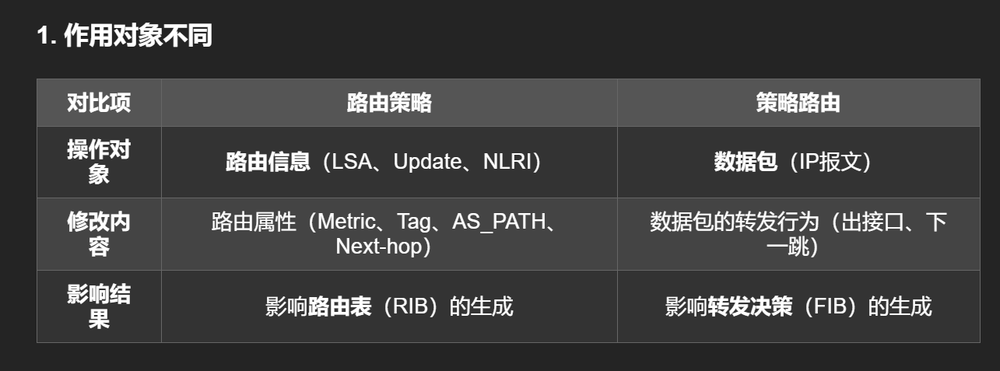
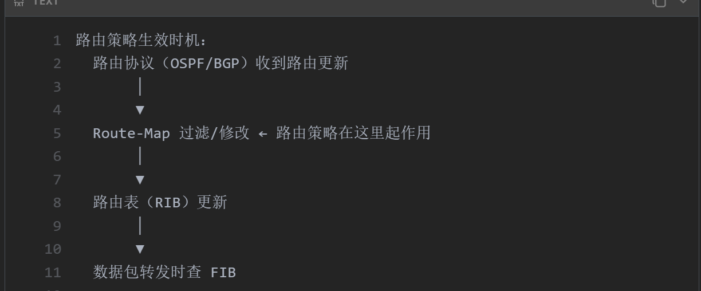
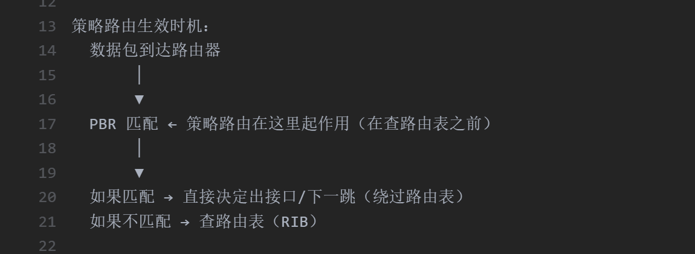

# 1.route-policy(route-map) 路由策略有什么用（影响路由表的生成）？和策略路由的区别？

<!-- en-interview -->
### English Interview

**Question:** What is the purpose of route-policy (route-map) in network routing, and how does it differ from policy-based routing?

**Answer:**

Route-policy, or route-map, primarily affects the routing table generation process by filtering or modifying routing attributes during the reception, advertisement, or redistribution of routes in dynamic protocols like OSPF, BGP, or RIP. It doesn’t directly influence packet forwarding paths. Instead, it operates on routing information—such as LSA, Update, or NLRI—modifying attributes like metric, next-hop, or AS_PATH, which then impact the Routing Information Base (RIB). For example, you might use it to selectively import routes from one protocol to another or adjust route priorities.

In contrast, policy-based routing (PBR) acts on actual data packets. When a packet arrives, PBR checks it against policies before consulting the routing table. If matched, it forces the packet to a specific next-hop or interface, bypassing the RIB. So, route-policy shapes the routing table, while PBR controls packet forwarding decisions independently of the routing table.
